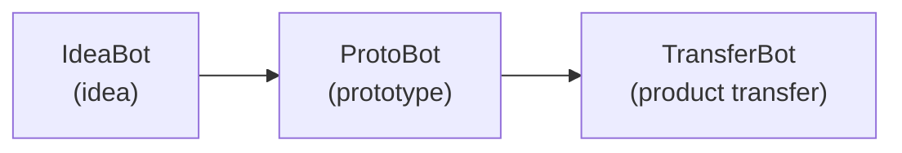

# ProtoBot

ProtoBot is an experimental, spec-first software development system. It
takes structured requirements and generates working, tested, inspected
prototypes for customer demonstrations. It is the second tool in the Hermes
pipeline:

ProtoBot is intended to produce prototypes, not final production products.
The implementation is a disposable, regenerable artifact. The durable asset
is the specification and the evidence showing how a particular implementation
conformed to it.

## Approach to Software Development

ProtoBot puts human judgment before implementation and automation after the
specification is approved:

1. **Sketching:** A person and an agent define the project's Vision and
   Architecture, including its observable external interfaces.
2. **Dimensioning:** They turn those interfaces into precise EARS
   (Easy Approach to Requirements Syntax) requirements. This approved
   Schematic is the human review boundary.
3. **Building:** Autonomous Workers independently generate tests and
   implementation from the approved requirements. The test Worker cannot see
   implementation source, and the implementation Worker cannot see canonical
   test source.
4. **Inspecting:** Independent Inspectors review the result for security,
   test completeness, code quality, specification conformance, and mutation
   survivors. Defects return to Building; undefined behavior blocks the work
   until the specification is clarified.

The core principles are:

- **The specification is the source.** People define what the system must do;
  agents determine how to implement it. Code and tests can be regenerated from
  the approved specification.
- **Observable behavior comes first.** Requirements describe stable external
  behavior and interfaces, not internal modules or implementation choices.
- **Verification must be independent.** Separating test and code generation
  helps prevent agents from optimizing for a visible oracle instead of the
  intended behavior.
- **Constraints are structural.** Sandboxes, repository projections, tooling,
  and policy enforce isolation and permissions rather than relying on prompts
  or agent discipline alone.
- **Every component must be evaluable.** A known input and measurable output
  are prerequisites for improving an agent, tool, or workflow stage.

At the system level, the Drafting Table hosts interactive specification work,
`ears-manager` governs specification artifacts and validation, the Job Site
runs autonomous Building and Inspecting, and a pluggable WMS Adapter tracks
work-item lifecycle. Project content remains in Git; workflow state and
commit-scoped conformance evidence are recorded separately.

## Documentation

- [ProtoBot project board](https://github.com/orgs/redhat-et/projects/35/views/1)
- [Architecture overview](docs/architecture/overview.md)
- [System components](docs/architecture/components.md)
- [User interaction flow](docs/architecture/user-interaction-flow.md)
- [Related work](docs/architecture/related-work.md)
- [Open design questions](docs/architecture/open-questions.md)

ProtoBot is under active design and implementation. The architecture documents
describe the current direction and identify decisions that remain open.

## License

ProtoBot is licensed under the [Apache License 2.0](LICENSE).
