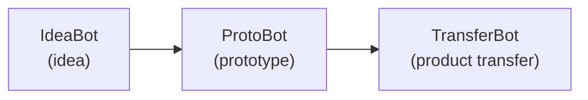

# ProtoBot

ProtoBot is an experimental, spec-first software development system. It
takes structured requirements and generates working, tested, inspected
prototypes for customer demonstrations. It is the second tool in the Hermes
pipeline:


```mermaid
flowchart LR
    IdeaBot["IdeaBot<br/>(idea)"] --> ProtoBot["ProtoBot<br/>(prototype)"] --> TransferBot["TransferBot<br/>(product transfer)"]
```

ProtoBot is intended to produce prototypes, not final production products.
The implementation is a disposable, regenerable artifact. The durable asset
is the specification and the evidence showing how a particular implementation
conformed to it.

## Approach to Software Development

ProtoBot puts human judgment before implementation and automation after the
specification is approved:

1. **Sketching:** A person and an agent define the project's Vision and
   Architecture, including its observable external interfaces.
2. **Dimensioning:** They turn those interfaces into precise EARS
   (Easy Approach to Requirements Syntax) requirements. This approved
   Schematic is the human review boundary.
3. **Building:** Autonomous Workers independently generate tests and
   implementation from the approved requirements. The test Worker cannot see
   implementation source, and the implementation Worker cannot see canonical
   test source.
4. **Inspecting:** Independent Inspectors review the result for security,
   test completeness, code quality, specification conformance, and mutation
   survivors. Defects return to Building; undefined behavior blocks the work
   until the specification is clarified.

The core principles are:

- **The specification is the source.** People define what the system must do;
  agents determine how to implement it. Code and tests can be regenerated from
  the approved specification.
- **Observable behavior comes first.** Requirements describe stable external
  behavior and interfaces, not internal modules or implementation choices.
- **Verification must be independent.** Separating test and code generation
  helps prevent agents from optimizing for a visible oracle instead of the
  intended behavior.
- **Constraints are structural.** Sandboxes, repository projections, tooling,
  and policy enforce isolation and permissions rather than relying on prompts
  or agent discipline alone.
- **Every component must be evaluable.** A known input and measurable output
  are prerequisites for improving an agent, tool, or workflow stage.

At the system level, the Drafting Table hosts interactive specification work,
`ears-manager` governs specification artifacts and validation, the Job Site
runs autonomous Building and Inspecting, and a pluggable WMS Adapter tracks
work-item lifecycle. Project content remains in Git; workflow state and
commit-scoped conformance evidence are recorded separately.

## Repository Layout

ProtoBot is a language-agnostic monorepo. Each independently buildable
component owns its native module and toolchain. The current Go components are
organized as:

```text
ears-manager/
  go.mod
  cmd/ears-manager/
  internal/{cli,project,records,schema,specvalidation,storage}/
source-control-manager/
  go.mod
  cmd/source-control-manager/
  internal/{cli,mcpserver,scm,gitx,host,ears,render,...}/
  internal/golden/          # the golden repository fixture, replayed
  internal/testing/         # the gh and ears-manager stubs of the fixture
  internal/jobsite/         # Worker projection isolation and sandbox contract (#78, #79)
wms/
  go.mod
  validation/               # backend-neutral lifecycle evaluator
  memory/                   # in-memory WMS conformance adapter
```

Additional WMS backends can use their native layout under the same monorepo,
for example `wms/github/` or `wms/jira/`; other components can use a native
layout such as `drafting-table/web/`. The root `go.work` makes local Go
component development convenient without coupling other languages to Go.

The install targets are:

```text
go install github.com/redhat-et/protobot/ears-manager/cmd/ears-manager@latest
go install github.com/redhat-et/protobot/source-control-manager/cmd/source-control-manager@latest
```

### First `ears-manager` release

The first command slice provides `project init`, `check`, requirement
add/list/show/update/retire, interface add/list/show, artifact get/put,
proposed change-set create/list/show/update/compare, and deterministic
`impact` analysis. `project init` adopts an existing repository by registering
its specification artifacts and writing the `.protobot/` control namespace;
it does not create content, branches, commits, pushes, or pull requests.
Writes are validated against a candidate specification before an atomic file
transaction is applied; JSON output and exit statuses are deterministic.

`change-set create` cuts and checks out the change-set branch, and
`change-set show --at FULL-SHA` reads a manifest at a named commit. The
Source Control Manager commits, pushes, and opens the pull request. Immutable
historical `--at` reads on the other commands and explicit `--against`
comparisons remain separate follow-on work.

## Specification store

ProtoBot hosts its own specification store under `.protobot/`. Those files
are written by `ears-manager`; do not edit them by hand.
`docs/vision.md` and `docs/architecture.md` are registered artifacts. A
direct edit that leaves the registry digest unchanged fails
`ears-manager check`. The initial store includes the governed `CS-00001`
change set, the `protobot-cli` interface, and requirement `REQ-CLI-00001`.

Run the local check from the checked-out source, so it uses the same
`ears-manager` version CI builds:

```sh
cd ears-manager
go run ./cmd/ears-manager check
```

Machine-readable diagnostics use the JSON envelope, which is also what CI
prints:

```sh
cd ears-manager
go run ./cmd/ears-manager --output json check
```

CI fetches the default branch so `check` can tell approved from proposed
change sets and verifies that already-approved change-set manifests remain
unchanged, then runs `ears-manager --output json check`. A non-zero
exit fails the merge gate. The `ears-manager` validation diagnostics use the
same codes, exit statuses, and JSON shape locally and in CI; the separate
manifest guard reports changed paths in the Actions log. For matching
approved/proposed classification, keep the local default-branch ref current;
`ears-manager` does not fetch it automatically. On a validation failure,
create or resume a change set with `ears-manager change-set create`, update
registered files with `ears-manager artifact put`, and edit structured
records through their `ears-manager` commands. Run formatters before
`artifact put` so its digest covers the final file contents. When refreshing
a change-set branch after the default branch moves, follow the governed
refresh procedure (including `ears-manager change-set update`) and rerun
`check` so the base, impact assessment, and store digests stay current. Then
commit and push to the same branch. Do not edit a registered artifact or a
structured record by hand as a workaround. For a transient runner or fetch
failure, rerun the failed workflow after service is restored.

The gate detects accidental or incomplete edits; digests are not signatures
and are not an adversarial security boundary. A pull request can change its
own validator or workflow, so human review and protected checks remain the
trust boundary.

## Documentation

- [ProtoBot project board](https://github.com/orgs/redhat-et/projects/35/views/1)
- [Vision](docs/vision.md)
- [Architecture overview](docs/architecture/overview.md)
- [Architecture interfaces and constraints](docs/architecture.md)
- [`ears-manager` CLI integration contract](docs/architecture/ears-manager-cli.md)
- [Source Control Manager](docs/architecture/source-control-manager.md)
- [System components](docs/architecture/components.md)
- [User interaction flow](docs/architecture/user-interaction-flow.md)
- [Related work](docs/architecture/related-work.md)
- [Open design questions](docs/architecture/open-questions.md)
- [Architecture decisions](docs/decisions/)

ProtoBot is under active design and implementation. The architecture documents
describe the current direction and identify decisions that remain open.

## License

ProtoBot is licensed under the [Apache License 2.0](LICENSE).
