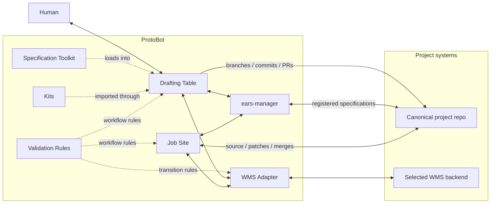
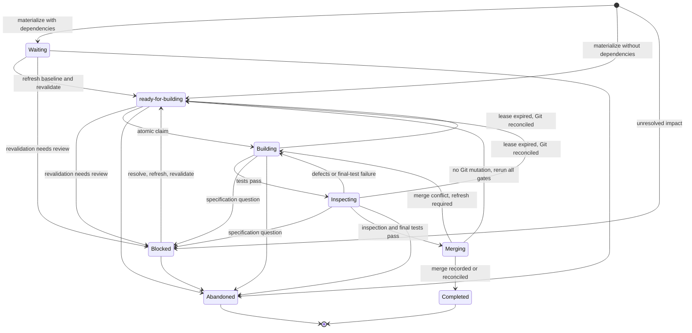
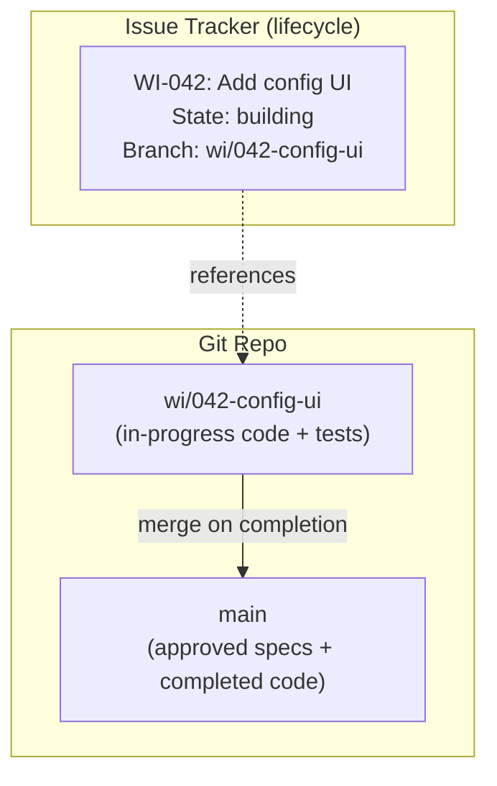
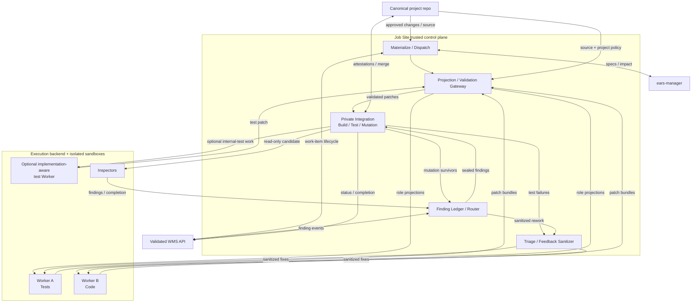
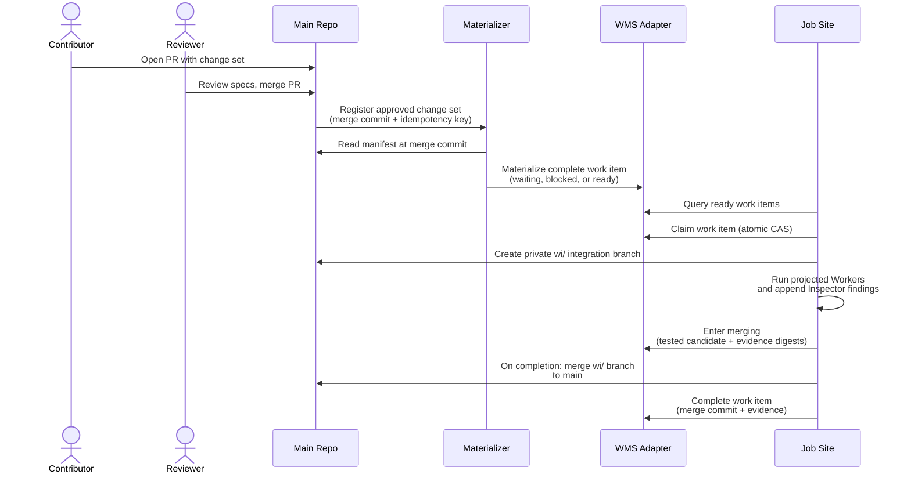

# ProtoBot: System Components

> Design document — draft, July 2026

**Contents:**

- [Overview](#overview)
- [Components](#components)
- [Drafting Table](#drafting-table)
- [Specification Toolkit](#specification-toolkit)
- [Kits](#kits)
- [`ears-manager`](#ears-manager)
- [WMS Adapter](#wms-adapter)
- [Content Storage Model](#content-storage-model)
- [Validation Rules](#validation-rules)
- [Job Site](#job-site)
- [Cross-Cutting Concerns](#cross-cutting-concerns)
- [Related Documents](#related-documents)

## Overview

This document identifies the major system components that ProtoBot
needs to be built from, and the interfaces between them. The goal is
to drive design decisions about what to build, what to reuse, and
where the hard integration problems are.

For the user-facing flow and phase details, see
[user-interaction-flow.md](user-interaction-flow.md).

---

## Components

This diagram intentionally stops at component boundaries. The Job Site's
control plane, isolated execution domains, and external runtime services
are shown in [Job Site](#job-site).

ProtoBot has seven primary logical components and reusable asset families:

1. **Drafting Table** — The environment where the human and an AI
   agent collaborate during Sketching and Dimensioning. It combines a
   frontend (web UI or TUI) with an agent harness that runs the
   specification work. Different Drafting Table implementations can be
   swapped in; what they share is the Specification Toolkit, the
   Validation Rules, and the WMS Adapter API.
2. **Specification Toolkit** — The portable set of skills, tools, and
   prompts that encode how to do Sketching and Dimensioning. Shared
   across all Drafting Table implementations — it's the domain logic
   that makes any compatible harness capable of driving the
   specification process.
3. **Kits** — Versioned imports that currently provide proposed
   EARS/interface content and Inspector definitions. Exact packaging and
   additional capabilities remain open.
4. **`ears-manager`** — A CLI tool that is the programmatic interface
   to the specification store. Manages the file-based spec database
   (EARS requirements, interfaces, change sets), enforces EARS formatting
   rules, and validates referential integrity. Used by agents via the
   Specification Toolkit, by CI for verification, and by humans
   directly.
5. **WMS Adapter** — A thin, pluggable integration layer over the
   chosen work management backend (GitHub Issues/Projects, GitLab,
   Jira, Beads, Trello). Translates ProtoBot's work item model
   to/from the backend's native concepts. One implementation is
   active per project. Backend translators remain deliberately thin;
   the stable API boundary uses shared Validation Rules to enforce
   atomic lifecycle transitions.
6. **Validation Rules** — Domain logic that enforces well-formedness
   on work item state transitions. Shared across the Drafting
   Table and the Job Site — both use these rules when writing to the
   WMS. Not a running service; a shared library or rule set.
   (Spec-level validation — EARS formatting, referential integrity —
   is handled by `ears-manager`, not here.)
7. **Job Site** — The autonomous execution engine that runs Workers and
   Inspectors to turn approved requirements into working, tested
   prototypes. Its control plane materializes complete work-item
   contracts and dispatches them by pulling ready items from the WMS
   when execution capacity is available.

---

## Drafting Table

The Drafting Table is where the human sits down with an AI agent to do
the architectural and specification work — Sketching (Phase 1) and
Dimensioning (Phase 2). It is also where the user receives
notifications about blocked work items and resolves them.

A Drafting Table implementation consists of two parts: a **frontend**
(what the user sees and interacts with) and an **agent harness** (what
runs the model, executes tools, manages the conversation). Different
implementations provide both parts together, but all load the same
Specification Toolkit and talk to the same WMS API.

### Reference implementations

**Web Drafting Table** — A web application similar to IdeaBot. The
frontend is a browser-based UI; the harness is a hosted agent runtime
running server-side. This is the natural choice when the user wants
persistent access, push notifications for blocked work items, and no
local setup.

- Provides its own agent harness (hosted runtime).
- Can push notifications to the user (blocked work items, Job Site
   status updates) at any time via the persistent browser connection.
- Needs a deployment target (cluster or hosted service).

**TUI Drafting Table** — A terminal-based interface using an existing
coding agent like OpenCode or Claude Code as the harness. The user
launches it locally; the harness runs on their machine and connects
to the WMS via MCP or API.

- The harness already exists (OpenCode, Claude Code, etc.) — the
  Drafting Table is the Specification Toolkit loaded into it plus
  WMS connectivity.
- Blocked-work notifications use a **pull model**: on session start,
  the harness checks the WMS for blocked items and presents them.
  ("You have 2 work items blocked on undefined behavior — resolve
  now or continue with other work?")
- For urgency between sessions, external notification channels
  (email, Slack) can alert the user that something needs attention.
  The TUI itself doesn't need to be the notification mechanism.

### Responsibilities (common to all implementations)

- Host the conversational interaction between user and agent during
  Sketching (producing the Sketch: Vision + Architecture) and
  Dimensioning (producing the Schematic: approved EARS requirements).
- Present the agent's gap-closing suggestions and allow the user to
  accept, modify, or reject them.
- Surface blocked work items from the WMS and let the user resolve
  them (add a requirement or approve an out-of-scope declaration).
- Display work item status from the WMS so the user has visibility
  into what the Job Site is doing.

### Interfaces

- **To WMS Adapter (via API/MCP):** Reads build work-item state for
  display, queries blocked items, and submits reviewed resolution or
  change-set references. The Materializer validates those inputs and
  performs the expected-state transition during contract refresh.
- **To `ears-manager`:** Reads and writes every registered specification
  artifact, including Vision/Architecture prose and external interface
  IDLs. The Drafting Table never edits spec files directly.
- **To project repo:** Creates branches/commits and opens PRs containing
  artifacts produced through `ears-manager`.
- **To User:** Conversational interface for Sketching and
  Dimensioning. Displays Job Site progress/status. Surfaces blocked
  work items.
- **From IdeaBot:** Receives IdeaBot output as input to Sketching
  (handoff format is an
  [open question Q4](open-questions.md#q4-ideabot-handoff-format)).

### Open design questions

- **Async escalation UX.** The web implementation can push; the TUI
  pulls on session start. Is pull-on-start sufficient, or do some
  escalations need faster turnaround? If so, what external channel
  (email, Slack, webhook) should be used? See
  [open question Q2][q2].
- **Spec gap surfacing pattern.** During Dimensioning, the agent
  must aggressively surface unspecified behaviors. What's the UX
  for this? Inline suggestions? A separate gap report? See
  [open question Q1](open-questions.md#q1-spec-gap-surfacing-ux).
- **Multi-interface orchestration.** When a project has many
  interfaces, does the user dimension them one at a time, or jump
  between them? See
  [open question Q3](open-questions.md#q3-multi-interface-orchestration).
- **Session continuity across implementations.** A user might start
  Dimensioning in the TUI and continue in the web UI (or vice
  versa). The proposed change set and specification state are committed
  to its git branch, while the WMS stores work records and pointers. Does
  conversational context (the agent's memory of the discussion so far)
  need to transfer too, or is the committed specification state
  sufficient?

---

## Specification Toolkit

The Specification Toolkit is the portable domain logic that any
Drafting Table implementation loads to become capable of driving
Sketching and Dimensioning. It is not a running service — it is a
shared asset consumed by the agent harness.

### Contents

- **Skills** — Structured instructions for the agent: how to conduct
  a Sketching session (elicit Vision, enumerate interfaces, identify
  interface types), how to conduct Dimensioning (translate
  Architecture into EARS requirements, surface spec gaps, handle
  each EARS pattern type).
- **Tool definitions** — MCP tool schemas or API client code for
  interacting with the WMS Adapter (creating/reading/updating work
  items, querying blocked items) and `ears-manager` (adding,
  listing, and validating specifications on the active change-set or
  build-work-item branch).
- **Prompts** — System prompts, templates, and reference material:
  EARS pattern definitions, the interface-type taxonomy, the
  undesired-behavior taxonomy, gap-closing heuristics, the
  specification hierarchy (Vision → Architecture → Interface →
  Requirement), and change-set impact analysis.

### Design principles

- **Harness-agnostic.** The toolkit must work in any compatible agent
  harness — OpenCode, Claude Code, a hosted web runtime, or future
  harnesses. This means no dependencies on harness-specific APIs
  beyond standard tool execution and prompt loading.
- **Two runtime service dependencies: WMS Adapter and `ears-manager`.** Work
  item lifecycle state lives in the WMS backend (via the adapter).
  Specification content lives in the project's git repo (on contributor
  or change-set branches before approval and build-work-item branches
  during execution), accessed exclusively through `ears-manager`. The
  toolkit does not maintain its own state store.
- **Versioned and testable.** The toolkit should be versioned
  alongside the WMS Adapter API it targets. Changes to EARS patterns,
  gap-closing heuristics, or the specification hierarchy should be
  testable independently of any particular Drafting Table
  implementation.

### Interfaces

- **To agent harness:** Versioned skills/prompts plus standard tool
  definitions; no harness-specific state API is required.
- **To WMS Adapter:** Request/work-item queries, expected-version
  transitions, blocked-work resolution, and status display.
- **To `ears-manager`:** All registered specification reads/writes,
  comparison, impact analysis, and validation.
- **From Kits/project policy:** Reviewed Inspector/spec imports and policy
  context; the Toolkit does not activate remote content implicitly.

### Open design questions

- **Toolkit packaging format.** What does the toolkit look like on
  disk? A directory of markdown skills + JSON tool schemas (like
  OpenCode's skill system)? A plugin/extension package? The answer
  depends partly on what the target harnesses support.
- **Tool surface split.** The toolkit needs tools for two systems:
  the WMS Adapter (work item lifecycle CRUD and queries) and the
  spec store (via `ears-manager`). The WMS Adapter tools handle
  work item lifecycle; `ears-manager` handles all spec read/write
  operations. The agent should not need to manipulate spec files
  directly.

---

## Kits

A **Kit** is a reusable, versioned import for a standard project concern,
such as Python conventions, Kubernetes deployment, CI, or packaging. The
exact package format and full capability model are intentionally open
until ProtoBot has implementation experience.

The currently established Kit contents are:

- **EARS/interface content:** proposed interface definitions and
  requirements for the concern; and
- **Inspector definitions:** specialist Inspectors and activation rules
  relevant to that concern.

Importing a Kit never changes an approved project implicitly. EARS and
interface content becomes a normal proposed change set with provenance
and human review. Inspector definitions become a proposed project-policy
change; activation is visible and reviewable. An upgrade is another
explicit diff, not an in-place remote update.

Projects may use ProtoBot-provided, organization-provided, or
project-local Kits. Every import records source, version, digest, and
provenance in the project control namespace. Whether Kits also package
agent skills, projection defaults, build/test conventions, mutation
operators, or internal test controls remains an open question. No Kit
may broaden sandbox, credential, network, or repository permissions
without a separate policy review.

### Interfaces

- **To `ears-manager`:** Imports EARS/interface content as a proposed
  change set with Kit provenance.
- **To project policy:** Proposes Inspector definitions/activation rules;
  project review controls activation.
- **To Kit source:** Resolves pinned source/version/digest without
  executing unreviewed content.

### Open design questions

- **Kit package and trust format.** Archive, OCI artifact, git ref, or
  another format? How are signatures, compatibility, dependencies, and
  organization trust policy represented?
- **Additional modules.** Which implementation experience justifies
  adding skills or execution policy beyond the currently understood
  EARS/interfaces and Inspector definitions?

---

## `ears-manager`

`ears-manager` is a CLI tool that serves as the programmatic
interface to the specification store. It abstracts the underlying
file format (JSONL, directory-of-files, or whatever is chosen),
manages change sets, and enforces EARS methodology rules
deterministically. Semantic impact analysis still requires agent and
human judgment, but its inputs and approved result are structured.

It is used by three callers:

- **Agents** (via the Specification Toolkit) — the Drafting Table
  agent calls `ears-manager add requirement`, `ears-manager add
  interface`, and change-set commands during Dimensioning. The Job
  Site receives changed and applicable requirement IDs in the build
  work-item contract and resolves them at its immutable specification
  commit via `ears-manager list` / `ears-manager show`. Workers also
  receive the full approved Schematic for context. See
  [ongoing obligations](user-interaction-flow.md#ongoing-obligations)
  and [open question Q19][q19].
- **CI** — `ears-manager check` runs on every branch push to
  validate that spec files are well-formed, all EARS statements
  match required templates, and referential integrity holds.
- **Humans** — a developer or architect can run `ears-manager`
  directly to inspect or change registered specification artifacts
  without involving an agent.

### Interfaces

- **CLI:** Stable machine/human command surface used by the Toolkit, Job
  Site, CI, and maintainers.
- **Specification working tree:** Registered artifact paths in the
  current change-set/build branch; no independent service database.
- **Validator plugins/tools:** Format-specific IDL/prose/schema checks
  invoked under registered artifact policy.
- **Outputs:** Deterministic structured results, diagnostics, diffs,
  impact candidates, and non-zero validation status for CI.

### Subcommands

| Subcommand | Purpose |
| --- | --- |
| `ears-manager check` | Validate all spec files: EARS formatting, required fields, applicability metadata, change-set integrity, and referential integrity. Exit non-zero on failure. Suitable for CI gates. |
| `ears-manager add requirement` | Add a new EARS requirement with interface or project-wide applicability selectors and optional narrower scopes. Validates the EARS statement and metadata before writing. |
| `ears-manager add interface` | Register a new interface in the Architecture within the active proposed change set. |
| `ears-manager artifact put` | Create/update a registered Vision, Architecture, or external interface-IDL artifact within the active change set. Records kind/path/digest and invokes its configured validator without requiring `ears-manager` to understand every format. |
| `ears-manager artifact get` | Read a registered opaque/prose/IDL artifact by kind or ID through the governed path registry. |
| `ears-manager change-set` | Create, inspect, and update a proposed change set. Records its base revision, intent, affected scope, and requirement operations. Approved change sets are immutable. |
| `ears-manager compare` | Compare a proposed change set with the current Schematic and open deltas. Reports exact duplicates, stable-ID before/after changes, declared conflicts/supersession, and dependency cycles for agent/user review. |
| `ears-manager impact` | Compare a proposed change set with the Schematic and produce potentially applicable requirements from scope intersections and explicit relationships. Records the reviewed applicable set with rationale. |
| `ears-manager list` | List requirements, interfaces, change sets, or registered artifacts. Filter requirements by interface, applicability scope, EARS pattern, or explicit relationship. |
| `ears-manager show` | Show a requirement, interface, change set, or registered artifact metadata by ID. |
| `ears-manager update` | Modify an existing interface or requirement through a proposed change set and revalidate it. |
| `ears-manager retire` | Retire a requirement through a proposed change set after checking references and impact. |

### What it validates

- **EARS formatting.** Each requirement statement must match one of
  the six EARS patterns (ubiquitous, event-driven, state-driven,
   unwanted behavior, optional feature, and complex/combined). The
   tool parses the statement and rejects free-form text that doesn't
   fit a pattern.
- **Required metadata.** Each requirement must have a stable ID, at
  least one machine-queryable applicability selector, an EARS pattern
  type, and provenance. Most selectors name interfaces; project-wide
  and environmental requirements use an explicit project selector.
  Narrower project-defined capability or resource selectors may refine
  either scope. Each requirement also declares a verification mode;
  `implementation-aware` requires rationale. Missing fields are rejected.
  Requirements contain no mutable workflow state.
- **Referential integrity.** Requirement applicability metadata
  references interfaces defined in the Architecture. Explicit
  requirement relationships and change-set references must resolve.
  The minimum relationship vocabulary is `depends-on`, `conflicts-with`,
  `supersedes`, and `related-to`; `depends-on` must be acyclic. Dangling
  references are flagged.
- **Artifact governance.** Every Vision, Architecture, interface IDL,
  requirement store, and change-set file is registered by kind, path,
  digest, owner, and validator. Opaque prose and external IDLs still pass
  through `ears-manager` for change-set membership and path/transaction
  control; format-specific tools perform their content validation.
- **File format consistency.** Whatever storage format is chosen
  (JSONL, directory-of-files, etc.), `ears-manager` ensures files
  are syntactically valid and follow the expected schema.

### Change-set impact analysis

A change set is a durable specification transaction, not a permanent
owner or grouping of requirements. It is mutable while proposed and
immutable after approval. Its machine-readable manifest records:

- the immutable base specification commit and user intent;
- specification operations, including interface/Architecture changes and
  requirement operations in the **changed** set (`add`, `revise`, or
  `retire`);
- affected interfaces and optional narrower applicability scopes;
- whether implementation work is required, with rationale; and
- the impact assessment, including each candidate's `applicable` or
  `not-applicable` disposition, rationale, and whether it was found
  mechanically or added through semantic review.

`ears-manager impact` generates a conservative candidate applicable set
from interface and scope intersections plus explicit requirement
relationships. It is deterministic and should prefer false positives to
missed obligations. The Dimensioning agent examines the change
semantically and may add candidates that metadata alone cannot find. A
human approves the changed set and all impact dispositions together.
Active requirements added or revised by the changed set plus the included
`applicable` requirements form the binding delivery-obligation set.
Retired requirements remain in the audit delta but are not obligations.
Recording exclusions prevents the same conservative false positives from
being reconsidered without context on every run.

An approved change set materializes one build work item by default. The
materializer reruns deterministic analysis at the resulting
specification commit and creates the item in `blocked` if any candidate
lacks a reviewed disposition. The work item freezes the approved changed
and applicable IDs at that commit. Requirements have no lifecycle state
and are never claimed. The work-item contract separately records changed
operations and active delivery obligations.
Future splitting or combining requires a reviewed delivery plan and a
new impact assessment rather than an autonomous regrouping decision.

If an applicable requirement was introduced or revised by another build
work item that has not completed, the new item records a dependency and
cannot dispatch first. When that dependency completes, the materializer
applies every pre-claim eligibility check in the decided contract-refresh
policy. A passing refresh appends the new baseline/contract version and
moves to `ready-for-building`; a failing refresh remains `blocked` for an
impact amendment or is superseded. This preserves the
distinction between specification applicability and whether the current
code baseline has evidence of conformance.

The resulting approved commit cannot be embedded in the manifest that
it contains. After merge, the WMS records the change-set ID and resulting
merge commit as coordination and audit metadata. Together, the
manifest's base commit and the WMS merge-commit reference identify the
exact before and after specifications and form the materialization
idempotency input.

### Design principles

- **Deterministic, not AI-driven.** `ears-manager` is conventional
  code — a linter/validator/CRUD tool, not an LLM. It enforces
  rules mechanically. The _agent_ decides what requirements to
  write; `ears-manager` ensures they're well-formed.
- **Statically linked Go binary.** Implemented in Go and distributed
  as a single static binary with zero runtime dependencies. This
  ensures it works identically across all deployment contexts — dev
  containers, CI runners, OpenShell sandboxes, local machines —
  without depending on what's installed in the local environment.
- **Format-agnostic interface.** Callers interact via subcommands,
  not by reading/writing files directly. This means the underlying
  storage format can change (JSONL → directory-of-YAML → SQLite)
  without breaking agents, CI, or human workflows.
- **Single write gate for specification artifacts.** All registered spec
  reads/writes go through `ears-manager`. It directly understands the
  requirement/interface registry and delegates validation for opaque
  prose or external IDLs. No other component modifies spec files
  directly. This eliminates split transactions and inconsistent artifact
  ownership without forcing one parser to understand every IDL.

### Open design questions

- **Storage format.** JSONL is tentatively chosen for
  git-friendliness, but `ears-manager` abstracts this. The choice
  can be deferred and changed later without affecting callers. See
  [open question Q7](open-questions.md#q7-requirements-storage-format).
- **Spec directory layout.** One file per interface? One file per
  requirement? A hierarchy mirroring the specification levels
  (Vision → Architecture → Interface → Requirement)? The layout
  affects merge conflict frequency and `ears-manager`'s internal
  complexity.
- **Query richness.** How far does `ears-manager list` go? Simple
  filtering (by interface, applicability scope, or pattern type)? Or
  richer queries like "requirements with no usable scope" or
  "interfaces with no requirements"? Richer queries make the agent's
  job easier but increase `ears-manager`'s complexity.
- **EARS template strictness.** How strictly does `ears-manager`
  enforce EARS patterns? Exact keyword matching ("When...",
  "While...", "If...then...")? Or does it allow minor variations?
  Too strict may fight the agent; too loose defeats the purpose.

---

## WMS Adapter

The WMS Adapter is a thin, pluggable integration layer between
ProtoBot and the user's chosen work management backend. It is
deliberately thin: it translates ProtoBot's work item model to/from the
backend's native concepts (issues, cards, tickets) and handles durable,
atomic operations. Shared Validation Rules run at its API boundary; the
backend-specific translator does not reimplement those rules, determine
pipeline routing, or manage dispatch.

One adapter implementation is active per project. Unlike the Drafting
Table (where multiple implementations may be used simultaneously —
e.g., TUI and web for the same project), the WMS backend is a
per-project choice. A project is one prototype/canonical repo; one
ProtoBot deployment may host many projects and adapter configurations.

### Adapter implementations

Each adapter maps ProtoBot's build work-item model onto a backend:

| Backend | Native concept | Atomic work-item claim |
| --- | --- | --- |
| GitHub Issues/Projects | One issue per build work item | Conditional state update using an expected version, or an external coordinator if the issue API cannot provide compare-and-swap. Assignment alone is not a claim. |
| GitLab | One issue per build work item | Same contract as GitHub. |
| Jira | One issue per build work item | Conditional transition using issue versioning, or an external coordinator. Assignment alone is not a claim. |
| Beads | One bead per build work item plus dependency links | `bd update --claim` provides native atomic compare-and-swap; `bd ready` returns claimable work. |
| Trello | One card per build work item | Requires an external coordinator unless the backend can provide a conditional transition. |

### Responsibilities

- **Store and retrieve** work item lifecycle state: pipeline phase,
  blocked/ready status, owner/lease, dependencies, change type,
  provenance, immutable Git references, and finding-ledger events.
- **Store and retrieve request backlog metadata:** intent/rationale
  reference, human-owned business priority, owner, refinement state, and
  typed request relationships. Specification content remains in Git.
- **Persist materialized work idempotently:** atomically create-or-return
  the complete contract already assembled by the Job Site Materializer
  under a stable idempotency key. Dispatch must never observe a partial
  item.
- **Transition work items atomically:** compare the expected current
  state before applying a claim or any other lifecycle mutation.
- **Translate** between ProtoBot's work item model and the backend's
  native data model.
- **Expose a uniform API** (the WMS Adapter API) so that callers
  (Drafting Table, Job Site) don't need to know which backend is in
  use.

The adapter does **not**:

- Store work item content (specs, code, tests, inspection reports).
  That lives in the git repo. See
  [Content Storage Model](#content-storage-model) below.
- Determine pipeline entry point (that's a Validation Rules
  concern).
- Decide whether a work item is ready for the Job Site (that's a query
  the Job Site makes against the adapter's state, evaluated by the
  Job Site using Validation Rules).
- Push work to the Job Site (the Job Site pulls).

### Adapter API

The Adapter API is the stable contract that the Drafting Table and
the Job Site both talk to. Build work-item state persists in the issue
tracker while specification content lives in the git repo. The Drafting
Table reads that state for status and blocked-work UX; the Job Site owns
execution transitions.

The API surface includes:

- **Requests:** Create/read/refine requests; update business priority only
  for an authorized human maintainer; query by refinement state, owner,
  priority, or typed relationship; and link a request to its change set or
  direct true-bug build work item.
- **Materialization:** Create or return a build work item by stable
  idempotency key. The operation writes its source specification and
  code commits, source change set or bug report, changed and applicable
  requirement IDs, impact dispositions, dependencies, and provenance as
  one durable contract.
- **Lifecycle transitions:** Update state only when the caller supplies
  the expected current state and monotonically increasing contract
  version. Claiming compares `ready-for-building` and atomically writes
  `building`, owner identity, renewable lease, and a new fencing token.
  Every execution mutation must present that token. A stale owner or
  duplicate claim fails without mutation even if the item later cycles
  through the same state.
- **Queries:** Read items by ID, state, dependency, owner, or
  idempotency key, including "all ready items" and "all blocked items."
- **Git references:** Record source specification and code commits,
  content branch, resulting merge commit, and reconciliation state.
- **Conformance evidence references:** On completion, associate each
  delivery-obligation requirement ID with immutable test/inspection
  artifacts naming the source specification and tested candidate
  commits. The completion envelope pairs their digests with the
  resulting merge commit.
- **Idempotent completion:** Complete only a `merging` item whose tested
  product-tree digest, sealed Inspection Run, post-attestation integration
  head, target, contract version, and fencing token match. Repeating the
  operation with the same resulting merge commit returns the prior result;
  a different result is rejected for reconciliation.
- **Finding ledger:** Create a finding by stable producer idempotency key
  and append evidence, routing, disposition, confirmation, and resolution
  events with both a stable event idempotency key and expected finding
  version. A replayed event returns its original result; concurrent
  writers never replace a finding or a shared report.
- **Atomic finding decisions:** Append the finding event, transition the
  work item when needed, and enqueue a sanitized Worker task in one
  transaction/outbox operation using expected finding, work-item, and
  contract versions. Backends without a native transaction require the
  same external coordinator used for atomic work-item claims.

### Build Work Item Lifecycle

Requirements are declarative specification records and have no mutable
workflow status. Coordination belongs to the build work item:

- **`waiting`** means the durable contract exists but another build work
  item must complete first.
- **`ready-for-building`** means the contract is complete, all impact
  candidates are dispositioned, and dependencies are resolved.
- **`building`** is owned by one Job Site under a lease acquired by
  atomic compare-and-swap. Lease renewal and all writes require the
  current fencing token.
- **`inspecting`** means generated code and tests pass and independent
  review is underway. Findings or a failed final test within the frozen
  obligation set return the same item to `building` without changing its
  contract. A finding outside that set transitions to `blocked` for an
  impact amendment.
- **`blocked`** records unresolved impact, specification/policy questions,
  or reconciliation failures and releases any execution lease. Ordinary
  unresolved dependencies use `waiting`. Resolution refreshes the
  contract and returns it to `ready-for-building`.
- **`completed`** records the resulting merge commit and an immutable
  completion envelope that references the pre-merge evidence artifacts.
  It does not mutate requirements.
- **`merging`** records the tested candidate commit and proposed target
  before mutating Git. It cannot be abandoned. If the Git merge succeeds
  but the completion write fails, reconciliation idempotently transitions
  this state to `completed`; a conflict returns it to `building`. If
  reconciliation proves Git was never mutated, it increments the
  contract version and returns the item to `ready-for-building`, where a
  new owner must rerun all test and inspection gates.
- **`abandoned`** is terminal and is rejected if Git or reconciliation
  metadata shows that integration may already have occurred. Restarting
  canceled logical work creates a replacement item with a new
  materialization key and explicitly retargets any dependents.

Expired execution leases do not authorize immediate reuse. The
reconciler first inspects the branch and integration metadata, then
increments the contract version and returns a recoverable `building` or
`inspecting` item to `ready-for-building`. The next claim receives a new
fencing token, preventing the old owner from affecting it.

Every adapter must provide the same atomic materialization and transition
semantics. It may use a backend primitive or an external coordinator,
but issue, ticket, or card assignment by itself is insufficient.
`ears-manager` knows nothing about workflow state; it stores and
validates the specification content referenced by each work-item
contract.

### Open design questions

- **Adapter API granularity.** How rich does the query surface need
  to be? Simple key-value CRUD, or structured queries like "all
  blocked items with their blocking reason"? Richer queries reduce
  round-trips but may be hard to map onto simpler backends (Trello).
- **Notification channels.** The WMS backend knows when work items
  are blocked (the Job Site or Drafting Table sets that state). For
  time-sensitive escalations, should there be an optional
  notification layer (email, Slack, webhook) on top of the adapter,
  or is that the Drafting Table's responsibility to poll?

---

## Content Storage Model

Project content lives in the **project's git repo**, not in the
issue tracker. Approved specifications live on main. Each build work
item gets its own branch for code and tests; the issue tracker holds
work-item lifecycle state and immutable Git references.

### Required control namespace

ProtoBot mandates only a `.protobot/` control namespace, not a universal
language/source/test layout:

| Path | Owner and purpose |
| --- | --- |
| `.protobot/project.yaml` | Project identity, configured artifact paths, non-secret WMS/backend references, and schema versions. |
| `.protobot/projection.yaml` | Deny-by-default path classification for Worker and attestation projections. |
| `.protobot/policy.yaml` | Required Inspectors, WIP/scheduling policy, sandbox profile, and other reviewed project policy. |
| `.protobot/kits.lock` | Optional Kit source/version/digest/provenance locks. |
| `.protobot/change-sets/` | Immutable approved change-set manifests. |
| `.protobot/test-catalog.jsonl` | Stable test IDs, requirement links, verification modes, control surfaces, and validity metadata. |
| `.protobot/attestations/` | Finding snapshots/reports, conformance metadata, and canonical demo manifests; always `attestation-only`. |

`project.yaml` points to the project's Vision, Architecture/interface
IDLs, and structured requirement store wherever project conventions put
them. `ears-manager` is the exclusive write gate for every registered
specification artifact: it owns structured requirements, the interface
registry, relationships, and change-set manifests and delegates
format-specific validation for prose/IDL artifacts. The Job Site owns the
test catalog and attestation snapshots. ProtoBot configuration never
contains credentials.

Source and test trees may follow Go, Python, TypeScript, existing-project,
or future optional Kit conventions. The committed projection manifest is
authoritative regardless of those conventions. CI rejects edits by a
component or Worker outside its owned/allowlisted paths. This gives
existing projects an adoption path without weakening role isolation.

### How it works

- **During Sketching/Dimensioning,** the contributor writes
  specification artifacts (Vision, Architecture, EARS requirements,
  and a change-set manifest) on a branch and opens a PR against main.
  On merge, an idempotent materializer creates one complete build
  work-item contract from the approved change set unless the reviewed
  manifest explicitly says no implementation work is required.
- **Materializing a work item** records the source specification/code
  commit, changed and applicable requirement IDs, impact dispositions,
  dependencies, and materialization key. After dependencies resolve, the
  materializer runs the complete pre-claim refresh policy. It appends a
  refreshed contract and moves to `ready-for-building` only on success;
  otherwise it blocks or supersedes the item. The Job Site claims only a
  ready item and creates a branch off its recorded source commit (e.g.,
  `wi/042-config-ui`).
- **During Building,** Workers commit in ephemeral projections and the
  Job Site imports validated patches to the integration branch.
  Inspectors read the private candidate and append Finding Ledger events;
  they never write a shared report file.
- **On completion** (all tests pass, Inspectors clear, final test
  pass succeeds), the `wi/` branch merges to main via merge commit.
  Code, tests, the sealed JSONL finding snapshot, rendered inspection
  report, and evidence references land on main. The WMS Adapter marks the
  work item `completed` and records the resulting merge commit plus
  conformance-evidence references.
- **Blocked/abandoned** work items are branches whose corresponding
  issue is marked blocked or abandoned. The branch is inert until
  the issue state changes. Abandoned branches can be archived or
  deleted.

### Why this split

| Concern | Where it lives | Why |
| --- | --- | --- |
| Which work items exist, their pipeline phase, blocked status | Issue tracker | Issue trackers are built for this. |
| Approved specifications (Sketch, EARS, change sets) | main branch (via PR merge) | Structured, versionable, diffable, and CI-lintable. Requirements have no workflow state. |
| Draft specifications (pre-approval) | Contributor branch (PR) | Standard fork-and-PR or branch-and-PR workflow. |
| In-progress code and tests | Work item branch (`wi/`) | Created by the Job Site for Building/Inspecting. |
| Live Inspector findings | Append-only finding ledger via WMS boundary | Supports atomic parallel writes, stable identity, routing, and rechecks. |
| Finding evidence and report snapshots | Integration artifact store, then work-item branch | Content-addressed raw evidence stays integration-only; deterministic JSONL and Markdown views are committed before merge. |
| Conformance evidence artifacts | Work item branch, referenced by WMS | Name requirement, specification, and tested candidate commits without self-referencing the later merge commit. |
| Completed specs + code | main branch (via work item merge) | Canonical state of the project. |

### Key properties

- **Work-item state tracks progress.** Requirements are immutable at a
  given specification commit and have no workflow markers. The WMS
  exposes durable build work items in `waiting`, `ready-for-building`,
  `building`, `inspecting`, `blocked`, `merging`, `completed`, or
  `abandoned`.
  The Job Site claims an entire ready item atomically.
- **Impact is approved with intent.** Each approved change set records
  both changed requirements and unchanged applicable obligations. A
  build work item snapshots both sets and their specification commit;
  neither set carries lifecycle state.
- **Conformance is commit-scoped evidence.** Branch artifacts record
  which requirement IDs were verified against which specification and
  tested candidate commits. The WMS completion envelope adds the
  resulting merge commit and evidence digests. A later change produces
  new evidence rather than resetting a global `implemented` marker.
- **Sketch updates are regular work items.** Updating the Vision or
  Architecture follows the same branch → review → merge lifecycle
  as any other change. No special case needed.
- **CI can validate branches.** Spec format, well-formedness, and
  consistency checks run on branch pushes, just like code linting.
- **Concurrent work items don't conflict until merge.** Each work
  item has its own branch. Conflicts surface at merge time, which
  is when they need to be resolved anyway.
- **The integration repository reads from the branch.** The Job Site
  checks out the work item's branch in a private integration repository.
  Workers receive role-specific projections of its recorded source
  commit, never that full checkout. There is no ambiguity about which
  specification or code baseline a projection represents.
- **Regressions reveal missing impact.** Each work item must move the
  project from one working state to another. If it breaks a previously
  passing test for a requirement outside the frozen obligation set, the
  item blocks for an impact amendment rather than silently expanding its
  contract. Once the requirement is dispositioned as applicable and a
  new contract version is appended, fixing the regression is the same
  item's responsibility. The branch cannot merge until every test in the
  active requirement-selected catalog passes, including valid
  pre-existing tests.
- **Concurrent work items follow the standard dev branch model.**
  The Job Site should prefer picking non-overlapping work items, but
  when concurrent items do touch the same areas, the standard
  refresh-before-merge workflow applies. The Job Site first evaluates
  current main under the pre-merge policy below. A blocked result requires
  an impact amendment. An accepted result merges main into the integration
  branch, returns the item to `building`, and reruns every gate; conflicts
  or regressions are the delivering Job Site's responsibility to resolve.

### Contract refresh policy (decided)

A work item never silently follows a moving branch. Every refresh context
uses the same eligibility checks:

- no active delivery requirement, affected interface/IDL, applicability
  selector/relationship, or source change-set intent changed;
- no relevant `.protobot/` policy, projection, Kit lock, or active test-
  catalog entry changed;
- `ears-manager impact` produces no new or changed candidate disposition;
- changed implementation/test paths and declared scopes are disjoint from
  the work item's projected/touched paths and scopes, except for recorded
  dependency results; and
- all dependencies are completed and reconciled.

If any check fails, the item moves to `blocked` for a reviewed impact
amendment. A changed requirement or incompatible intent may supersede the
item entirely rather than refresh it.

- **Pre-claim baseline refresh:** after dependencies complete and before
  the first claim, the Materializer appends a contract version with the
  new source commit/check evidence, regenerates the projection and active-
  test plans, and moves the item from `waiting` to
  `ready-for-building`. No build branch or execution gates exist yet.
- **Blocked-item resume:** the control plane evaluates eligibility and
  appends the new source/contract version without touching the existing
  integration branch. It then transitions `blocked` to
  `ready-for-building`. A Job Site must acquire a new lease/fencing token
  through the normal atomic claim before it merges the recorded main
  commit into that branch, regenerates projections/test selection, and
  resumes Building.
- **Pre-merge revalidation:** an active Job Site with the current lease
  evaluates again after a successful Inspection Run. On success it
  appends the contract version, merges latest main under the same fence,
  regenerates projections/test selection, and returns to `building`. On
  failure it transitions to `blocked` and releases the lease.

Every existing-branch refresh reruns build, full active tests, mutation,
and a new Inspection Run. A path-disjoint result never waives these gates.

### Open design questions

- **Requirements storage format.** EARS requirements need to be
  structured files at known paths. JSONL (one requirement per line)
  is tentatively chosen for git-friendliness, but cross-references
  and hierarchy may require a different format. See
  [open question Q7](open-questions.md#q7-requirements-storage-format).
- **Spec directory layout.** What does the spec directory look like?
  One file per interface? One file per requirement? A hierarchy
  mirroring the specification levels (Vision → Architecture →
  Interface → Requirement)? The layout affects merge conflict
  frequency and queryability.
- **Branch naming and lifecycle.** Convention for branch names
  (e.g., `wi/<id>-<slug>`), when branches are created (on work item
  creation or on first content write), and cleanup policy for
  completed/abandoned branches.

### Merge strategy (decided)

**Merge commits**, not squash or rebase. The latest main is merged into
the work-item branch during final refresh (see concurrent work items
above), preserving the Job Site iteration DAG. The final merge commit
preserves where overlaps exist and, critically, does not destroy the
intermediate commits created by the Drafting Table and the Job Site.
Every operation is auditable: Dimensioning edits to EARS, each
Job Site triage cycle's fixes, Inspector-driven rework. This history is
essential for optimization work (understanding how many cycles the
Job Site needed, what Inspectors flagged, where Workers struggled).

### Worker repository projections (decided)

ProtoBot keeps one canonical hosted repository per project. For each
build work item, the Job Site creates three temporary local repositories
in separate sandbox filesystems:

- **Worker A repository (test projection):** approved specifications,
  interface contracts, shared test/build protocol, and canonical tests
  that remain valid for unchanged requirements. It contains no
  implementation source, implementation history, or implementation Git
  objects.
- **Worker B repository (implementation projection):** approved
  specifications, interface contracts, shared build protocol, and the
  implementation baseline. It contains no canonical test source, test
  history, or test Git objects. Worker B may create private scratch
  checks, but they are destroyed with the sandbox and never merged or
  counted as independent evidence.
- **Integration repository:** a full checkout of the canonical source
  commit. Only the Job Site integration and Triage components can access
  it. Workers have no filesystem, Git, credential, or network path to
  this repository.

Each Worker projection is created by exporting allowlisted files from
the source commit into a new `git init` repository with a synthetic root
commit. It has its own object database, no Git alternates, no canonical
remote, and no repository credentials. Snapshot export rather than
sparse checkout is required because sparse paths do not prevent reading
excluded objects. The repositories are local temporary directories in
single-player mode and ephemeral sandbox volumes in hosted mode; they
are not separate GitHub/GitLab projects.

A versioned **projection manifest** classifies project paths as
`shared`, `test`, `implementation`, `integration-only`, or
`attestation-only`. Attestation paths can be committed after inspection
but are excluded from product-tree digests, builds, packages, and Worker
views. Unclassified paths are denied by default. A kit may provide
conventions for a language or stack only if that capability is defined in
the future; the manifest committed to the project is always the
authoritative policy. Sandbox filesystem policy independently enforces
the exported view.

#### Canonical test selection

Every canonical test has a stable test ID and a machine-readable
`verifies` list of requirement IDs plus the specification commit against
which it was generated. Before projection or baseline execution, the Job
Site classifies the existing suite:

- Tests mapped only to unchanged active requirements remain valid.
- Any test mapped to a revised or retired requirement is quarantined.
  Worker A regenerates the affected coverage from the current
  specification; the stale test is not exposed to Worker B or executed
  as a gate.
- A test spanning changed and unchanged requirements is quarantined as a
  unit, and replacement coverage must preserve every still-active
  requirement it referenced.
- Unmapped legacy tests remain integration-only and require an Inspector
  disposition. They cannot silently fail a Worker or be deleted merely
  to make the build pass.
- Implementation-aware tests also declare the internal control surfaces
  they use. They are quarantined whenever the work item changes one of
  those surfaces, even if the requirement text is unchanged, and are
  routed to the Implementation-aware Test Worker after a new candidate
  exists.

Quarantine is a logical, commit-scoped test-catalog decision; stale files
may remain in Git history but are excluded from test discovery and CI for
that specification commit. The selected active catalog, not every test
file present in the repository, defines the executable regression suite.

Worker B receives self-correction without seeing canonical tests through
an opaque **baseline validation runner**. The runner executes the valid
unchanged-requirement suite in the integration environment and returns
only sanitized feedback described below. Worker A sees valid prior test
source and the test harness, but never implementation source.

#### Import and history preservation

Workers commit inside their projections. The Job Site exports
path-restricted patch bundles, verifies that every path is allowed for
the role, and applies them to full-baseline integration-side branches.
At each cycle, those branches merge into the work-item branch with merge
commits before build and test execution. Commit trailers and trace data
record the projection commit IDs, patch digests, cycle number, and
sanitized triage decision. Thus the canonical integration DAG preserves
the exact Worker contributions and iteration history without making the
full DAG visible to either Worker.

#### Isolation acceptance tests

Every supported sandbox/backend must pass negative tests proving that
each Worker cannot:

- enumerate the other Worker or integration repository's refs;
- read a known forbidden commit with `git cat-file` or recover it as an
  unreachable/reflog object;
- read forbidden current or historical paths;
- use a remote, credential, Git alternate, shared object cache, or
  network endpoint to fetch the canonical or peer repository; or
- submit a patch outside its role's allowlisted paths.

These tests run for both the initial project and later work items, so
previously merged implementation and test artifacts remain separated.

#### Triage and baseline feedback contract (decided)

Triage and the baseline validation runner can see the combined
integration environment, but Workers receive only a structured,
auditable allowlist:

- outcome (`pass`, `fail`, or `blocked`), fault classification (test,
  implementation, or both), and retry budget;
- affected requirement IDs and a reason stated only in terms of the
  approved requirement or interface contract;
- identifiers and diagnostics for artifacts owned by the recipient,
  such as Worker A's test syntax error or Worker B's compiler error; and
- a request to regenerate or revise the recipient's own artifact.

Feedback must exclude peer files, paths, diffs, commits, object IDs,
assertions, expected values, actual system outputs, combined stack
traces, code behavior, raw test logs, mutation details, and raw Inspector
findings. Worker A cannot receive observations produced by the
implementation; Worker B cannot receive canonical test source or
test-derived oracle details. If a reason cannot be expressed safely, the
sanitizer returns only the requirement ID and a generic regeneration
request. Every raw input, sanitized output, and redaction decision is
recorded for evaluation, but only the sanitized record crosses the
Worker boundary.

---

## Validation Rules

Validation Rules are the domain logic that enforces well-formedness
on work items and state transitions. They answer questions like:

- Does this work item have approved requirements before it can move
  to `ready-for-building`?
- Has `ears-manager` successfully validated registered artifacts and
  requirement/interface references for the work-item specification
  commit?
- Is a blocked item's escalation actually resolved before unblocking?
- What pipeline entry point does this change type require?
  (Undefined/changes → Dimensioning; contradictions → Building
  directly. See
  [Incremental Development][incremental-development].)

[incremental-development]: user-interaction-flow.md#incremental-development-and-change-types

Validation Rules are a shared library or declarative rule set. The
Drafting Table and Job Site apply them before writes for early feedback.
The WMS API boundary then atomically verifies the expected current state
and allowed transition before mutating the backend. That boundary may be
implemented inside the adapter service or as a mandatory validation
gateway in front of thin backend translators.

### Why shared rules at the write boundary?

Duplicating validation in every GitHub, Jira, Beads, or other backend
translator would cause the implementations to drift. Caller-only
validation is also insufficient: direct API/MCP callers can bypass it,
and validation followed by a separate write has a time-of-check/time-of-
use race. A single shared rule definition provides early caller feedback
and authoritative enforcement at the write boundary without duplicating
business logic in each translator.

### Scope boundary with `ears-manager`

The line between Validation Rules and `ears-manager` is:

- **`ears-manager`** handles **spec-level** validation: EARS
  formatting, required metadata, referential integrity between
  requirements, interfaces, explicit relationships, and change sets;
  impact dispositions; and file format consistency. These are rules
  about the _content_ of
  specifications.
- **Validation Rules** handle **lifecycle** validation: work item
  state transitions, pipeline entry point determination, readiness
  checks (e.g., "are all requirements approved before moving to
  `ready-for-building`?"). These are rules about the _workflow_
  around specifications.

### Interfaces

- **Caller library/schema:** Drafting Table, Materializer, Job Site, and
  Finding Router evaluate proposed commands for early diagnostics.
- **WMS write boundary:** Receives command, trusted authorization context,
  expected state/version/fencing token, and current record; atomically
  returns allowed transition or structured rejection.
- **Rule version:** Every decision records the exact rule/policy version
  for replay and audit.

### Open design questions

- **Rule packaging.** Are these rules expressed as code (a library
  imported by the Drafting Table and Job Site), as a declarative
  schema (state machine definition), or as part of the
  Specification Toolkit's skills/prompts (so the agent itself
  enforces them)? The answer affects testability and how tightly
  coupled the rules are to specific implementations.

---

## Job Site

The Job Site is the autonomous execution engine — the entire background
phase (Building + Inspecting). It pulls work items whose delivery
obligations reference approved requirements at an immutable specification
commit, including true-bug items with an empty changed set, and produces
working, tested, inspected code.

This diagram groups projection, catalog, baseline, patch-validation, and
sandbox-adapter details behind their main responsibility. Worker and
Inspector arrows carry projections, patches, read-only candidates, or
sanitized tasks — never access to the private integration repository.

### Responsibilities

- **Materialization:** Receive an approved-change-set registration or
  true-bug intake event. Resolve the exact manifest through
  `ears-manager`, rerun deterministic impact analysis, resolve
  dependencies, construct the complete versioned contract, and call the
  WMS Adapter's idempotent materialization operation. This control-plane
  function runs independently of Worker capacity.
- **Dispatch:** Query the WMS Adapter for work items in
  `ready-for-building` state and pull them when the Job Site has capacity.
  The Job Site decides what to work on and when using reviewed project
  scheduling policy. Human business priority is authoritative; the Job
  Site applies dependencies, aging, WIP, resource/risk fit, and conflict
  avoidance without changing it. There is no external push scheduler.
- Run Worker A (test generator) and Worker B (code generator)
  concurrently from the same changed and applicable EARS requirements,
  under strict dual-model isolation using ephemeral role-projected
  repositories.
- Quarantine tests invalidated by revised or retired requirements, run
  the unchanged-requirement suite through the opaque baseline validator,
  and enforce requirement-to-test traceability.
- Merge Worker outputs, build a runnable artifact, and execute the
  test suite against it.
- Triage test failures (bad test, bad code, or both) and route fixes
  back to the appropriate Worker(s).
- Loop the triage → fix → retest cycle until all tests pass.
- Hand passing code to Inspector agents (Security, Test Completeness,
  Code Quality, and potentially others depending on project type).
- Atomically append Inspector and mutation findings to the Finding
  Ledger. Route code/test defects through the feedback sanitizer;
  undefined behavior blocks the work item and escalates through the
  Drafting Table. Raw findings never cross a Worker boundary.
- Run a final test pass after Inspectors clear, then produce the
  output prototype, demo artifacts, and commit-scoped conformance
  evidence.
- Run mutation testing as a hidden quality audit. One ledger finding is
  created per survivor; Mutation Inspectors disposition it without
  exposing mutant details to generating Workers.
- Enforce isolation and safety constraints at the sandbox level
  (not just via prompts): prevent Workers from seeing each other's
  files, refs, or Git objects; reject out-of-role patches; prevent
  shortcutting (e.g., mocking instead of real implementations); and
  enforce network policy (allow package registries and docs, block
  repository access and exfiltration).
- Apply Validation Rules before writing state transitions to the
  WMS Adapter.

### Internal structure

The Job Site includes these sub-components:

- **Materializer/Dispatcher:** Converts approved change sets and bug
  reports into complete WMS contracts, reconciles Git/WMS operations,
  and atomically claims ready work for available execution slots.
- **Workers (A and B):** The agents that generate tests and code.
  Each runs in a separate sandbox against an ephemeral role projection;
  neither receives the canonical remote or repository credentials.
- **Implementation-aware Test Worker:** An optional exception path for
  requirements whose declared verification mode needs internal controls.
  It receives read-only implementation plus writable test paths after a
  candidate exists, cannot modify code, and is subject to independent
  Inspector and hidden-mutation gates.
- **Projector/Test Catalog:** Builds deny-by-default role repositories,
  validates test-to-requirement metadata, and quarantines stale tests.
- **Baseline Validator:** Runs the opaque unchanged-requirement suite in
  the private integration environment and submits raw results to the
  shared Feedback Sanitizer.
- **Patch/Ownership Validator:** Treats every execution-backend patch
  bundle as untrusted, verifies digest/signature and role-owned paths, and
  passes only accepted patches to Integration.
- **Feedback Sanitizer:** The single Worker-facing boundary for Baseline,
  Triage, and Finding Router tasks; it enforces the decided allowlist and
  records redactions.
- **Triage mechanism:** Something needs to look at test failures and
  decide fault. This could be another agent, a heuristic, or a
  hybrid. It runs only in the private integration environment and passes
  every Worker-directed decision through the Feedback Sanitizer. See
  [open question Q15](open-questions.md#q15-phase-3-triage-mechanism).
- **Finding Ledger/Router:** Accepts idempotent append-only events from
  parallel Inspectors, derives current status and report views, and emits
  recipient-specific tasks through the feedback sanitizer.
- **Inspector roster:** Which Inspectors run depends on the project.
  A CLI tool doesn't need an Accessibility Inspector. This could be
  derived from Architecture interface types, proposed by imported Kits,
  or explicitly selected by the user in project policy. Spec Conformance
  is mandatory whenever any delivery obligation uses
  implementation-aware verification. See
  [open question Q12](open-questions.md#q12-inspector-roster-per-project-type).
- **Build/merge infrastructure:** The merge step is not just "put
  files together" — it must build Worker B's code into a runnable
  artifact (container, listening API, CLI binary) and start it so
  Worker A's tests can execute against it. See
  [open question Q8](open-questions.md#q8-building-merge-infrastructure).
- **Mutation Inspector:** Receives hidden survivor details in the private
  integration environment and proposes explicit `test-gap`, `spec-gap`,
  `equivalent`, or `tooling-invalid` dispositions. Dismissal outcomes
  require independent confirmation.

### Finding Ledger (decided)

Each Inspecting pass begins with an immutable **Inspection Run manifest**
bound to the work-item contract version, candidate commit, and a
`product_tree_digest` over every path that can affect build, execution, or
packaging. It lists
the required Inspector principal/version/independence policy, required
mutation campaign/configuration, prior findings that must be rechecked,
and the finding-ledger sequence at start. Each required producer appends
a signed `producer-completed` event even when it found nothing. Mutation
completion includes its campaign manifest and counts.

Inspectors run in parallel and never edit one shared report. Each emits a
machine-readable finding with these required fields:

- stable `finding_id` and producer `idempotency_key`;
- Inspection Run, work-item, contract version, and candidate commit;
- producer identity/version, category, severity, and subject fingerprint;
- one or more requirement IDs, or an explicit `spec-gap` scope when no
  approved requirement exists;
- current status derived from events; and
- content-addressed evidence references and digests.

The first `create` for an idempotency key atomically allocates or returns
the stable finding. All later changes are immutable events such as
`evidence-added`, `routed`, `disposition-proposed`, `confirmed`,
`disputed`, `resolved`, `recheck-passed`, `reopened`, or
`obsolescence-proposed`, `scope-exclusion-proposed`, or
`scope-exclusion-confirmed`. Every event has its own stable idempotency
key and create-or-return semantics in addition to the expected finding
version. Thus a successful append whose response is lost can be retried
without duplicating a route, confirmation, or resolution. The Ledger
assigns a global sequence and records actor, timestamp, Inspection Run,
candidate/contract version, and rationale.

Non-mutation findings use explicit dispositions too:
`implementation-defect`, `test-defect`, `both-defective`,
`omitted-applicable`, `spec-gap`, or `not-a-defect`. The first three route
to the appropriate Worker(s), the next two block for reviewed
specification/impact work, and `not-a-defect` requires independent
Inspector confirmation before dismissal. Mutation findings use the more
specific vocabulary below.

Legal finding states are enforced at the write boundary:

| State | Legal next states and required actor/evidence |
| --- | --- |
| `open` | An Inspector proposes a disposition. Worker-actionable defects atomically route; `omitted-applicable`/`spec-gap` atomically block; a dismissal enters `confirmation-pending`; a missing mutation subject may enter `obsolescence-pending`. |
| `routed` | A rechecking Inspector may mark `resolved` for the current candidate, `reopened`, or propose subject obsolescence. Task delivery itself uses the outbox. |
| `blocked` | A rechecking Inspector may mark `resolved` after the dependency/requirement update, `reopened`, propose subject obsolescence, or enter `scope-exclusion-pending` after an approved out-of-scope declaration. |
| `confirmation-pending` | A matching independent vote produces `dismissed-confirmed`; a nonmatching vote enters `disputed` without routing or blocking. |
| `disputed` | A third independent Inspector votes. Once two votes match, the Router chooses `routed` for any Worker-actionable defect, `blocked` for omitted impact/spec gaps, or `dismissed-confirmed` for a confirmed no-defect/equivalent/tooling dismissal. |
| `scope-exclusion-pending` | Independent Mutation and Spec Conformance Inspectors must confirm that behavior is wholly inside the approved exclusion; then it becomes `scope-excluded-confirmed`. Any rejection returns it to `blocked`. |
| `obsolescence-pending` | A Mutation Inspector and independent Spec Conformance Inspector must confirm that the current candidate no longer contains the subject and still satisfies its mapped obligations; then it becomes `superseded-confirmed`. |
| `resolved`, `dismissed-confirmed`, `scope-excluded-confirmed`, or `superseded-confirmed` | Terminal only for the verified candidate. A later Inspection Run requires `recheck-passed` to bind the terminal result to its candidate, or `reopened` to return to `open`. |

The policy prevents an Inspector from confirming its own proposal.
"Independent" requires a different principal and sandbox/session, no
shared conversation state, and the configured independent model/provider
class; retries of the same principal do not count as another vote.
Inspectors recheck every prior finding ID listed by the Inspection Run,
not merely findings whose derived status is currently open.

Routing uses the WMS transaction/outbox operation: finding event,
work-item transition, and sanitized task enqueue either commit together
or not at all. Delivery is idempotent by task key, and reconciliation
replays undelivered outbox entries. A work item therefore cannot remain
executable with a ledger finding that says it is blocked, or become
`building` without its routed task.

An Inspection Run can seal only when every required producer has
completed, its mutation campaign is complete, every prior finding has a
recheck event for the current candidate, and all current findings are
terminal. Sealing atomically records the Ledger high-watermark; later
events for that run are rejected. Rework creates a new run for the new
candidate, so a resolution from an older candidate cannot satisfy the
completion gate vacuously.

After sealing and before `merging`, the Job Site writes a deterministically
ordered JSONL snapshot and rendered Markdown inspection report under a
projection-manifest path classified `attestation-only`. Sandbox/build
policy prevents that namespace from entering source, tests, generated
artifacts, package inputs, or Worker projections. The Job Site recomputes
`product_tree_digest` after committing the snapshot and refuses merge if
it changed. Thus the commit can carry attestations without changing the
candidate that the sealed run certified. The JSONL is the machine view;
Markdown is never a source of truth. Raw evidence remains integration-
only and is referenced by digest.

The later `merging` envelope records both the sealed Inspection Run and
product digest plus the post-attestation integration-head commit. This
explicitly proves that only excluded attestation paths changed after the
candidate commit inspected by the run.

#### Mutation finding dispositions (decided)

Each mutation campaign emits a signed completion manifest containing the
source specification, implementation-tree digest, active-test-catalog
digest, tool/operator versions, deterministic seed, environment, and
complete mutant inventory. A stable `mutant_id` hashes the implementation
subject: tool/operator semantic version, stable module/symbol/AST identity,
and transformation. A candidate-specific `mutant_instance_id` adds the
original target-node digest. Test-only and unrelated implementation
changes therefore preserve the instance ID when the mutated subject is
unchanged, while the campaign's full implementation digest still proves
which tree was tested.

Killed-mutant entries record the test IDs, requirement IDs, and declared
control surfaces that detected them. Every implementation-aware test must
have campaign evidence that it kills at least one eligible, non-equivalent
mutation of each internal control surface it claims to verify. If the
selected mutation tool cannot challenge a required surface, the gate is
unsatisfied. Project/backend configuration must supply a suitable operator
or test-control mechanism rather than treating missing evidence as a pass;
a future Kit capability may assist but is not required or assumed.

Each surviving mutant starts as an `open` ledger finding whose subject is
the canonical mutant/instance IDs. Only Inspectors may disposition it:

| Disposition | Required action and completion evidence |
| --- | --- |
| `test-gap` | Route a sanitized requirement-level task to the appropriate test Worker. Resolve only when a rerun shows the same mutant is killed. |
| `spec-gap` | Block and create a linked Dimensioning change set. The user adds a requirement or approves an explicit out-of-scope declaration. Added requirements require mutation rerun; an exclusion becomes `scope-excluded-confirmed` only when independent Mutation and Spec Conformance Inspectors verify the mutant affects nothing outside that declared boundary. Human input resolves scope, not mutant mechanics. |
| `equivalent` | A second independent Inspector must confirm that the mutation causes no externally observable behavior change for any reachable input/state. An observable change outside approved requirements is `spec-gap`, not equivalent. Internal refactoring with identical external behavior may be equivalent. Both rationales and evidence remain in the Ledger. |
| `tooling-invalid` | Record a reproducible mutation-runner/operator failure and obtain independent Inspector confirmation. Quarantine that operator/version for the affected construct. |

If implementation rework changes or removes the target node, the old
finding cannot be called killed or equivalent. It enters
`obsolescence-pending`; a Mutation Inspector and independent Spec
Conformance Inspector must confirm from the complete current campaign
that the subject is absent, its mapped requirements still conform, and
all replacement mutants for those requirements/control surfaces are
terminal. Only then is `superseded-confirmed` valid for the current
candidate.

There is no `accepted-risk` or aggregate-score bypass. If a required
confirmation disagrees, a third independent Inspector acts as tie-breaker;
two matching dispositions determine the result. Failure to obtain two
matching dispositions within the Inspector retry budget leaves the
finding open; the work item cannot complete and is abandoned/replaced
after its normal retry policy rather than escalated to a human code
reviewer.

Completion requires a sealed current-candidate Inspection Run, a complete
campaign manifest, implementation-aware effectiveness links, and every
survivor finding terminal: `test-gap` killed, `spec-gap` resolved and
rerun or explicitly excluded with two-Inspector confirmation, a
two-Inspector confirmed `equivalent`/`tooling-invalid` dismissal, or
confirmed subject supersession under the rule above. Mutation score
remains an evaluation metric, not a substitute for individual
disposition.

### Interfaces

- **To WMS Adapter:** Queries for ready work items (pull-based
  dispatch). Reports status updates (in progress, tests passing,
  inspection underway, done), resulting Git commits, and evidence
  references. Atomically appends Finding Ledger events and pushes
  escalations that block work items.
- **To project repo:** Maintains the private integration checkout,
  creates role-projected temporary repositories, imports validated patch
  bundles, writes inspection/evidence artifacts, and merges to main on
  completion.
- **To CI / Build System:** Needs build and test execution
  infrastructure. May need self-contained CI for parallel prototype
  experiments.
- **Outputs:** Prototype artifacts, demo artifacts (showboat docs,
   animated GIFs, screenshots), Finding Ledger snapshots, and rendered
   inspection reports.

### Open design questions

- **Fullsend integration depth.** Fullsend is the first Job Site backend,
  but ProtoBot retains materialization, WMS abstraction, role projections,
  dual-worker integration, Triage sanitization, and evidence semantics.
  Which Fullsend extension points can host those functions unchanged,
  and which require a ProtoBot orchestration layer or upstream Fullsend
  contribution?
- **Projection-manifest migration.** New projects can use tool-generated
  or project-authored default path classes; a future Kit capability may
  assist. Existing repositories may mix tests and implementation or
  generate source during builds. What migration and validation UX helps a
  user produce a deny-by-default projection manifest without
  misclassifying files?
- **Isolated vs. implementation-aware tests.** Some requirements
  can't be practically tested at the interface boundary (timing,
  caching, internal state). The exception Worker and compensating gates
  are decided; what fraction of requirements need this path, which
  standard internal-control interfaces should projects/backends define,
  and should a future Kit capability package any of them? See
  [open question Q9][q9].
- **HU-02 compliance gate.** Does merging code to main count as a
  "write action" under Red Hat's AIA/HU-02? The
  [multi-player workflow](#multi-player-workflow) places the human
  checkpoint at PR merge (specs landing on main). Everything after
  is autonomous execution of approved intent. This may satisfy
  HU-02, but needs confirmation. See
  [open question Q13](open-questions.md#q13-hu-02-compliance).

---

## Cross-Cutting Concerns

These are not components in themselves but affect the design of
multiple components.

### Evaluability

**Architectural constraint:** Every agentic component in the system
must be independently evaluable. Learning where the inefficiencies
are and being able to measurably improve them is a high priority.
This must be supported in the architecture from the beginning, not
retrofitted.

This means each component needs:

- **Defined inputs and outputs** that can be captured and replayed.
  If you can't feed a component a known input and measure its
  output, you can't eval it.
- **Structured trace data** recorded during operation — not just
  "did it succeed" but how it got there: how many iterations, what
  decisions were made, where time was spent, what was discarded.
- **Isolation boundaries that allow component-level testing.** You
  should be able to eval the Triage mechanism without running the
  full Job Site, or eval gap-closing heuristics without a live
  Dimensioning session.

**Per-component eval surfaces:**

| Component | Key eval questions | Data source |
| --- | --- | --- |
| Sketching agent (Toolkit) | Does it elicit a complete Architecture? Does it surface unstated assumptions? | Recorded Sketching sessions (input descriptions → produced Sketches) |
| Dimensioning agent (Toolkit) | Does it produce complete EARS coverage? How many gaps does it surface vs. miss? | Recorded Dimensioning sessions; compare agent-surfaced gaps against gaps found later by Inspectors |
| Worker A (test generator) | Do generated tests actually verify the requirements? What's the mutation kill rate? | Generated test suites vs. EARS requirements; mutation testing results |
| Worker B (code generator) | Does generated code pass independently-generated tests on first try? How many triage cycles? | Integration-cycle history and Worker patch bundles (cycle count, fix types) |
| Triage mechanism | Does it correctly attribute failures to tests, code, or both? | Triage decisions vs. actual root causes (measurable when the fix confirms or contradicts the triage) |
| Inspectors | Do they catch real defects? What's the false positive rate? Do they miss things mutation testing catches? | Finding Ledger events/dispositions vs. mutation results and later rework |
| Gap-closing heuristics | How often does the Job Site or Inspector discover undefined behavior that Dimensioning should have caught? | Async escalation frequency; "unspecified" bin in the undesired-behavior taxonomy |

**The git history is a natural eval dataset.** The merge-commit and
integration-cycle history preservation decisions (see
[Content Storage Model](#content-storage-model)) were made partly
for this reason: the full iteration history of every work item —
Dimensioning edits, Job Site cycles, Inspector findings, rework — is
recorded in git and available for analysis without additional
instrumentation.

**Open design questions:**

- **Trace format and storage.** What structured trace data does each
  component emit beyond git commits? Logs? OpenTelemetry spans?
  Something custom? Where is it stored and how is it queried?
- **Eval harness.** How do you run an eval? Feed a component
  recorded inputs and compare outputs against a reference? The
  Eval Hub and
  Agent Eval Harness
  are existing Red Hat eval infrastructure — should ProtoBot use
  them, or does the component-level eval need something different?
- **Baseline establishment.** What's the first set of evals to
  build? The Job Site cycle count (how many triage iterations before
  tests pass) is probably the easiest high-signal metric to start
  with, since the git history captures it directly.

### Multi-Player Workflow

Specifications and code are decoupled on main. Approved change sets land
on main via normal PR merge. The merge registration idempotently
materializes a complete build work item in the WMS, including its changed
and applicable requirement IDs. The Job Site claims ready work items,
not requirements. Code lands on main when a work-item branch merges, at
which point the WMS completes the item and records commit-scoped
conformance evidence.

Main can therefore contain approved specifications not yet reflected in
code. This gap is represented by `waiting`, `ready-for-building`, or
active build work items, not by mutable status on requirements. The WMS
work-item queue is the project's explicit, queryable delivery backlog.

#### The PR → merge → build model

1. **Contributor** writes a change set (via Drafting Table +
   `ears-manager`) and opens a PR against main. Contributors
   without write access use the standard fork-and-PR workflow.
2. **Reviewer** reviews the specs using GitHub's standard review
   tools (line comments, request changes, approve) and merges the
   PR. This is the human approval gate — standard branch
   protection rules, CODEOWNERS, and required reviews all apply.
   CI runs `ears-manager check` as a merge gate to validate spec
   well-formedness.
3. **The change set lands on main.** A registration hook calls the Job
   Site materializer with the change-set ID, resulting merge commit, and
   stable materialization key.
4. **The materializer constructs the contract.** It reads the manifest
   at that commit, reruns deterministic impact analysis, resolves
   dependencies, and calls the WMS's atomic create-or-return operation.
   One approved change set creates one build work item by default. The
   item starts in `waiting` when it has dependencies, `blocked` when
   impact review remains, and `ready-for-building` otherwise. Dispatch
   cannot observe an incomplete contract.
5. **The Job Site** queries ready work items and atomically claims one by
   compare-and-swap. It creates the `wi/` branch from the recorded source
   commit and runs the Building/Inspecting pipeline.
6. **On completion**, the Job Site first transitions the item to
   `merging` with the tested candidate commit and evidence digests. It
   then merges the `wi/` branch to main and idempotently records the
   resulting merge commit and `completed` state. Requirements themselves
   are not mutated.

Both registration and completion are reconciled across Git and WMS. If
a Git merge succeeds but its WMS write fails, a reconciler finds the
merge by change-set/work-item metadata and retries the same idempotent
operation. It never creates duplicate work or repeats a completed merge.

A true-bug report enters through the same materializer without a change
set. It supplies the violated requirement IDs and affected scope. The
materializer runs deterministic impact analysis and conservatively marks
every candidate applicable; exclusions require a reviewed impact change
set.

#### Why this model

- **Standard GitHub permissions.** PR merge is the approval gate,
  which is exactly what branch protection rules, CODEOWNERS, and
  required reviews are designed for. No custom label-based
  permission scheme needed.
- **Standard contributor workflow.** Branch, commit, open PR, get
  review, merge. No special labels, no "don't merge — only label
  it" confusion.
- **Change sets are not ownership containers.** A requirement can be
  introduced by one change set, revised by another, and retired by a
  third. The initial one-change-set/one-work-item delivery boundary does
  not create a lasting requirement-to-feature relationship.
- **Explicit backlog.** Durable build work items are the project's
  approved backlog, visible and queryable in the WMS without attaching
  transient state to requirements.
- **Traceability.** Every requirement has clear provenance: which
  PR merged it, who approved the merge, when. Standard git/GitHub
  audit trail connects that approval to the work-item contract,
  tested candidate, resulting merge commit, and evidence artifacts.
- **HU-02 compliance.** The human confirmed the intent (the specs)
  by merging the PR — a more recognized, auditable approval action
  than applying a label. Everything after is autonomous execution
  of that approved intent.

#### Escalations

When the Job Site discovers undefined behavior during Building or
Inspecting, it cannot resolve this autonomously — it needs human
input:

1. **Job Site opens an issue** in the main repo describing the
   undefined behavior. The work item is marked blocked in the WMS.
2. **Any team member** writes the missing spec changes and opens
   a linked change-set PR against main (the normal contribution flow).
3. **Reviewer** merges the PR. Its build work item becomes an explicit
   dependency of the blocked item when implementation is required.
4. After the dependency completes, the original item follows the full
   contract-refresh policy. It returns to `ready-for-building` only after
   all pre-claim checks pass; otherwise it remains blocked for an impact
   amendment or is superseded. A previously executing item follows the
   blocked-item resume path, obtains a new fenced claim before touching
   its branch, and reruns all execution gates.

This uses the same PR → merge flow as initial contributions —
no special escalation mechanism needed.

#### Single-player mode

In single-player mode, the contributor has write access and can
push specs directly to main (or merge their own PRs). A local
`register-approved-change-set` command or hook performs the same
idempotent WMS materialization as the multi-player merge hook. Direct
push is not sufficient by itself. The difference is ceremony, not
architecture.

#### Open design questions

- **Future split/combine strategy.** The initial contract is one approved
  change set to one build work item. Splitting large change sets or
  combining several of them could improve throughput, but interactions
  between the new boundaries require a reviewed delivery plan and fresh
  impact analysis. What rules and UX should govern that review?
- **Bot account model.** The Job Site needs a GitHub identity with
  write access for creating `wi/` branches and merging completed
  work. GitHub App? Bot account? Machine user? Each has different
  permission scoping, rate limits, and audit characteristics.

### Sandbox / Execution Environment

The first Job Site backend is **Fullsend**, using its OpenShell-based
execution path. A direct **OpenShell** backend is the fallback and the
preferred base for a custom ProtoBot Job Site. This is an implementation
strategy, not an architectural dependency: both adapters implement the
same ProtoBot execution and sandbox contract. Because both still depend
on OpenShell, a separate portable containment profile is the required
sandbox fallback for platform incompatibility or failed OpenShell
acceptance tests.

The portable profile may use rootless Podman/OCI containers locally and
Kata, KubeVirt, or another microVM boundary when hosted. It must pair
filesystem/process isolation with an external egress policy proxy and
credential broker; running a plain container is not sufficient. The
profile is usable only after it passes the same suite below, including
per-executable/per-destination L7 controls. Until then, an OpenShell
failure disables autonomous execution on that platform.

ProtoBot continues to own the control plane around Fullsend:

- The Materializer/Dispatcher creates WMS contracts and coordinates
  projection creation. The Projector/Test Catalog alone reads canonical
  source to emit signed role projections; the Baseline Validator operates
  only in the private integration environment.
- Fullsend's privileged pre-phase receives only those bundles, verifies
  and stages them, and cannot read the canonical repository. Its
  post-phase returns path-restricted patch bundles. Neither phase nor the
  sandboxed agent receives Git/WMS mutation credentials; ProtoBot's
  Patch/Ownership Validator checks the untrusted return before Integration
  applies it.
- ProtoBot's private integration loop combines Worker outputs, runs the
  active test catalog, sanitizes Triage feedback, and records conformance
  evidence. Fullsend may host these stages only if its extension points
  preserve the same boundaries.
- Fullsend's Review fan-out is a candidate host for Inspectors, subject to
  ProtoBot's finding and feedback contracts.

OpenCode remains the first Drafting Table harness. Job Site Workers use
the harnesses supported by the selected execution backend; OpenCode is
not a Job Site prerequisite unless a Fullsend OpenCode runtime is added.

#### Sandbox contract and acceptance suite

The sandbox is the primary enforcement mechanism for safeguards; prompts
are not a security boundary. Fullsend/OpenShell, direct OpenShell, and
the portable profile must pass the same end-to-end suite for every
supported compute backend:

- **Execution and filesystem:** no host, peer Worker, canonical repo, or
  integration-repo reads; no writes outside projected paths; no mount,
  namespace, ptrace, privilege, device, or forbidden syscall escape.
- **Git isolation:** all negative ref/object/history/remote tests in
  [Worker repository projections](#worker-repository-projections-decided)
  pass from inside the actual agent process.
- **Network:** deny by default; allow only an approved executable to an
  approved destination, protocol, method, and L7 path. Tests must reject
  the same destination from another binary plus DNS, direct-IP, redirect,
  raw-socket, alternate-port, and TLS-bypass attempts.
- **Credentials:** no downstream credential appears in a sandbox file,
  environment variable, process argument, log, response body, or agent-
  readable proxy state. A boundary broker injects credentials only after
  authorization and strips them before responses return.
- **Lifecycle:** lease expiry, process termination, and work-item
  completion remove ephemeral repositories, processes, mounts, network
  policy, and broker sessions without making data recoverable by the next
  sandbox.
- **Auditability:** policy version, sandbox/backend version, executable
  digest, authorization decision, allowed request, denial, and cleanup
  result are tied to the work-item trace.

If a backend or platform cannot pass the suite, the Job Site refuses
autonomous execution. It must not silently switch to a weaker profile.
Fullsend's use of OpenShell is therefore validated as effective behavior,
not accepted transitively by product name.

### Authentication and Credential Isolation

MCP/API servers terminate inbound client tokens and use server-owned,
least-privilege credentials downstream (the Alcove Bridge/Gate pattern).
OAuth 2.1 is the ESS-required baseline. The inbound identity is never
replaced by the service identity for authorization or audit.

At every mutation boundary, a Gate:

1. Validates token signature, issuer, audience, expiry, and subject.
2. Maps the trusted subject and work-item contract to an authorization
   context: project, role, work item/change set, allowed refs, actions,
   and expiry. Caller-supplied project or branch claims are not trusted.
3. Authorizes the requested action against that context and the current
   WMS contract version.
4. Obtains a project/action-scoped downstream credential from an external
   broker. Git hosting should use short-lived installation/service tokens
   where available; the Gate enforces branch restrictions that the token
   format cannot express.
5. Records both the original caller and downstream service actor with the
   project, role, work item, action, ref, issuer/audience, policy version,
   idempotency key, and resulting WMS/Git object.

Workers and implementation-aware test agents receive no Git or WMS
mutation role. Only the Materializer, Integration/Merge service, and WMS
control plane receive narrowly scoped actions required by their current
contract. Inspector identities can read the private integration snapshot
and append findings but cannot modify code or tests.

Authorization acceptance tests cover wrong issuer/audience, expired or
forged tokens, cross-project access, role escalation, wrong work item or
ref, unauthorized action, stale contract/fencing token, downstream token
scope, credential-exfiltration attempts, and complete caller attribution
for every WMS or Git mutation.

### Compliance (ESS + AIA)

ProtoBot shares IdeaBot's CMDB record but its autonomous
code-generation design likely rates **High risk** on the AI Agent Risk
Evaluator — higher than IdeaBot — requiring a fresh AIA submission.
The main design-relevant control is HU-02 (Agentic Authorization):
human confirmation before write/deploy actions. The
[multi-player workflow](#multi-player-workflow) places the human
checkpoint at PR merge time (when specs land on main). Everything
after is autonomous execution of approved intent. Whether this
satisfies HU-02 for the subsequent automated code merge needs
confirmation.

---

## Related Documents

[q2]: open-questions.md#q2-async-requirement-suggestion-delivery
[q9]: open-questions.md#q9-isolated-vs-implementation-aware-tests
[q19]: open-questions.md#q19-applicability-metadata-and-semantic-impact-coverage

- [Overview](overview.md) — What ProtoBot is, guiding principles,
  and workflow summary
- [User Interaction Flow](user-interaction-flow.md) — Phase details
  and sequence diagrams
- [Open Design Questions](open-questions.md) — Unresolved design
  questions across all areas
- [Related Work](related-work.md) — Red Hat internal projects,
  external factory projects, and lessons learned
