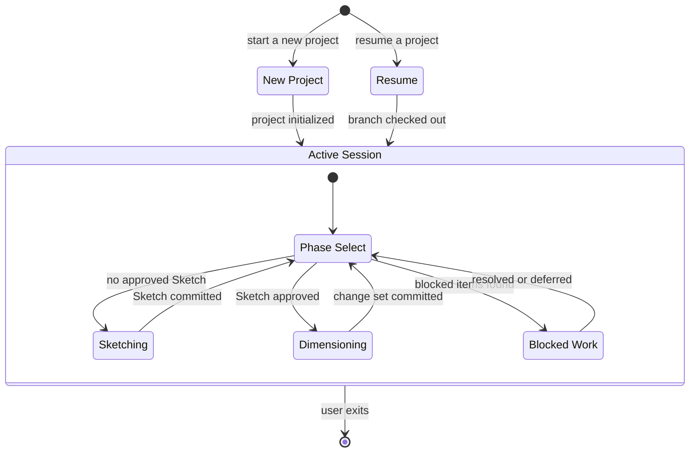

# ProtoBot: Drafting Table MVP User Experience

> Design document — draft, September 2026
>
> Defines the stable interaction contract for the first local
> Drafting Table during Sketching and Dimensioning. This document
> describes UX semantics that any Drafting Table implementation must
> satisfy. It does not prescribe TUI layout, keybindings, or visual
> design.

**Contents:**

- [Purpose and scope](#purpose-and-scope)
- [State categories](#state-categories)
- [Session lifecycle](#session-lifecycle)
- [Sketching interactions](#sketching-interactions)
- [Dimensioning interactions](#dimensioning-interactions)
- [Requirement proposals and gap surfacing](#requirement-proposals-and-gap-surfacing)
- [Impact review and approval](#impact-review-and-approval)
- [Blocked-work resolution](#blocked-work-resolution)
- [Job Site status](#job-site-status)
- [Authoritative mutation ownership](#authoritative-mutation-ownership)
- [Representative transcript](#representative-transcript)
- [Out-of-scope decisions](#out-of-scope-decisions)
- [Related Documents](#related-documents)

---

## Purpose and scope

This document answers the question posed by issue #28: _What stable
interaction contract does the first local OpenCode Drafting Table
expose during Sketching and Dimensioning?_

It defines:

- how a user starts, resumes, and exits a session;
- how artifacts and conversation are presented;
- how the agent proposes requirements and surfaces gaps;
- how impact review, approval, and revision work;
- how blocked work items are surfaced and resolved;
- how Job Site status is displayed; and
- which system owns each authoritative mutation.

The contract is defined for the **single-player TUI** first. Web
presentation and push notifications are future implementations
that share the same Specification Toolkit and Validation Rules but
differ in hosting, session management, and notification delivery
(see [out-of-scope decisions](#out-of-scope-decisions)).

### Relationship to sibling contracts

This document defines _what the user sees and decides_. Adjacent
contracts define _how_ the underlying systems respond:

- **#30** (`ears-manager` CLI integration) defines the governed
  command/result boundary for specification reads and writes.
- **#33** (OpenCode Specification Toolkit adapter) defines skill
  discovery, tool permissions, and the harness-specific adapter
  layer.
- **#34** (single-player Git integration) defines branch, commit,
  and PR behavior for turning governed changes into reviewable Git
  history.

This UX contract references those integration points without
prescribing their internal details.

---

## State categories

The Drafting Table works with three distinct categories of state.
Conflating them produces the confusion the architecture documents
warn against: mutable workflow markers on immutable specification
records, or conversation ephemera treated as authoritative.

### Draft conversation state

Ephemeral, session-scoped state owned by the agent harness.

- The conversation history between user and agent.
- The agent's in-progress reasoning, clarifying questions, and
  unsaved proposals.
- Suggestions the user has not yet accepted or rejected.

This state lives in the harness process (OpenCode's conversation
context). It is not persisted to Git or the WMS as a resumption
point. If the session ends without the user committing, draft
conversation state is lost. The committed specification state
and the change-set branch are the resumption points, not the
conversation.

However, the session emits structured trace data (replayable
inputs, outputs, and decision records) for component-level
evaluability, as required by the Architecture
([`docs/architecture.md`](../architecture.md#specification-toolkit),
[`docs/architecture/overview.md`](overview.md#build-for-evaluability-from-day-one)).
Traces are a record of what happened, not a resumption
mechanism. The trace format is an open design question
([`docs/architecture.md`, lines
196–200](../architecture.md#specification-toolkit)).
Whether the user is informed that their session is recorded is
a UX decision deferred to the Specification Toolkit adapter
(#33).

### Authoritative Git specification state

Durable, versioned state owned by `ears-manager` and persisted
in the project's Git repository.

- Approved specifications on `main`: Vision, Architecture,
  interface definitions, EARS requirements, and approved
  change-set manifests.
- In-progress specifications on contributor/change-set branches:
  proposed requirements, interface changes, and draft change-set
  manifests that have not yet been reviewed and merged.

Every mutation to this state goes through `ears-manager`
(governed by #30). The Drafting Table never writes specification
files directly. `ears-manager check` validates well-formedness
as a CI gate before merge.

### WMS lifecycle state

Durable, external state owned by the WMS Adapter and persisted
in the configured WMS backend.

- Build work-item records: pipeline phase, blocked/ready status,
  owner, dependencies, and fencing tokens.
- Request backlog: intent, rationale, business priority,
  refinement state, and typed relationships.

Every mutation to this state goes through the WMS Adapter API
(governed by Validation Rules). The Drafting Table reads this
state for display and blocked-work surfacing; it submits
reviewed resolutions but does not directly modify work-item
fields.

---

## Session lifecycle



### Starting a new project

The user starts a new project by providing an initial description
or IdeaBot artifacts. The Drafting Table:

1. Initializes the `.protobot/` control namespace through
   `ears-manager` (project identity, artifact paths, schema
   version). The entry point and initialization subcommand
   are implementation details defined by the harness and
   `ears-manager` CLI contract (#30), not by this UX
   contract.
2. Creates a contributor branch for the initial Sketch.
3. Enters the Sketching phase.

If IdeaBot artifacts are provided, the agent uses them to seed
the Vision and Architecture proposals. The handoff is manual:
the user pastes or references IdeaBot output in the
conversation. Automated integration is a future capability.

### Resuming an existing session

On session start, the Drafting Table:

1. Identifies the project from `.protobot/project.yaml` in the
   working tree.
2. Queries the WMS Adapter for blocked work items and pending
   requests.
3. If blocked items exist, presents them before entering the
   main workflow (see
   [blocked-work resolution](#blocked-work-resolution)).
4. Detects in-progress branches and offers to resume or start a
   new change set.

The resumption point is the committed specification state on the
branch, not the previous conversation. The agent reads the
current branch content through `ears-manager` and reconstructs
context from the specification artifacts, not from stored
conversation history.

### Exiting a session

The user can exit at any time. The Drafting Table:

- Warns if there are uncommitted specification changes in the
  working tree (changes written through `ears-manager` but not
  yet committed to the branch).
- Does not prevent exit. Uncommitted changes remain in the
  working tree for the next session.
- Does not auto-commit. The user explicitly decides when to
  commit and when to open a PR.

---

## Sketching interactions

Sketching produces the Sketch artifact: a Vision statement and
an Architecture that enumerates external interfaces and their
types. The interaction follows the sequence defined in
[user-interaction-flow.md, Phase 1](user-interaction-flow.md#phase-1-sketching).

### Interaction pattern

The agent drives the conversation through a structured elicitation:

1. **Intent capture.** The agent asks the user to describe what
   they want to build. Free-form input is accepted. The agent
   parses intent, identifies scope, and asks clarifying questions
   about audience, constraints, and boundaries.

2. **Vision proposal.** The agent proposes a Vision statement
   (what, who, why) and presents it for review. The user may:
   - **Approve** the Vision as proposed.
   - **Revise** by providing corrections or additions. The agent
     incorporates feedback and re-presents.
   - **Reject** and restart the Vision from a different angle.

3. **Architecture proposal.** The agent proposes an Architecture
   enumerating external interfaces, persistent state, and
   environmental constraints. The user reviews each section. The
   agent surfaces unstated assumptions and asks about boundaries
   (see [Architecture guidance][arch-guidance]).

4. **Sketch commit.** When the user approves both Vision and
   Architecture, the agent writes them through `ears-manager
   artifact put` and commits them to the branch. The Sketch is
   now the baseline for Dimensioning.

### Artifact presentation

The agent presents proposed artifacts inline in the
conversation. For Vision and Architecture, the full text is
shown. The user reviews the rendered content, not raw YAML or
file paths. The agent highlights changes from the previous
version when revising.

### Exit criteria

Sketching is complete when the user has approved a Vision
statement and an Architecture that enumerates all external
interfaces and their types. The agent confirms exit criteria are
met before transitioning to Dimensioning.

---

## Dimensioning interactions

Dimensioning produces the Schematic: approved EARS requirements
for each interface identified in the Architecture. This is the
primary human review boundary. The interaction follows the
sequence defined in
[user-interaction-flow.md, Phase 2][phase2].

### Change-set workflow

Every Dimensioning session operates on a **change set** — a
proposed specification transaction. The workflow:

1. **Open a change set.** The agent creates a change set via
   `ears-manager change-set create`, recording the base
   specification commit, intent, and affected scope.

2. **Identify affected scope.** The agent determines which
   interfaces and scopes the requested change affects, based on
   the user's description and the current Architecture.

3. **Propose requirements.** The agent proposes EARS
   requirements for the affected scope. Each requirement follows
   one of the six EARS patterns. The agent presents requirements
   one at a time or in small groups for review.

4. **User review cycle.** For each proposed requirement, the
   user may:
   - **Accept** the requirement as proposed.
   - **Modify** the requirement text or metadata. The agent
     re-presents the revised version.
   - **Reject** the requirement with rationale.

5. **Gap surfacing.** The agent proactively surfaces unspecified
   behaviors (see
   [requirement proposals and gap
   surfacing](#requirement-proposals-and-gap-surfacing)).

6. **Impact analysis.** The agent runs `ears-manager impact` and
   presents the results for review (see
   [impact review and approval](#impact-review-and-approval)).

7. **Change-set commit.** When the user approves the complete
   change set (changed requirements plus impact dispositions),
   the agent commits all artifacts to the branch.

8. **PR preparation.** The agent opens a PR against `main` (or
   prepares one for the user to open in single-player mode). The
   PR contains the change-set manifest, new/revised requirement
   files, and any interface changes.

### Requirement presentation

When presenting a proposed requirement, the agent shows:

- The EARS pattern type (ubiquitous, event-driven, state-driven,
  optional feature, unwanted behavior, or complex).
- The requirement text in EARS format.
- The `applies_to` metadata: which interfaces and scopes.
- The verification mode (isolated-interface by default;
  implementation-aware with rationale if needed).
- The provenance (user-authored or agent-suggested).

The agent does not show internal `ears-manager` metadata
(file paths, raw YAML structure) unless the user requests it.
The presentation focuses on the requirement's meaning, not its
storage representation.

### Multi-interface navigation

When a project has multiple interfaces, the agent presents a
summary of which interfaces have been dimensioned and which
remain. The user may:

- Continue with the current interface.
- Switch to a different interface.
- Review the overall progress across all interfaces.

The agent tracks which interfaces have requirements and which
have gaps, using `ears-manager list` to query the current state.
Interface ordering is a user choice, not enforced by the system
(see [Q3](open-questions.md#q3-multi-interface-orchestration)).

---

## Requirement proposals and gap surfacing

The agent must aggressively surface specification gaps during
Dimensioning. Once the autonomous Building phase begins, the
agent fills unspecified behaviors with its own assumptions —
and those assumptions become invisible de facto contracts (the
Hyrum's Law problem observed in IdeaBot; see
[related-work.md](related-work.md#ideabot-hermes-pipeline)).

### Proposal types

The agent produces two types of proposals:

1. **Direct requirement proposals.** The agent translates the
   user's intent into EARS requirements. These are
   _user-authored_ in provenance: the user provided the intent,
   the agent structured it.

2. **Gap-closing suggestions.** The agent identifies behaviors
   the user has not specified and proposes requirements to cover
   them. These are _agent-suggested (interactive)_ in
   provenance. Common gap categories:

   - **Error handling.** "What should happen when the API
     returns a 500?" "What if the file does not exist?"
   - **Boundary conditions.** "What is the maximum input
     length?" "What happens with an empty list?"
   - **State transitions.** "What happens if the user cancels
     mid-operation?" "What if the connection drops?"
   - **Security.** "Should this endpoint require
     authentication?" "What about input validation?"
   - **Concurrency.** "What if two users modify the same
     resource simultaneously?"

### Gap surfacing UX

The agent surfaces gaps inline during the Dimensioning
conversation. For each gap:

1. The agent describes the unspecified behavior clearly:
   _"The current requirements do not specify what happens
   when the user submits an empty form."_

2. The agent proposes a requirement to cover it, using the
   appropriate EARS pattern.

3. The user responds with one of:
   - **Accept** the proposed requirement (possibly with
     modifications).
   - **Declare out of scope** with rationale. The agent
     records the out-of-scope declaration in the change-set
     manifest so the decision is traceable and does not
     resurface in future sessions.
   - **Defer** to a future change set. The agent records the
     gap as a known open item without blocking the current
     change set.

This addresses [Q1](open-questions.md#q1-spec-gap-surfacing-ux)
for the TUI implementation. The interaction pattern is inline
suggestions within the conversation flow, not a separate gap
report.

### Exhaustive surfacing loop

The agent continues surfacing gaps until the interface is fully
specified for the current change set's scope. The loop:

```text
repeat
    agent proposes requirement or surfaces gap
    user accepts, modifies, rejects, or declares out of scope
until no further gaps identified for affected scope
```

The agent signals when it believes the scope is fully covered
and asks the user for confirmation before proceeding to impact
analysis. The user may identify additional requirements the
agent missed.

---

## Impact review and approval

After the user has reviewed all proposed and gap-closing
requirements, the agent runs impact analysis to identify
unchanged requirements that constrain the implementation of the
change set.

### Impact analysis flow

1. **Deterministic analysis.** The agent invokes
   `ears-manager impact`, which generates a conservative list of
   potentially applicable requirements based on interface and
   scope intersections plus explicit requirement relationships.

2. **Semantic supplement.** The agent examines the change set
   semantically and may add candidates that metadata alone cannot
   find. The agent explains why each additional candidate may be
   applicable.

3. **Presentation.** The agent presents the full impact
   assessment: changed requirements (the normative delta) and
   applicable requirement candidates. For each candidate, the
   agent shows:
   - The requirement text and its interface/scope.
   - Why it was flagged (mechanical intersection or semantic
     analysis).
   - The agent's recommendation (applicable or not applicable).

4. **User disposition.** For each impact candidate, the user
   records a disposition:
   - **Applicable** — this unchanged requirement constrains the
     implementation of the change set. It becomes a delivery
     obligation.
   - **Not applicable** — this requirement does not constrain
     the change set, with rationale. The exclusion is recorded
     so the same false positive does not recur.

5. **Approval.** The user approves the complete change set:
   changed requirements plus all impact dispositions. The agent
   confirms what will be committed:
   - The number of added, revised, and retired requirements.
   - The number of applicable requirements.
   - Whether implementation work is required.

6. **Commit and PR.** On approval, the agent commits all
   artifacts to the branch via `ears-manager` and Git
   operations (governed by #30 and #34). In multi-player and
   web modes, the agent prepares a PR for reviewer merge;
   branch protection on `main` prevents direct pushes. In
   single-player mode, the user may push directly to `main`
   or open a self-reviewed PR.

7. **Post-merge materialization.** After the change set lands
   on `main` (via reviewer merge or single-player push), a
   registration hook calls the Job Site materializer with the
   change-set ID, merge commit, and materialization key
   ([`components.md`, multi-player
   workflow](components.md#multi-player-workflow)). The
   materializer constructs the contract and calls the WMS
   Adapter's idempotent create-or-return operation.
   Materialization produces exactly one build work item
   ([`architecture.md`, control-flow
   invariants](../architecture.md#data-and-control-flow)).
   In single-player mode, a local
   `register-approved-change-set` command or hook performs
   the same materialization
   ([`components.md`, single-player
   mode](components.md#single-player-mode)). The user sees
   confirmation that the work item was created (or already
   existed). This is the moment when their approved change
   set becomes autonomous work.

### Revision after impact

If the impact analysis reveals that the change set's scope is
broader than intended, the user may:

- Remove requirements from the change set to narrow scope.
- Split the change set into smaller units (each requiring its
  own impact assessment).
- Add requirements to address newly discovered obligations.

The agent re-runs impact analysis after any scope change.

---

## Blocked-work resolution

When the autonomous Building or Inspecting phase discovers
undefined behavior, it blocks the affected work item and
escalates to the user. The Drafting Table surfaces these
blocked items so the user can resolve them.

### Notification model

The TUI Drafting Table uses a **pull model**: on session start,
the agent queries the WMS Adapter for blocked work items and
presents them. There is no push notification within the TUI
session.

For urgency between sessions, external notification channels
(email, Slack, webhook) can alert the user that something needs
attention. The TUI itself is not the notification mechanism
(see [Q2](open-questions.md#q2-async-requirement-suggestion-delivery)).

### Blocked-work presentation

On session start, if blocked items exist, the agent presents a
summary before entering the main workflow:

```text
You have 2 work items blocked on specification questions:

1. WI-042 "Add config UI" — blocked on undefined behavior:
   "No requirement specifies what happens when the user
   submits invalid YAML in the config editor."

2. WI-067 "CLI help output" — blocked on omitted applicable
   requirement: "REQ-CLI-003 (all subcommands provide --help)
   was not included in the impact assessment."

Resolve now, or continue with other work?
```

For each blocked item, the agent shows:

- The work-item identifier and description.
- The blocking reason: undefined behavior, omitted applicable
  requirement, specification question, policy question, or
  reconciliation failure
  ([`components.md`, work-item
  lifecycle](components.md#work-item-lifecycle-states)).
- The relevant requirement context.

### Resolution options

The user resolves a blocked item by choosing one of:

1. **Add a requirement.** The user enters a Dimensioning
   session to create a linked change set that covers the
   undefined behavior. The change set follows the standard
   Dimensioning workflow (propose, review, impact, approve,
   commit). The blocked work item depends on the resulting
   build work item when implementation is required.

2. **Approve an out-of-scope declaration.** The user confirms
   that the undefined behavior is explicitly out of scope. The
   declaration is recorded in the specification (via
   `ears-manager`) and becomes part of the approved Schematic.
   Independent Inspectors must confirm the exclusion boundary
   before the finding is resolved.

3. **Amend the impact assessment.** For omitted applicable
   requirements, the user reviews the omission and records the
   missing requirement as applicable. The change set is amended
   with the new disposition and a new contract version is
   created.

4. **Defer.** The user acknowledges the blocked item but
   chooses to work on something else first. The item remains
   blocked in the WMS.

5. **Acknowledge an informational block.** For
   reconciliation failures and policy questions, the
   control plane resolves the underlying condition (e.g.,
   a conflicting merge is retried or a policy exception is
   granted). The Drafting Table displays these items as
   informational: the user sees why the item is blocked but
   cannot resolve it through a specification change. The
   item returns to `ready-for-building` when the control
   plane clears the condition.

After resolution, the control plane reruns eligibility checks
and refreshes the work-item contract. The item returns to
`ready-for-building` only if all checks pass.

---

## Job Site status

The Drafting Table displays work-item status from the WMS so
the user has visibility into what the Job Site is doing.

### Status display

The agent can show a summary of active work items on request:

```text
Job Site status:

  WI-041 "Auth API"        completed   (merged 2026-09-08)
  WI-042 "Config UI"       blocked     (undefined behavior)
  WI-043 "CLI scaffolding" building    (cycle 2, tests failing)
  WI-044 "REST endpoints"  waiting     (depends on WI-043)
```

For each item, the display includes:

- Work-item identifier and short description.
- Current pipeline phase (`waiting`, `ready-for-building`,
  `building`, `inspecting`, `blocked`, `merging`, `completed`,
  or `abandoned`).
- A brief status note (blocking reason, cycle count, dependency,
  or completion date).

### Status scope

The Drafting Table reads status from the WMS Adapter. It does
not modify work-item state, dispatch work, or interact with the
Job Site control plane. The Job Site pulls work autonomously;
the Drafting Table provides visibility, not control.

The user may request detailed status for a specific work item
(the agent queries the WMS Adapter by ID) but cannot alter the
Job Site's scheduling decisions. Business priority is the only
user-modifiable field, and only an authorized maintainer may
change it.

---

## Authoritative mutation ownership

Every authoritative mutation in the Drafting Table is owned by
a specific system. The agent proposes; the user decides; the
owning system persists.

| Mutation | Owning system | Approval boundary |
| --- | --- | --- |
| Create/revise/retire a requirement | `ears-manager` | User accepts the proposed requirement in conversation; `ears-manager` validates and writes to the working tree. |
| Register an interface | `ears-manager` | User approves the interface definition; `ears-manager` writes the record. |
| Write Vision or Architecture artifact | `ears-manager` (artifact put) | User approves the artifact content; `ears-manager` writes and registers it. |
| Create or update a change set | `ears-manager` | Agent creates the manifest; user approves the complete change set before commit. |
| Record impact disposition | `ears-manager` | User records applicable/not-applicable for each candidate; persisted in the change-set manifest. |
| Record out-of-scope declaration | `ears-manager` | User approves the declaration; `ears-manager` persists it in the specification. |
| Commit specification changes | Git (via harness) | User explicitly requests commit. The agent stages `ears-manager` outputs and commits to the branch (#34). |
| Open or update a PR | Git host API (via harness) | User explicitly requests PR creation or update. |
| Create or refine a request | WMS Adapter | User provides intent and rationale; the adapter persists the request record. |
| Transition a work-item state | WMS Adapter (via Validation Rules) | Transitions happen at the WMS write boundary with Validation Rules enforcement. The Drafting Table submits reviewed resolutions; it does not directly set work-item fields. |
| Register approved change set and materialize build work item | Job Site Materializer (via WMS Adapter) | Triggered by a registration hook (multi-player merge or single-player local command). The materializer resolves the manifest, reruns deterministic impact analysis, and calls the WMS Adapter's idempotent create-or-return operation ([`components.md`](components.md#multi-player-workflow)). |
| Update business priority | WMS Adapter | Authorized maintainer only. The Drafting Table surfaces the action; Validation Rules enforce authorization. |

### What the agent may _not_ do

The agent operates through governed tools. It cannot:

- Write specification files directly (bypassing `ears-manager`).
- Modify work-item state without going through the WMS Adapter's
  validated boundary.
- Commit or push without explicit user action.
- Approve its own suggestions — every specification delta
  requires user confirmation.

These constraints are enforced structurally: branch protection
(multi-player and web modes), `ears-manager check` as a CI
gate, path ownership in CI, credential isolation through the
Alcove Bridge/Gate pattern
([`components.md`](components.md#authentication-and-credential-isolation)),
and optionally harness-level tool permissions (#33). The agent
never holds a real credential: in hosted modes, Bridges
pre-fetch tokens and Gates inject them at the mutation
boundary; in single-player mode, the user's own Git host
token is used with no OAuth 2.1 infrastructure required
([`architecture.md`, deployment
topology](../architecture.md#pluggable-boundaries)).

---

## Representative transcript

The following transcript demonstrates a Dimensioning session
for a CLI interface. It shows user decisions, agent
suggestions, gap surfacing, impact review, and approval. This
is a representative fixture, not a prescriptive script — the
agent adapts to the user's input and pace.

### Session start

```text
Agent: Welcome back. Project "protobot" detected from
       .protobot/project.yaml.

       Checking for blocked work items...
       No blocked items found.

       You have an in-progress branch
       "cs/add-cli-help-requirements" with 2 uncommitted
       requirements. Resume this work, or start a new
       change set?

User:  Resume.

Agent: Resuming change set CS-005 on branch
       "cs/add-cli-help-requirements".

       Change set intent: "Add --help requirements for
       ears-manager subcommands."

       Current state:
       - 2 requirements added (REQ-CLI-004, REQ-CLI-005)
       - 0 revised, 0 retired
       - Affected interface: ears-manager CLI
       - Impact analysis not yet run

       REQ-CLI-004 and REQ-CLI-005 cover "requirement add"
       and "requirement list". Shall I continue proposing
       --help requirements for each remaining ears-manager
       subcommand?

User:  Yes, continue.
```

### Requirement proposal and acceptance

```text
Agent: Proposed requirement for "requirement show":

       ID: REQ-CLI-006
       Type: event-driven
       Text: "When the user invokes 'ears-manager
       requirement show' with the '--help' flag, the
       ears-manager CLI shall display a usage summary
       that includes the subcommand purpose, required
       arguments, optional flags, and at least one
       example invocation."
       Applies to: ears-manager CLI
       Scope: help-output
       Verification: isolated-interface

       Accept, modify, or reject?

User:  Accept.

Agent: REQ-CLI-006 written via ears-manager.

       Next: "requirement update". Proposed requirement:

       ID: REQ-CLI-007
       Type: event-driven
       Text: "When the user invokes 'ears-manager
       requirement update' with the '--help' flag, the
       ears-manager CLI shall display a usage summary
       that includes the subcommand purpose, required
       arguments, optional flags, and at least one
       example invocation."
       Applies to: ears-manager CLI
       Scope: help-output
       Verification: isolated-interface

       Accept, modify, or reject?

User:  Modify. The text should also mention that the help
       output must describe the change-set requirement for
       update operations.

Agent: Revised requirement:

       ID: REQ-CLI-007
       Type: event-driven
       Text: "When the user invokes 'ears-manager
       requirement update' with the '--help' flag, the
       ears-manager CLI shall display a usage summary
       that includes the subcommand purpose, required
       arguments, optional flags, at least one example
       invocation, and a note that update operations
       require an active change set."
       Applies to: ears-manager CLI
       Scope: help-output
       Verification: isolated-interface

       Accept, modify, or reject?

User:  Accept.
```

### Gap surfacing

```text
Agent: I've proposed --help requirements for each
       ears-manager subcommand. Before running impact
       analysis, I want to surface a potential gap:

       The current requirements specify what --help output
       must contain, but they do not specify what happens
       when a user invokes a subcommand with an
       unrecognized flag.

       Proposed gap-closing requirement:

       ID: REQ-CLI-018
       Type: unwanted-behavior
       Text: "If the user provides an unrecognized flag to
       any ears-manager subcommand, then the ears-manager
       CLI shall exit with a non-zero status code and
       display a diagnostic message that names the
       unrecognized flag and suggests '--help'."
       Applies to: ears-manager CLI
       Scope: error-handling
       Verification: isolated-interface
       Provenance: agent-suggested (interactive)

       Accept, modify, reject, or declare out of scope?

User:  Accept.

Agent: REQ-CLI-018 written.

       One more gap: the requirements do not specify the
       exit code value for --help itself. Some CLIs use
       exit 0 for --help; others use exit 1.

       Proposed gap-closing requirement:

       ID: REQ-CLI-019
       Type: event-driven
       Text: "When the user invokes any ears-manager
       subcommand with the '--help' flag, the
       ears-manager CLI shall exit with status code 0."
       Applies to: ears-manager CLI
       Scope: help-output
       Verification: isolated-interface
       Provenance: agent-suggested (interactive)

       Accept, modify, reject, or declare out of scope?

User:  Accept.

Agent: REQ-CLI-019 written. No further gaps identified for
       this scope. Ready to run impact analysis?

User:  Yes.
```

### Impact analysis and approval

```text
Agent: Running ears-manager impact...

       Impact analysis complete. Changed set: 13
       requirements added. Applicable candidates: 2.

       Candidate 1 (mechanical):
         REQ-CLI-001: "The ears-manager CLI shall provide
         a top-level '--version' flag that displays the
         current binary version and exits with status
         code 0."
         Reason: shares interface "ears-manager CLI" and
         scope "help-output" — the --help and --version
         flags interact in the same flag-parsing path.
         Recommendation: applicable.

       Candidate 2 (mechanical):
         REQ-CLI-003: "The ears-manager CLI shall display a
         top-level usage summary when invoked with no
         subcommand."
         Reason: shares interface "ears-manager CLI" —
         the top-level help and per-subcommand help must
         be consistent.
         Recommendation: applicable.

       For each candidate, confirm applicable or not
       applicable with rationale.

User:  Candidate 1: applicable. Candidate 2: applicable.

Agent: Impact dispositions recorded.

       Change set CS-005 summary:
       - 13 requirements added
       - 0 revised, 0 retired
       - 2 applicable requirements
       - Implementation required: yes

       Approve this change set for commit?

User:  Approved.

Agent: Committed change set CS-005 to branch
       "cs/add-cli-help-requirements".

       Files committed:
       - .protobot/change-sets/cs-005.yaml
       - specs/requirements/req-cli-004.yaml through
         req-cli-014.yaml (11 subcommand files)
       - specs/requirements/req-cli-018.yaml and
         req-cli-019.yaml (2 gap-closing files)

       Open a PR against main?

User:  Yes.

Agent: PR #72 opened: "Add --help requirements for
       ears-manager subcommands."
```

---

## Out-of-scope decisions

The following are explicitly out of scope for this MVP UX
contract. They are listed here so the decisions are traceable
and do not silently resurface.

| Decision | Rationale |
| --- | --- |
| Web Drafting Table UX | The web implementation shares the Specification Toolkit but has its own session management, authentication, and push notification model. Its UX contract is a separate deliverable. |
| Push notifications in the TUI | The TUI uses a pull model on session start. External notification channels (email, Slack) are a deployment concern, not a TUI UX concern ([Q2](open-questions.md#q2-async-requirement-suggestion-delivery)). |
| `ears-manager` command/result shapes | Defined by #30, not this document. This contract references `ears-manager` operations by name; #30 defines their request and result structures. |
| Specification Toolkit adapter internals | Defined by #33. This contract describes what the user sees; #33 defines how the Toolkit integrates with the OpenCode harness. |
| Git commit and branch behavior | Defined by #34. This contract describes when the user decides to commit; #34 defines the branch naming, commit content, and PR mechanics. |
| Request backlog refinement UX | The request-to-change-set refinement flow is described in [user-interaction-flow.md](user-interaction-flow.md#request-backlog-and-refinement). A detailed UX contract for the refinement interactions may be a follow-up deliverable. |
| Multi-player review ceremony | Multi-player mode adds reviewer merge as the approval gate. The UX difference is ceremony (PR review instead of direct push), not the interaction contract defined here. |
| Kit import UX | Kit discovery, import, and policy review are future capabilities. |
| True-bug intake and change-type classification | True-bug intake is an external entry point ([`architecture.md`, interface #8](../architecture.md#external-interfaces)) that skips Sketching and Dimensioning and enters Building directly ([`user-interaction-flow.md`](user-interaction-flow.md#request-backlog-and-refinement)). The classification that routes a request as _undefined_, _changes_, or _contradicts_ is part of backlog refinement ([`architecture.md`, Drafting Table](../architecture.md#drafting-table)). Both require their own UX contracts; this document covers only the Sketching and Dimensioning interactions. |
| Conversation persistence across sessions | Session continuity relies on committed specification state, not conversation history transfer. Whether conversation context should persist is an open question for the Specification Toolkit adapter (#33). |

---

## Related Documents

- [Vision](../vision.md) — Purpose, intended users, desired
  outcomes, prototype scope, and non-goals.
- [Architecture](../architecture.md) — External interface
  inventory, pluggable boundaries, persistent state,
  environmental constraints, and Drafting Table boundary.
- [Overview](overview.md) — Guiding principles, EARS format,
  workflow, and platform.
- [System Components](components.md) — Component architecture,
  interfaces, and cross-cutting concerns.
- [User Interaction Flow](user-interaction-flow.md) — Phase
  details, sequence diagrams, and testing strategy.
- [Open Design Questions](open-questions.md) — Unresolved
  design questions across all areas.
- [Related Work](related-work.md) — Internal and external
  projects informing the design.

[arch-guidance]: user-interaction-flow.md#what-belongs-in-the-architecture
[phase2]: user-interaction-flow.md#phase-2-dimensioning
