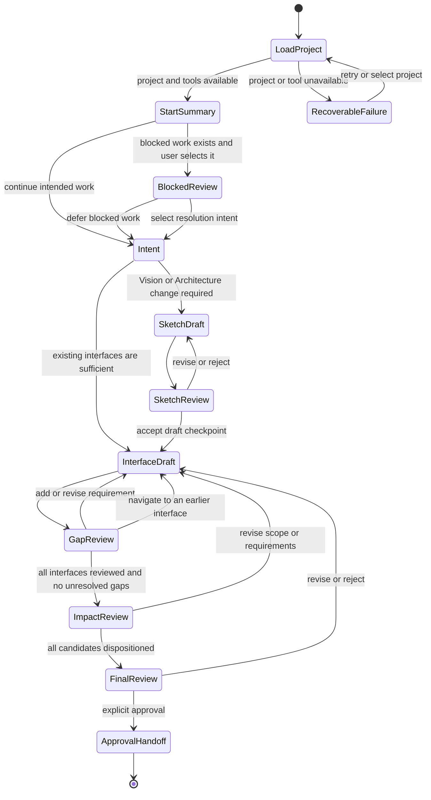

# ProtoBot: Drafting Table MVP User Experience

> Design document — draft, September 2026
>
> Defines the stable interaction semantics for the first local OpenCode
> Drafting Table during Sketching and Dimensioning.

**Contents:**

- [Purpose and Scope](#purpose-and-scope)
- [Design Principles](#design-principles)
- [State Categories and Ownership](#state-categories-and-ownership)
- [Session Lifecycle and Interaction Model](#session-lifecycle-and-interaction-model)
- [Sketching Interactions](#sketching-interactions)
- [Dimensioning Interactions](#dimensioning-interactions)
- [Requirement Proposals and Gap Surfacing](#requirement-proposals-and-gap-surfacing)
- [Impact Review and Approval](#impact-review-and-approval)
- [Blocked-Work Resolution](#blocked-work-resolution)
- [Job Site Status](#job-site-status)
- [Authoritative Mutation Boundaries](#authoritative-mutation-boundaries)
- [Failure Behavior](#failure-behavior)
- [Representative Transcript](#representative-transcript)
- [Acceptance Evidence](#acceptance-evidence)
- [Decisions](#decisions)
- [Out-of-Scope Decisions](#out-of-scope-decisions)
- [Related Documents](#related-documents)

---

## Purpose and Scope

This document answers the question posed by issue #28: _What stable
interaction contract does the first local OpenCode Drafting Table expose
during Sketching and Dimensioning?_

It defines:

- how a user starts, resumes, and exits a session;
- how artifacts, requirements, and conversation are presented;
- how the agent proposes requirements and surfaces gaps;
- how impact review, final review, approval, and revision work;
- how blocked work items are surfaced and resolved;
- how Job Site status is displayed;
- how failures, stale state, and tool errors are handled; and
- which system owns each authoritative mutation.

The contract is defined for the **single-player TUI** first. Web presentation
and push notifications are future implementations that share the same
Specification Toolkit and Validation Rules but differ in hosting, session
management, and notification delivery (see
[Out-of-Scope Decisions](#out-of-scope-decisions)).

### Relationship to sibling contracts

This document defines _what the user sees and decides_. Adjacent contracts
define _how_ the underlying systems respond:

- **#30** (`ears-manager` CLI integration) defines the governed command and
  result boundary for specification reads and writes. See the
  [`ears-manager` CLI Integration Contract](ears-manager-cli.md).
- **#31** ([Drafting Table WMS Integration](drafting-table-wms.md)) defines
  the exact WMS Adapter operations and result shapes for Drafting Table use.
- **#32** ([Validation Rules](validation-rules.md)) defines lifecycle
  validation and rejection schemas.
- **#33** ([Agent Harness Adapter Contract](agent-harness/adapter-contract.md),
  with the [OpenCode](agent-harness/opencode.md),
  [Claude Code](agent-harness/claude-code.md), and
  [Codex](agent-harness/codex.md) bindings) defines skill discovery, tool
  permissions, and the harness adapter layer, and records where a
  harness sandbox makes the user run a step the agent would.
- **#34** (single-player Git integration) defines branch, commit, and PR
  behavior for turning governed changes into reviewable Git history.
- **#125** ([Source Control Manager](source-control-manager.md)) performs
  those Git and PR operations when the user asks for a commit or a PR.

This UX contract coordinates these integration points without prescribing
their internal details.

---

## Design Principles

### Stable semantics, flexible presentation

The contract defines states, information that must be presented, choices that
must be available, and the effects of each choice. It does not require exact
prompt text, terminal colors, key bindings, or a particular message layout.
Another compatible harness can implement the same protocol without copying
OpenCode's presentation.

### Explicit checkpoints

The interaction uses checkpoints at which the user can review, revise, reject,
or approve a coherent artifact. The agent may converse freely inside a
checkpoint, but it must not infer approval from silence, topic changes, or
acceptance of an individual suggestion.

### Authoritative state over conversation memory

Conversation history helps the agent communicate but is not a source of truth.
A session can resume from Git specification state, the active proposed change
set, and WMS records. If rationale matters after a session, it must be recorded
in a governed artifact or WMS record rather than existing only in the
conversation.

### Structural mutation boundaries

The agent proposes and presents decisions. Authoritative mutations occur only
through the system that owns the state: `ears-manager` for registered
specification artifacts, Git, through the Source Control Manager, for
reviewed repository history, and the WMS Adapter for request and build-work
lifecycle state.

### TUI-first and local

All required acceptance evidence must run in a local session with local
repositories and fake or local tool boundaries. The MVP requires neither a
web UI nor a hosted session-state or notification service.

---

## State Categories and Ownership

The Drafting Table works with three distinct categories of state. Conflating
them produces the confusion the architecture documents warn against: mutable
workflow markers on immutable specification records, or conversation
ephemera treated as authoritative.

### Draft conversation state

Ephemeral, session-scoped state owned by the agent harness:

- The conversation history between user and agent.
- The agent's in-progress reasoning, clarifying questions, and unsaved
  proposals.
- Suggestions the user has not yet accepted or rejected.

This state lives in the harness process (OpenCode's conversation context). It
is not persisted to Git or the WMS as a resumption point. If the session ends
without the user committing, draft conversation state is lost. The committed
specification state and the change-set branch are the resumption points, not
the conversation.

However, the session emits structured trace data (replayable inputs, outputs,
and decision records) for component-level evaluability, as required by the
Architecture ([`docs/architecture.md`](../architecture.md#specification-toolkit)
and [`overview.md`](overview.md#build-for-evaluability-from-day-one)).
Traces are a record of what happened, not a resumption mechanism. The trace
format is an open design question
([`docs/architecture.md`](../architecture.md#specification-toolkit)).
Whether the user is informed that their session is recorded is a UX decision
deferred to the Specification Toolkit adapter (#33).

### Authoritative Git specification state

Durable, versioned state owned by `ears-manager` and persisted in the project's
Git repository:

- Approved specifications on `main`: Vision, Architecture, interface
  definitions, EARS requirements, and approved change-set manifests.
- In-progress specifications on contributor/change-set branches: proposed
  requirements, interface changes, and draft change-set manifests that have
  not yet been reviewed and merged.

Every mutation to this state goes through
[`ears-manager`](ears-manager-cli.md).
The Drafting Table is not meant to write specification files directly;
the harness guard enforces this on the calls it checks, and a call
without a guard decision is limited as
[What the harness layer stops](agent-harness/adapter-contract.md#what-the-harness-layer-stops)
records.
`ears-manager check` validates well-formedness as a CI gate before merge.

### WMS lifecycle state

Durable, external state owned by the WMS Adapter and persisted in the
configured WMS backend:

- Build work-item records: pipeline phase, blocked/ready status, owner,
  dependencies, and fencing tokens.
- Request backlog: intent, rationale, business priority, refinement state,
  and typed relationships.

Every mutation to this state goes through the WMS Adapter API (governed by
Validation Rules). The Drafting Table reads this state for display and
blocked-work surfacing; it submits reviewed resolutions but does not directly
modify work-item fields.

### Detailed state ownership matrix

| State category | Owning authority | Drafting Table behavior |
| :--- | :--- | :--- |
| **Conversation messages & notes** | Local harness; ephemeral | Non-authoritative; maintained for flow but never treated as approval. |
| **Proposed spec & change sets** | Git branch via `ears-manager` | Presents & revises; does not directly edit registered spec paths on guard-checked calls. |
| **Approved specifications** | Canonical Git history | Treats approved commit as current Schematic baseline. |
| **Work items & Job Site status** | WMS via WMS Adapter | Reads for display; submits validated mutations with version checks. |
| **Lifecycle validity** | Validation Rules at WMS gate | Preflights for feedback; never overrides an authoritative rejection. |
| **Harness skills & traces** | OpenCode adapter / Toolkit | Uses adapter boundary; harness internals are outside UX contract. |
| **Web history & registry** | Future Web Drafting Table | Not required, read, or mutated by the local TUI MVP. |
| **Claims, evidence & tests** | WMS Adapter / Job Site | Displays status when linked; does not own or mutate stores. |

No conversational action directly moves a build work item, approves a
specification on `main`, or bypasses either `ears-manager` or Validation
Rules.

---

## Session Lifecycle and Interaction Model

The Drafting Table follows a checkpointed protocol. A checkpoint is a semantic
state, not necessarily a separate terminal screen.



A session models exactly one change set lifecycle from initialization through
approval handoff or exit. Processing another change set requires starting or
resuming a subsequent session.

### Protocol invariants

The protocol enforces six non-negotiable invariants:

1. **Revisable checkpoints:** The user can revise or reject at every artifact
   review checkpoint.
2. **Safe rejection:** Rejection returns to draft work without changing
   approved state.
3. **Approval gating:** Every unresolved gap or impact candidate prevents final
   approval.
4. **Draft boundary:** Accepting an individual requirement or gap proposal is
   not approval of the complete change set.
5. **Exact revision binding:** Final approval is explicit and binds to the exact
   proposed change-set revision and base commit shown.
6. **Stale invalidation:** Any authoritative state change observed after a
   review invalidates that review and requires refreshed presentation and
   renewed approval.

### Starting a new project

The user starts a new project by providing an initial description or IdeaBot
artifacts. The Drafting Table:

This is the target end-to-end workflow. The EM-04 first release defers project
initialization and branch automation; its `change-set create` command records
the manifest but does not create or check out a branch. See the
[`ears-manager` CLI first-release
scope](ears-manager-cli.md#em-04-first-release-scope).

1. Creates and checks out `cs/00001-project-init` from the default branch.
2. Runs `ears-manager project init` and `change-set create` on that branch.
   See the [project initialization grammar][project-init-grammar].
3. On explicit approval, commits the control namespace and initial manifest
   and opens the pull request through the
   [Source Control Manager](source-control-manager.md). The user merges it on
   the host in single-player mode, or a reviewer does in multi-player mode,
   and registration follows.
4. Creates and checks out the contributor branch for the initial Sketch, then
   enters the Sketching phase.

If IdeaBot artifacts are provided, the agent uses them to seed the Vision and
Architecture proposals. The handoff is manual in the MVP: the user pastes or
references IdeaBot output in the conversation.

### Resuming an existing session

On session start, the Drafting Table reconstructs context from authoritative
state rather than conversation memory:

1. Identifies the project from `.protobot/project.yaml` in the working tree.
2. Reads the active branch, the default-branch head, and the pull-request state
   through the Source Control Manager's
   [`repo_state`](source-control-manager.md#repo_state), and the proposed
   change-set metadata via `ears-manager`.
3. Reads current artifact and requirement deltas through `ears-manager`.
4. Reads linked request and build-work state and versions through the WMS
   Adapter.
5. Determines the earliest incomplete checkpoint from unresolved drafts,
   gaps, impact dispositions, or validation failures.
6. Queries the WMS Adapter for blocked work items and pending requests.
7. Presents the reconstructed summary and asks the user to confirm the
   intended next action.

If no durable record supports a rationale mentioned in a lost conversation, the
agent asks again; it must not invent missing rationale.

### Exiting a session

The user can exit at any time. The Drafting Table:

- Warns if there are uncommitted specification changes in the working tree
  (changes written through `ears-manager` but not yet committed to the branch).
- Does not prevent exit. Uncommitted changes remain in the working tree for the
  next session.
- Does not auto-commit. The user explicitly decides when to commit and when to
  open a PR.

---

## Sketching Interactions

Sketching produces the Sketch artifact: a Vision statement and an
Architecture that enumerates external interfaces and their types. The
interaction follows the sequence defined in
[user-interaction-flow.md](user-interaction-flow.md#phase-1-sketching).

### Interaction pattern

The agent drives structured elicitation:

1. **Intent capture:** The agent asks the user to describe what they want to
   build. Free-form input is accepted. The agent parses intent, identifies
   scope, and asks clarifying questions about audience, constraints, and
   non-goals.
2. **Vision proposal:** The agent proposes a Vision statement (what, who,
   why, prototype boundary) and presents it for review. The user may approve,
   revise, or reject.
3. **Architecture proposal:** The agent proposes an Architecture enumerating
   external interfaces, persistent state, and environmental constraints.
4. **Sketch commit:** When the user approves both Vision and Architecture, the
   agent writes them through `ears-manager artifact put` and commits them to
   the branch. The Sketch becomes the baseline for Dimensioning.

### Architecture coverage rules

For ProtoBot projects, Architecture review must account for:

- all relevant components and interfaces from
  [`components.md`](components.md);
- all deployment topologies (single-player, multi-player, web) from
  [`overview.md`](overview.md) and [`architecture.md`](../architecture.md);
- credential isolation and environmental constraints; and
- every relevant persistent store.

The Drafting Table must surface omissions rather than silently treating an
unmentioned boundary as out of scope.

---

## Dimensioning Interactions

Dimensioning produces the Schematic: approved EARS requirements for each
interface identified in the Architecture. This is the primary human
review boundary
([user-interaction-flow.md](user-interaction-flow.md#phase-2-dimensioning)).

### Change-set workflow

Every Dimensioning session operates on a **change set** — a proposed
specification transaction:

The sequence below describes the target workflow. In the EM-04 first release,
`ears-manager change-set create` records the manifest but does not create or
check out the change-set branch; branch creation and reuse are deferred to
follow-on Git integration (see the
[`ears-manager` CLI first-release
scope](ears-manager-cli.md#em-04-first-release-scope)).

1. **Open a change set:** The agent creates a change set via
   `ears-manager change-set create`, recording base commit, intent, and scope.
2. **Identify affected scope:** The agent determines which interfaces and
   scopes the requested change affects.
3. **Sequential interface dimensioning:** The agent dimensions one affected
   interface at a time (see [Interface ordering](#interface-ordering)).
4. **Propose requirements:** The agent proposes requirements following the
   six EARS patterns.
5. **Hybrid gap surfacing:** The agent surfaces unspecified behaviors inline
   and at interface checkpoints.
6. **Impact analysis:** The agent runs `ears-manager impact` and supplements
   with semantic analysis.
7. **Final review:** The agent presents the complete aggregated change set.
8. **Approval handoff:** The user approves the exact change-set revision.

### Interface ordering

The Drafting Table dimensions **one affected interface at a time**. It presents
the ordered interface list and current progress before beginning. The user may
explicitly return to an earlier interface, but the agent does not freely
interleave unresolved proposals across multiple interfaces.

The initial ordering follows explicit dependencies when known and otherwise
uses a stable order. The MVP does not require users to author an interface
dependency graph (resolving Q3 for the local MVP).

### Requirement presentation

When presenting a proposed requirement, the agent shows:

- The requirement identifier (stable ID for a revision; proposed ID for an
  addition).
- The EARS pattern type (ubiquitous, event-driven, state-driven, optional
  feature, unwanted behavior, or complex).
- The requirement text in EARS format.
- Applicability selectors (`applies_to` interface and scope).
- Verification mode (`isolated-interface` by default; `implementation-aware`
  with rationale).
- Provenance (`user-authored` or `agent-suggested`).
- Relationships to other requirements.
- Before/after diff for revisions or retirement consequences.

The agent does not show internal storage paths or raw YAML unless requested.

---

## Requirement Proposals and Gap Surfacing

The agent must aggressively surface specification gaps during Dimensioning.
Once the autonomous Building phase begins, unspecified behaviors force agents
to substitute their own assumptions — creating invisible de facto contracts
(the Hyrum's Law hazard documented in
[`related-work.md`](related-work.md#ideabot-hermes-pipeline)).

### Proposal types

The agent produces two types of proposals:

1. **Direct requirement proposals:** The agent translates user intent into
   EARS requirements (`user-authored` provenance).
2. **Gap-closing suggestions:** The agent identifies unstated behaviors and
   proposes requirements to cover them (`agent-suggested` provenance). Common
   gap categories include error handling, boundary conditions, state
   transitions, security, and concurrency.

### Hybrid gap surfacing UX

The Drafting Table uses a **hybrid gap surfacing model** (resolving Q1):

- **Critical gaps are raised inline:** When continuing would embed an unsafe,
  contradictory, or high-impact assumption in later proposals, the agent
  intervenes immediately.
- **Candidate gaps are collected:** Non-critical gaps discovered during
  drafting are collected without disrupting conversation flow.
- **Interface-level gap checkpoint:** Before leaving an interface, the agent
  presents a complete gap summary for that interface, including gaps already
  addressed inline.

Every gap must receive one of three draft dispositions:

| Disposition | Required information | Interaction effect |
| :--- | :--- | :--- |
| **Add or revise requirement** | Resulting proposal & rationale | Returns to requirement review for that interface. |
| **Explicitly out of scope** | Observable boundary & rationale | Recorded in change set; draft until final approval. |
| **Unresolved** | Question & missing information | Preserves draft; **blocks impact & final approval**. |

### Anti-leakage rule

Deferral within a session is recorded as `unresolved`. Unlike permissive
models, **an unresolved gap strictly prevents final change-set approval**. The
user can exit and resume with unresolved gaps, but cannot approve the change
set while any gap remains unresolved. This prevents unspecified behaviors from
leaking into autonomous construction.

---

## Impact Review and Approval

After all affected interfaces pass gap review, the agent runs impact analysis
to identify unchanged requirements that constrain implementation.

### Impact analysis flow

1. **Deterministic analysis:** The agent invokes `ears-manager impact`,
   generating a conservative list of potentially applicable requirements based
   on interface/scope intersections and explicit relationships.
2. **Semantic supplement:** The agent examines the change set semantically and
   adds candidates that metadata alone cannot find, explaining why each is
   relevant.
3. **Presentation:** The agent presents changed requirements (normative delta)
   and applicable candidates, showing source, rationale, and recommendation.
4. **User disposition:** For each candidate, the user records `applicable`
   (becomes a delivery obligation) or `not-applicable` (with rationale to
   prevent recurring false positives).
5. **Scope revision:** If impact analysis reveals excessive scope, the user may
   remove requirements, split the change set, or add requirements. Any scope
   change reruns impact analysis.

### Final review checkpoint

Before approval, the Drafting Table presents one coherent final summary:

- Intent and rationale.
- Vision or Architecture changes.
- Interfaces covered and interface checkpoint statuses.
- Requirements added, revised, or retired.
- Unchanged applicable requirements.
- Explicit out-of-scope declarations.
- Unresolved gaps or impact candidates (must be zero).
- Validation results from `ears-manager check`.
- Expected implementation effect and dependencies.
- Exact proposed change-set revision and base specification commit SHA.

### Approval and post-merge materialization

1. **Explicit approval:** The user approves the exact presented revision.
   Approval cannot be inferred from silence or partial acceptances.
2. **Commit and PR:** The agent commits artifacts written via
   [`ears-manager`](ears-manager-cli.md) through the
   [Source Control Manager](source-control-manager.md) (#34, #125), then
   prepares a PR against `main` the same way. Multi-player and web modes
   require reviewer merge; single-player mode permits the contributor to merge
   their own PR without a separate reviewer.
3. **Single-player registration:** A self-merged PR still requires the local
   registration command or hook to trigger the Job Site Materializer.
4. **Post-merge materialization:** When the change set lands on `main`, the
   Job Site Materializer resolves the manifest, reruns deterministic impact
   checks, and calls the WMS Adapter to create build work items.
   - In single-player mode, confirmation is displayed synchronously upon
     successful registration.
   - In multi-player mode, confirmation is displayed on the next session start
     via pull query, reflecting asynchronous PR merge.

---

## Blocked-Work Resolution

When autonomous Building or Inspecting discovers undefined behavior, it
blocks the work item and escalates.

### Pull-on-start notification model

The TUI MVP uses a **pull-on-start model** (resolving Q2 for the local MVP):

- On every session start or resume, the agent queries the WMS Adapter for
  blocked items.
- If blocked items exist, the agent presents a summary before main work.
- The user may choose to resolve a blocked item or continue intended work.
- Unrelated work is not blocked unless the WMS reports an actual dependency.
- External push channels (email, Slack, web push) are deferred to hosted
  deployments.

### Resolution options

The user resolves blocked work by choosing one of five paths:

1. **Add a requirement:** Opens or resumes a linked Dimensioning change set to
   specify the undefined behavior.
2. **Approve an out-of-scope declaration:** Confirms the behavior is
   explicitly excluded. Recorded in the specification via `ears-manager`.
   Independent Inspector confirmation on the Job Site is still required before
   the finding clears.
3. **Amend the impact assessment:** Adds an omitted applicable requirement to
   the change set and issues a new contract version.
4. **Defer:** Leaves the work item blocked in the WMS and continues other work.
5. **Acknowledge an informational block:** For reconciliation failures or
   policy questions, the user records that the block was reviewed without a
   spec change. The acknowledgement is audit-only and leaves the item
   `blocked`; a later lifecycle resolution must use its own reviewed
   submission and the authoritative WMS transition.

Conversational choice does not unblock work. Work items transition out of
`blocked` only when an approved resolution is validated by the WMS write
boundary; acknowledgement alone never implies readiness.

---

## Job Site Status

The Drafting Table displays work-item status from the WMS for visibility.

### Status display

On request, the agent presents active work items:

```text
Job Site status:
  WI-041 "Auth API"        completed   (merged 2026-09-08)
  WI-042 "Config UI"       blocked     (undefined behavior)
  WI-043 "CLI scaffolding" building    (cycle 2, tests failing)
  WI-044 "REST endpoints"  waiting     (depends on WI-043)
```

For each item, the display includes identifier, description, pipeline phase
(`waiting`, `ready-for-building`, `building`, `inspecting`, `blocked`,
`merging`, `completed`, `abandoned`), and status notes.

### Boundary constraints

The Drafting Table provides visibility, not orchestration:

- It reads status from the WMS Adapter.
- It does not dispatch tasks, assign builders, or alter Job Site schedules.
- Requirements are **never assigned mutable workflow states** (such as
  "in-progress" or "implemented") in specification records. Workflow status
  belongs strictly to WMS work items.

---

## Authoritative Mutation Boundaries

| User action | Immediate effect | Owning system | Approval boundary |
| :--- | :--- | :--- | :--- |
| **Accept proposal** | Advances draft checkpoint | Local harness | None; non-authoritative. |
| **Add/edit requirement** | Updates draft change set | `ears-manager` | Final change set + Git commit. |
| **Update Vision/Arch** | Updates draft change set | `ears-manager` | Final change set + Git commit. |
| **Set impact status** | Updates impact assessment | `ears-manager` | Included in final change set. |
| **Declare out of scope** | Creates draft exclusion | `ears-manager` | Included in final change set. |
| **Approve change set** | Authorizes Git operation | Source Control Manager, under #34's rules | PR merge on the host by a reviewer, or a self-merge in single-player mode (#34). |
| **Reject / revise** | Returns to prior checkpoint | Local harness | None; approved state intact. |
| **Select block fix** | Links draft change set | WMS Adapter | Spec approval + WMS validation. |
| **Materialize work item** | Creates build work item | Job Site Materializer | Registration hook post-merge. |
| **View status** | Reads lifecycle state | WMS Adapter | Read-only. |

### Structural enforcement and security

The agent operates through governed tools and cannot:

- write specification files directly (bypassing `ears-manager`);
- modify work-item state directly (bypassing the WMS write boundary);
- commit or push without explicit user request; or
- approve its own suggestions.

These constraints are enforced structurally:

- **Credential isolation:** Enforced via the Alcove Bridge/Gate pattern
  ([`components.md`](components.md#authentication-and-credential-isolation)).
  The agent never holds live credentials. In hosted modes, Bridges pre-fetch
  scoped tokens and Gates inject them at the mutation boundary. In single-player
  mode, the user's local Git token is used without OAuth 2.1 infrastructure
  ([`architecture.md`](../architecture.md#environmental-constraints)).
- **Integrity gates:** Enforced by branch protection on `main`,
  `ears-manager check` in CI, and path-based ownership.

---

## Failure Behavior

### General failure rule

A failed tool call preserves the current checkpoint and does not imply that the
requested state change succeeded. The Drafting Table presents:

- the operation that failed;
- mutation certainty (no mutation, confirmed mutation, or unknown partial
  result);
- an actionable diagnostic from the owning tool;
- whether retry with the same idempotency key or expected version is safe; and
- explicit choices to retry, refresh, revise, or stop.

The agent must never convert an error into conversational success or manually
edit owned state to bypass a failed boundary.

### Validation failure

When `ears-manager` rejects a draft, the Drafting Table displays the record and
diagnostic, remains at the draft checkpoint, and prompts for revision or
abandonment. Invalid drafts cannot advance to final review or approval.

### Stale Git or WMS state

If base specification revision, active branch, change-set revision, work-item
version, or blocked reason changes after presentation, the Drafting Table
refreshes authoritative state and highlights changes. Prior approval of stale
state is invalid; the user must review and approve the refreshed proposal.

### Unavailable WMS

If the WMS cannot be reached, the Drafting Table reports status as unavailable.
It may continue independent specification drafting, but cannot claim
blocked-work review is complete, submit lifecycle mutations, or approve
change sets whose dependencies require WMS verification.

### Git approval and registration failure

If commit, push, PR creation, or merge fails, the specification remains
unapproved. The Drafting Table reports the last confirmed Git state and offers
safe retry or reconciliation paths without submitting premature WMS
transitions.

If registration fails after a successful merge, the specification remains
approved at the recorded `main` commit, but WMS materialization is incomplete.
The Drafting Table reports the registration failure and re-runs the same
idempotent `register-approved-change-set` call with the change-set ID only.
The merge commit comes from the Source Control Manager's
[`approved_merge`](source-control-manager.md#approved-state-read-face); another
merge or specification approval is not required.

---

## Representative Transcript

The following transcript illustrates a Dimensioning session for an
`ears-manager` CLI interface, demonstrating resume, requirement review,
hybrid gap surfacing, impact review, revision, and approval.

```text
Agent: Welcome back. Project "protobot" detected from .protobot/project.yaml.
       Approved specification baseline: commit 8c31a2f.
       Checking for blocked work items...
       Found 1 blocked item:
       - WI-009: blocked on undefined overwrite behavior in export command.

       You also have an in-progress change set CS-00005 on branch
       "cs/add-cli-help-requirements" with 2 uncommitted requirements.

       Resolve WI-009 now, or continue CS-00005?

User:  Continue CS-00005.

Agent: Resuming change set CS-00005. Intent: "Add --help requirements for
       ears-manager subcommands."
       Affected interface: ears-manager CLI.
       Current draft: REQ-CLI-00004 and REQ-CLI-00005 cover "requirement add"
       and "requirement list". Next subcommand: "requirement show".

       Proposed requirement:
       ID: REQ-CLI-00006
       Type: event-driven
       Text: "When the user invokes 'ears-manager requirement show' with
       the '--help' flag, the ears-manager CLI shall display a usage
       summary that includes subcommand purpose, required arguments,
       optional flags, and at least one example invocation."
       Applies to: ears-manager CLI / help-output
       Verification: isolated-interface
       Provenance: agent-suggested

       Accept, modify, or reject?

User:  Accept.

Agent: REQ-CLI-00006 added to draft change set.
       [Subcommand requirements REQ-CLI-00007 through REQ-CLI-00014 are reviewed.]

       Critical gap surfaced inline: The current requirements define
       subcommand help, but do not specify behavior when an unrecognized
       flag is passed to a subcommand. Continuing would leave error handling
       as an undocumented implementation assumption.

       Proposed gap-closing requirement:
       ID: REQ-CLI-00018
       Type: unwanted-behavior
       Text: "If the user provides an unrecognized flag to any ears-manager
       subcommand, then the ears-manager CLI shall exit with status 2 and
       display a diagnostic message that names the unrecognized flag and
       suggests '--help'."
       Applies to: ears-manager CLI / error-handling
       Verification: isolated-interface
       Provenance: agent-suggested

       Accept, modify, reject, or declare out of scope?

User:  Accept.

Agent: REQ-CLI-00018 added to draft.

       Interface checkpoint: ears-manager CLI
       Draft requirements: REQ-CLI-00004..00014, REQ-CLI-00018.
       Gaps resolved inline: unrecognized flag handling.
       Remaining candidate gap: exit code value for successful --help invocation.
       Add requirement, declare out of scope, or leave unresolved?

User:  Add requirement: exit code must be 0.

Agent: Proposed requirement:
       ID: REQ-CLI-00019
       Type: event-driven
       Text: "When the user invokes any ears-manager subcommand with the
       '--help' flag, the ears-manager CLI shall exit with status code 0."
       Applies to: ears-manager CLI / help-output
       Verification: isolated-interface
       Provenance: agent-suggested

       Accept or modify?

User:  Accept.

Agent: Interface checkpoint complete: ears-manager CLI. No unresolved gaps.
       Running impact analysis via ears-manager impact...

       Impact candidates identified:
       1. REQ-CLI-00001 (top-level '--version' flag). Deterministic candidate.
       Recommendation: applicable (shares flag-parsing path).
       2. REQ-CLI-00003 (top-level usage summary). Deterministic candidate.
       Recommendation: applicable (top-level and subcommand help alignment).

       Confirm each disposition or revise scope.

User:  Both are applicable.

Agent: Final Review for Change Set CS-00005:
       - Base specification commit: 8c31a2f
       - Draft revision: d7e18bc on branch cs/add-cli-help-requirements
       - Added requirements: REQ-CLI-00004..00014, REQ-CLI-00018..00019 (13 total)
       - Revised / retired: none
       - Applicable unchanged requirements: REQ-CLI-00001, REQ-CLI-00003 (2 total)
       - Scope exclusions: none
       - Unresolved gaps / impact items: none
       - Validation: ears-manager check passed
       - Implementation effect: required

       Approve this exact proposal, request revision, reject, or exit?

User:  Revise REQ-CLI-00018: diagnostic message must go to stderr.

Agent: Returning to ears-manager CLI draft.
       Revised REQ-CLI-00018:
       "If the user provides an unrecognized flag to any ears-manager
       subcommand, then the ears-manager CLI shall print a diagnostic
       message to stderr naming the flag and exit with status 2."
       Accept revised proposal?

User:  Accept. Show final review.

Agent: Validation passed. Impact unchanged.
       Draft revision updated to e8f29ab.
       Approve change set CS-00005 at revision e8f29ab?

User:  Approved.

Agent: Approval recorded for revision e8f29ab.
       Staging artifacts and committing to branch cs/add-cli-help-requirements.
       Committed revision e8f29ab.
       Pushing branch and opening a PR against main.
       PR opened. Merge it on the host when you are ready.

User:  Merged.

Agent: PR merged to main as commit f4a21c7.
       Running single-player registration hook...
       Change set CS-00005 registered against main commit f4a21c7.
       Work item WI-078 materialized in WMS with status
       'ready-for-building'.
```

---

## Acceptance Evidence

Acceptance evidence is verified through a harness-neutral fixture suite. A test
driver substitutes deterministic agents and local fakes for OpenCode,
`ears-manager`, the WMS Adapter, and the Source Control Manager. Fixtures
record user input, tool calls, presented semantic checkpoints, and final
authoritative state.

### Required test scenarios

| Scenario | Required acceptance evidence |
| :--- | :--- |
| **New project start** | Project confirmation, initial Sketch intent checkpoint, no writes outside `ears-manager`. |
| **Existing project start** | Baseline commit, phase, blocked work summary, and Job Site status presented. |
| **Resume without chat** | Earliest incomplete checkpoint reconstructed solely from Git spec and WMS state. |
| **Sketch revision/reject** | User revises or rejects Vision/Arch drafts; approved baseline commit remains unchanged. |
| **Sequential dimensioning** | Interfaces dimensioned one by one with progress and explicit navigation. |
| **Hybrid gap review** | Critical gap appears inline; complete gap summary presented at interface checkpoint. |
| **Out-of-scope decision** | Exclusion captures boundary & rationale; draft until final approval; no direct WMS edit. |
| **Impact review** | Deterministic & semantic candidate sources shown; all candidates dispositioned by user. |
| **Final approval** | Names exact base/draft revisions, changed/applicable counts, exclusions; zero open items. |
| **Revision at review** | Approval invalidated; validation and impact rerun; new draft revision presented. |
| **Blocked resolution** | Resolve or defer offered; approved linked change triggers WMS update via Materializer. |
| **Job Site display** | Native WMS states displayed; requirements never receive mutable workflow status. |
| **Tool error handling** | Checkpoint preserved; error diagnostics displayed; invalid state cannot be approved. |
| **Stale-state conflict** | Concurrent Git or WMS update forces refresh and re-review without silent overwrite. |
| **Partial tool failure** | Reports uncertainty; offers safe retry/reconciliation; never converts error to success. |
| **WMS unavailable** | Spec drafting continues if decoupled; blocked-work and status marked unavailable. |

### Fixture assertions

Every fixture test must assert:

- semantic checkpoint state before and after each user decision;
- exact owning boundary for every tool call;
- that no registered specification write occurred outside `ears-manager`;
- that no WMS mutation occurred outside the WMS Adapter and Validation Rules;
- that no Git or Git host write occurred outside the Source Control Manager;
- that approval was explicit and bound to the displayed revision; and
- that replay traces emit inputs, outputs, decisions, and tool results
  sufficient to evaluate agent quality without a live Job Site.

The test suite must execute cleanly in a local environment without web UI,
OAuth tokens, hosted session manager, or live cloud services.

---

## Decisions

| ID | Decision | Rationale & Architectural Consequence |
| :--- | :--- | :--- |
| **UX-001** | Checkpointed semantic protocol | Testable approval boundaries independent of terminal styling. |
| **UX-002** | Hybrid gap surfacing | Inline critical alerts prevent assumptions; checkpoints catch leaks. |
| **UX-003** | Ephemeral chat history | Resumption points rely strictly on Git spec and WMS records. |
| **UX-004** | Blocked work on session start | Pull-on-start surfaces blocks without disrupting unrelated work. |
| **UX-005** | Pull-on-start escalation | Satisfies local TUI MVP without hosted messaging infrastructure. |
| **UX-006** | Draft out-of-scope records | Exclusions share identical audit and approval gates as requirements. |
| **UX-007** | Sequential interface focus | Single-interface review prevents conversational confusion (Q3). |
| **UX-008** | Gaps block final approval | Unresolved gaps prevent specification completion and autonomous bugs. |
| **UX-009** | Exact revision approval | Approval binds to displayed commit SHA; prevents stale-state bugs. |
| **UX-010** | Checkpoints not approval | Partial draft acceptance never implies complete change-set approval. |
| **UX-011** | Governed tool ownership | Preserves architectural boundaries of `ears-manager`, the Source Control Manager, and WMS. |
| **UX-012** | Failures preserve checkpoint | Conversational fluency never masks tool failure or partial state. |
| **UX-013** | Concurrent changes invalidate | Stale presentations force refresh and re-approval before merge. |
| **UX-014** | Harness-neutral test matrix | Enables offline evaluation and deterministic verification. |
| **UX-015** | Immutable spec records | Spec requirements never hold mutable status; WMS owns work state. |

---

## Out-of-Scope Decisions

| Topic | Exclusion Rationale |
| :--- | :--- |
| **Web Drafting Table UX** | Web hosting, multi-tenant auth, and browser sessions belong to future contracts. |
| **Push notifications in TUI** | TUI uses pull-on-start. External push (Slack, email) is a hosted concern (Q2). |
| **`ears-manager` CLI schemas** | Exact command syntax, JSON payloads, and exit codes belong to the [`ears-manager` CLI Integration Contract](ears-manager-cli.md). |
| **Specification Toolkit internals** | Adapter hooks, prompt construction, and skill packaging belong to #33. |
| **Git integration internals** | Branch naming conventions, commit layouts, and PR mechanics belong to #34. |
| **Backlog refinement UX** | Request intake and backlog prioritization precede change-set creation. |
| **Multi-player review ceremony** | PR review ceremony is an organizational policy; drafting UX remains identical. |
| **Kit import UX** | Kit catalog discovery, import policies, and licensing are future features. |
| **True-bug intake routing** | True-bug intake enters Building directly; bypasses Sketch/Dimensioning. |
| **Chat history persistence** | Resumption uses Git state. Chat transfer across sessions is deferred (#33). |

---

## Related Documents

- [Vision](../vision.md) — Purpose, intended users, desired
  outcomes, prototype scope, and non-goals
- [Overview](overview.md) — What ProtoBot is, guiding principles,
  and workflow summary
- [Architecture](../architecture.md) — External interface inventory,
  pluggable boundaries, persistent state, and environmental
  constraints
- [System Components](components.md) — Component architecture,
  interfaces, and cross-cutting concerns
- [`ears-manager` CLI Integration Contract](ears-manager-cli.md) —
  Command grammar, results, diagnostics, and impact review
- [Validation Rules](validation-rules.md) — Lifecycle validation,
  authorization, transitions, and rejection semantics
- [Drafting Table WMS Integration](drafting-table-wms.md) — Backend-neutral
  request, query, linking, and blocked-resolution operations
- [User Interaction Flow](user-interaction-flow.md) — Phase details
  and sequence diagrams
- [Git and Project-Repository Integration](git-integration.md) —
  Project identification, branches, commits, PR preparation, and
  approved specification state
- [Source Control Manager](source-control-manager.md) — The Git and Git
  host operations behind a commit or a PR request
- [Agent Harness Adapter Contract](agent-harness/adapter-contract.md) —
  Harness-neutral adapter core, the guard, and harness obligations
- [OpenCode Harness Binding](agent-harness/opencode.md) — The first
  harness binding
- [Claude Code Harness Binding](agent-harness/claude-code.md) — The
  second harness binding
- [Codex Harness Binding](agent-harness/codex.md) — The third harness
  binding
- [Open Design Questions](open-questions.md) — Unresolved design
  questions across all areas
- [Related Work](related-work.md) — Red Hat internal projects,
  external factory projects, and lessons learned
- [ADR-0001](../decisions/0001-requirements-storage-format.md) — Requirements
  storage format

[project-init-grammar]: ears-manager-cli.md#project-initialization-grammar
