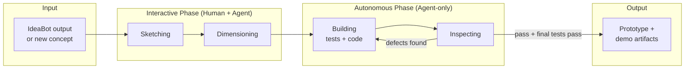
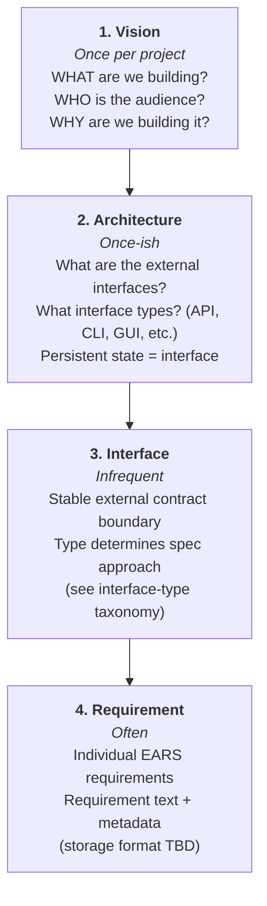
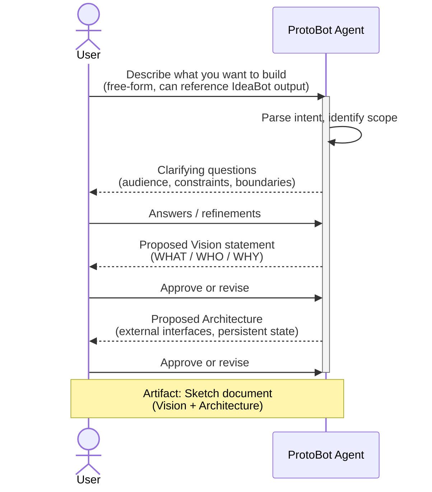
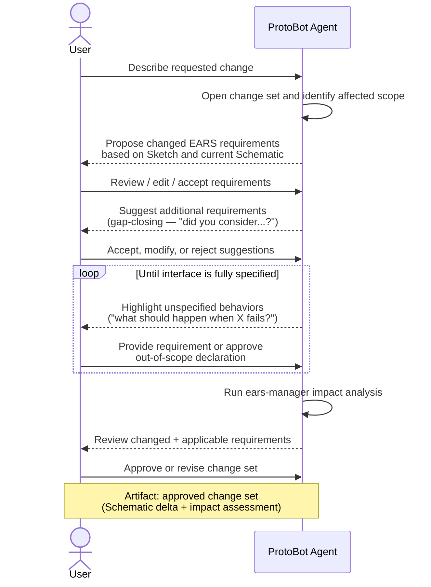
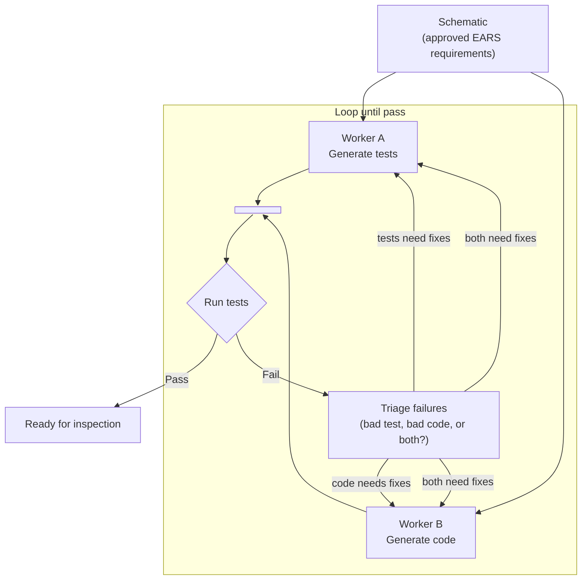
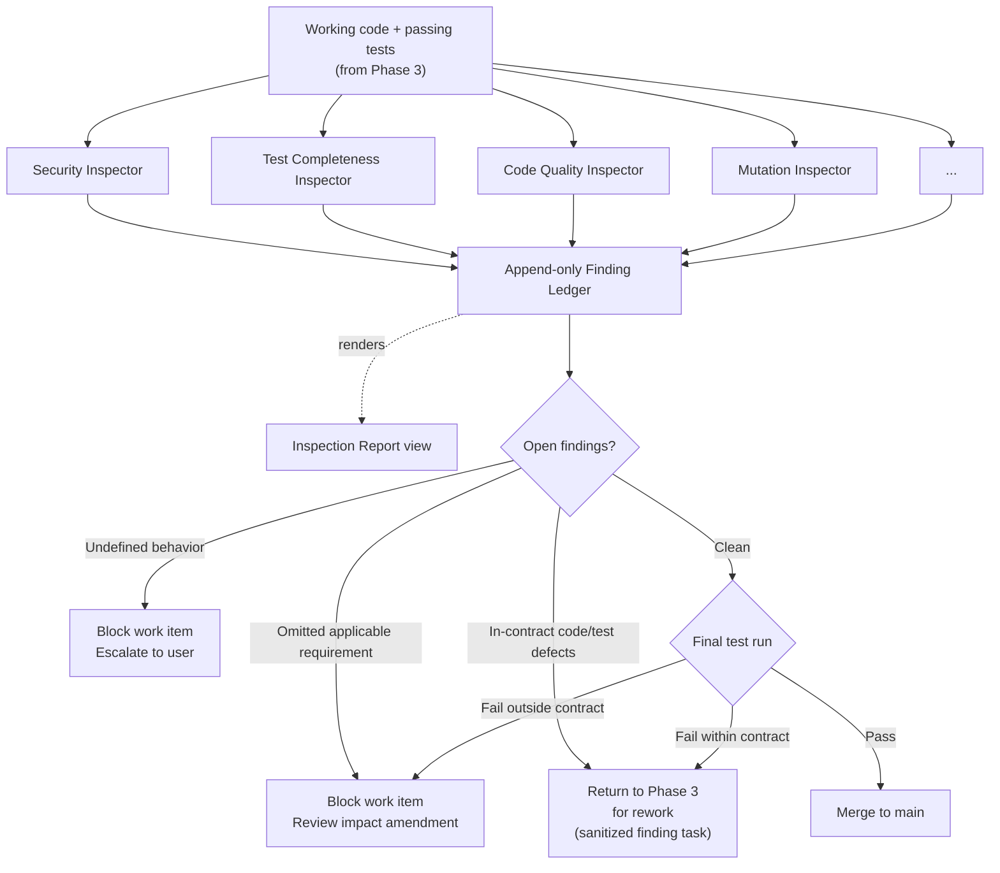
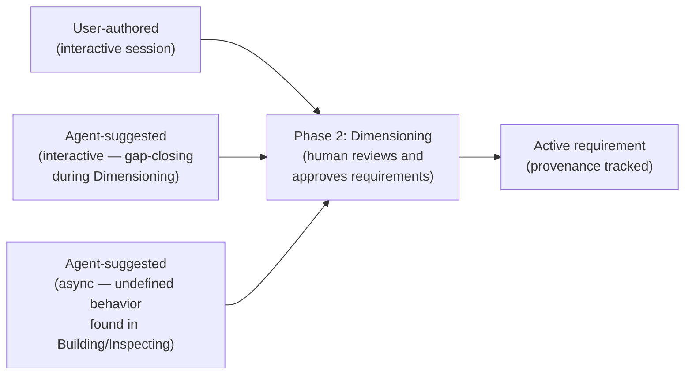
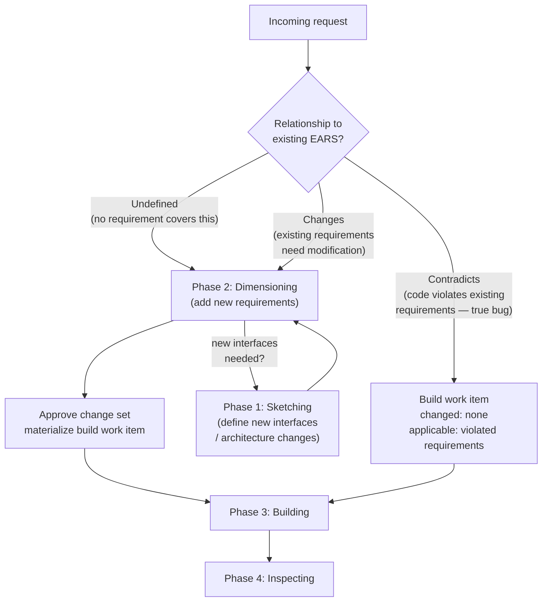
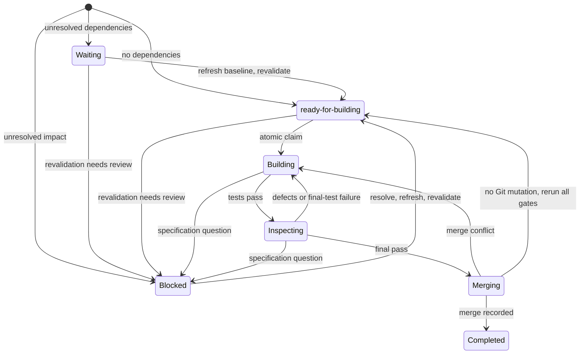
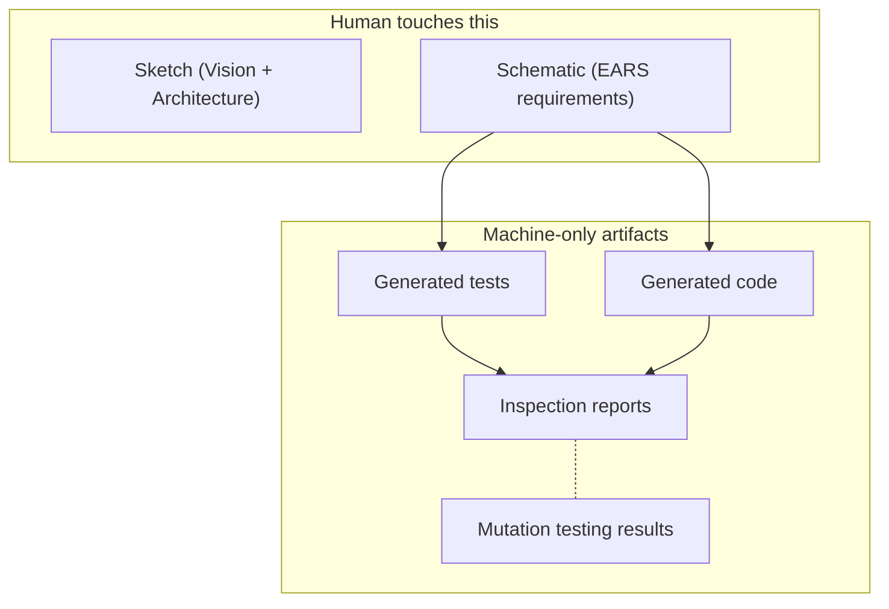

# ProtoBot: User Interaction Flow

> Design document — draft, July 2026

**Contents:**

- [Overview](#overview)
- [End-to-End Flow](#end-to-end-flow)
- [Specification Hierarchy](#specification-hierarchy)
- [Phase Details](#phase-details)
- [Request Backlog and Refinement](#request-backlog-and-refinement)
- [Requirement Provenance Flow](#requirement-provenance-flow)
- [Incremental Development and Change Types](#incremental-development-and-change-types)
- [Human Review Boundary](#human-review-boundary-summary)
- [Related Documents](#related-documents)

## Overview

ProtoBot is the second tool in the Hermes pipeline, following IdeaBot. It
takes requirement specifications as input and generates working prototypes
(for demos, not final products). The pipeline has four phases:

1. **Sketching** (interactive) — Human + AI define the Vision and
   Architecture.
2. **Dimensioning** (interactive) — Human + AI produce EARS requirement
   specifications (the Schematic).
3. **Building** (autonomous) — Agents generate tests and code
   concurrently from the approved EARS requirements.
4. **Inspecting** (autonomous) — Independent Inspector agents review
   the work; defects are sent back to Building for rework.

The human review boundary sits at the **Schematic** (approved EARS
requirements). Everything after Dimensioning is fully autonomous —
no human review of generated tests, code, or inspection results.

---

## End-to-End Flow

This is the top-level view of a user's journey through ProtoBot, from an
initial idea through to a reviewable prototype.



**Key principle:** Everything before and including Dimensioning involves the
human. Everything after (Building, Inspecting) is fully autonomous.
The only exception is if an Inspector discovers undefined behavior,
which blocks the work item and escalates to the user (see
[Incremental Development](#incremental-development-and-change-types)).

---

## Specification Hierarchy

Before diving into the phase details, it's important to understand _what_
the user is building during the interactive phase. Specifications are
produced at four levels, each answering progressively more specific
questions:



The top two levels (Vision, Architecture) are typically set once at
project start. Interface and Requirement are where the bulk of
ongoing interactive work happens.

**Interface-type taxonomy** (determines how each interface is spec'd):

| Interface Type | Spec Approach | Example |
| --- | --- | --- |
| Network service | Smithy / OpenAPI | REST API, gRPC service |
| CLI | `usage` (jdx.dev) / docopt / `wasi:cli` _(needs evaluation)_ | `protobot generate` |
| REPL | _(open gap — no real IDL exists)_ | Interactive notebook |
| Linkable library | WIT (Wasm Interface Types) | Shared SDK module |
| Web GUI (html/css) | _(open gap — not yet solved)_ | Dashboard UI |
| Native GUI | _(open gap — not yet solved)_ | Desktop app |

### Change sets and applicability

Dimensioning operates on a **change set**, not a permanent Feature
container. A change set is a proposed specification transaction that
captures the intent and rationale for a coherent change. It remains
mutable while under review and becomes an immutable audit record once
approved. Requirements have stable identities independent of change
sets: one change set may add a requirement, a later one may revise it,
and another may retire it.

Retiring a requirement removes an obligation; it does not by itself
require the corresponding behavior to disappear. If removal is desired,
the change set must add an active requirement that specifies the new
observable behavior. A retirement-only change set may therefore declare
that no implementation work is required.

Each change set records two distinct requirement sets:

- **Changed** requirements are added, revised, or retired by the change
  set. These are the normative specification delta.
- **Applicable** requirements are unchanged obligations that constrain
  implementation of the delta. For example, adding a CLI subcommand can
  make an existing ubiquitous `--help` requirement applicable even
  though that requirement was not edited.

For delivery, active requirements added or revised by the changed set
and every applicable requirement form the binding obligation set.
Retired requirements remain in the audit delta but are not obligations
to satisfy.

The change set also records its immutable base specification revision
and the interfaces and narrower scopes it affects. `ears-manager` uses
that scope, requirement applicability metadata, and explicit requirement
relationships to generate a conservative list of potentially applicable
requirements. The Dimensioning agent supplements that mechanical list
with semantic impact analysis. The user reviews the changed set and
dispositions each impact candidate as applicable or not applicable, with
rationale, as part of approving the Schematic delta.

An approved change set materializes one build work item by default. This
keeps the impact assessment and human approval boundary intact. Future
splitting or combining of change sets requires a separately reviewed
delivery plan and a new impact assessment at the chosen source
specification commit; the Job Site cannot silently change the reviewed
unit. Every append-only build work-item contract version freezes its
changed and applicable requirements against one immutable specification
commit. Dispatch is blocked if any impact candidate lacks a reviewed
disposition.

---

## Phase Details

### Phase 1: Sketching

> _"High-level free-form description of what to build"_ — produces a
> **Sketch**.



**User's role:** Provide the idea, answer clarifying questions, approve the
Vision and Architecture.

**Agent's role:** Structure the user's intent into the Vision/Architecture
levels of the spec hierarchy. Proactively surface gaps, ambiguities, and
unstated assumptions.

**Exit criteria:** User has approved a Vision statement and an Architecture
that enumerates all external interfaces and their types.

#### What belongs in the Architecture

The Architecture should describe the system's **external interfaces** —
its boundary with the outside world. Internal decomposition (services,
modules, components) is an implementation detail and should generally be
left to the Building phase. The user specifies _what the system looks
like from the outside_, not how it's structured internally.

**"External" means contractually stable, not just user-facing.** An
external interface is any boundary where you'd expect an independent
party to be able to write an implementation against the contract. This
includes user-facing APIs, but also internal boundaries that are
designed to be pluggable.

**Rule of thumb:** If you would support a third party creating a
plug-in implementation for a part of the system, the interface to that
component is an external interface and belongs in the Architecture.

For example, ProtoBot should support multiple work management systems
(Jira, GitHub, Trello, Beads). This means the boundary to the WMS
must be a fully specified interface so that arbitrary implementations
can be swapped in. From the standpoint of the overall ProtoBot project,
the WMS might feel "internal," but the pluggable nature makes its
interface external — it needs to be spec'd with the same rigor as any
user-facing API.

**Persistent state is an external interface.** State exists outside the
system — it outlives any single run, requires an upgrade/rollback path,
and needs some interface to read and write it. A database, a
configuration file on disk, or a set of Kubernetes CRDs are all
external interfaces even though they might feel "internal." They belong
in the Architecture.

**Environmental constraints are not interfaces, but still belong here.**
Sometimes the target environment dictates internal choices. For
example, a web frontend at Red Hat will likely be required to use
PatternFly because it's the blessed framework — even though PatternFly
isn't an external interface. These constraints should be captured in
the Architecture as **environmental requirements**, clearly
distinguished from interface definitions, so the Building phase doesn't
make incompatible choices.

In summary:

| Belongs in Architecture | Does NOT belong (leave to Building) |
| --- | --- |
| External APIs (REST, gRPC, CLI, etc.) | Internal service decomposition |
| Pluggable component interfaces (WMS, auth provider, model backend) | Class/module structure |
| Persistent state (DB schema, files, CRDs) | Internal data flow between components |
| User-facing interfaces (web UI, REPL) | Library choices not mandated by environment |
| Environmental constraints (PatternFly, UBI base image, language mandates) | |

---

### Phase 2: Dimensioning

> _"Turning the sketch into EARS requirements"_ — produces a
> **Schematic**.

This is the most time-consuming interactive phase and the **primary human
review boundary**. The agent helps the user produce precise, EARS-formatted
requirements for each interface identified in the Architecture.



**Critical UX design point:** The agent must aggressively surface spec gaps
_during_ this phase, because once the autonomous phase begins, the agent
will silently fill unspecified behaviors with its own assumptions — and
those assumptions become invisible de facto contracts (the Hyrum's Law
problem observed in IdeaBot).

**EARS requirement format** (tentatively JSONL, not in `.feature` files):

```json
{
  "id": "REQ-AUTH-001",
  "applies_to": {
    "interfaces": ["api-gateway"],
    "scopes": ["authentication"]
  },
  "verification": {
    "mode": "isolated-interface"
  },
  "type": "event-driven",
  "text": "When a user submits valid credentials, the system shall return a JWT token within 500ms.",
  "provenance": "user-authored",
  "created": "2026-08-01T14:30:00Z"
}
```

Requirements have no mutable workflow state. A stable requirement ID is
resolved against the immutable specification commit recorded by each
build work item. The WMS tracks the lifecycle of build work items, and a
completed item records commit-scoped conformance evidence rather than
marking requirements globally `implemented`. See
[Build Work Item Lifecycle](components.md#build-work-item-lifecycle).

Every requirement must carry machine-queryable applicability metadata.
At least one selector identifies its scope. Most requirements use one or
more stable interface IDs; project-wide and environmental requirements
use an explicit project selector. Projects may define narrower
capability or resource selectors in `applies_to.scopes` to reduce
false-positive intersections. The exact selector vocabulary remains an
open schema-design question; broad interface or project overlap provides
a safe initial candidate set.

Every requirement also declares `verification.mode`. The default is
`isolated-interface`; `implementation-aware` requires a rationale in the
requirement/change-set metadata and activates the compensating gates
defined below.

> **Needs follow-up: JSONL as storage format.** JSONL was chosen because
> it's git-friendly — each requirement is one line, so merge conflicts
> are easy to resolve. However, this only works well if requirements are
> truly self-contained, independent records. As soon as there are
> cross-references between requirements (e.g., "REQ-AUTH-001 depends on
> REQ-SESSION-003") or change-set history, JSONL may no longer be ideal
> because merges and reorganization become harder. Referential integrity
> remains `ears-manager`'s responsibility regardless of storage format;
> callers never resolve links or parse JSONL directly.
> Alternatives to evaluate: a directory of individual JSON/YAML files
> (one per requirement, hierarchy encoded in directory structure), a
> lightweight relational format, or a single structured document with
> tooling to handle merge conflicts.

**EARS pattern → test approach** (how each requirement type will be
verified in the autonomous phase):

| EARS Pattern | Example | Test Approach |
| --- | --- | --- |
| Ubiquitous (_"shall X"_) | "The API shall use TLS" | PBT: global invariant over arbitrary inputs |
| Event-driven (_"When..."_) | "When user logs in, shall issue token" | Example-based: specific input → expected output |
| State-driven (_"While..."_) | "While in maintenance mode, shall reject writes" | PBT: state invariant over arbitrary sequences |
| Unwanted behavior (_"If...then"_) | "If token expired, shall return 401" | Example-based: construct trigger, assert response |
| Optional feature (_"Where..."_) | "Where SSO is configured, shall use SAML" | Example-based: set config flag, check behavior |
| Complex (combined keywords) | "While in-flight, if reverse thrust commanded, shall inhibit reverser" | Combination of above approaches, matching the combined pattern |

---

### Phase 3: Building (Autonomous)

> _"Creating the implementation and its verification"_ — produces
> **Code** and a test suite concurrently.

Both test generation and code generation are driven directly from the
approved EARS requirements. A dedicated model generates tests while a
separate model generates code — neither sees the other's output.
Correctness is established when the independently-generated tests pass
against the independently-generated code.



**Why concurrent:** Both Workers read directly from the same EARS
requirements. Neither needs the other's output to begin, so there's no
reason to serialize them.

**Key constraint:** Worker A (tests) never receives implementation
source, including previously merged implementation history. Worker B
(code) never receives canonical test source, including previously merged
test history. Each works in an ephemeral local repository projected from
the same source commit with an independent object database, no canonical
remote, and no repository credentials. The full integration repository
is private to the Job Site and Triage. This prevents oracle gaming while
retaining one canonical hosted project repository.

Worker B may create private scratch checks and may call an opaque
baseline runner for unchanged requirements, but neither becomes
canonical test evidence. Worker A receives the test harness and valid
prior tests for unchanged requirements, but no implementation files or
objects. Tests mapped to revised or retired requirements are quarantined
before projection and execution.

**Merge + test + triage loop:** After both Workers produce their
initial outputs, the Job Site imports path-restricted patch bundles into
private integration-side branches, merges them into a single runnable
artifact, and executes the test suite. If tests fail, a triage step
determines fault — bad test, bad code, or both — and routes fixes
back to the appropriate Worker(s). The loop repeats until all tests
pass. Note that "both" is a real case: a test might be wrong _and_
the code might be wrong in a different way, and fixing only one side
would still fail.

Triage feedback is allowlisted to outcome, fault classification,
requirement IDs, requirement-level reasons, retry budget, and diagnostics
originating solely from the recipient's own artifacts. It excludes peer
source, assertions, expected or actual values, observed code behavior,
raw logs, mutation details, and raw Inspector findings. An auditable
sanitizer enforces this contract before feedback crosses either Worker
boundary.

#### Ongoing obligations

Not all requirements are fully satisfied by
a single work item. Some requirements are ongoing obligations that
apply to every new instance of something — for example, _"All CLI
subcommands shall provide usage descriptions via `--help`."_ This
requirement is satisfied by the work item that first implements
`--help` support, but it must be revisited by every subsequent work
item that adds a new subcommand.

This means Workers cannot limit themselves to active requirements added
or revised by the **changed** set. They receive the approved
**applicable** set as an equally binding part of the work-item contract.
`ears-manager` produces candidate intersections during
Dimensioning from affected interfaces, narrower scope selectors, and
explicit requirement relationships. The agent and user review that
impact assessment before approval. At materialization, the Job Site
reruns the deterministic analysis against the work item's source
specification commit and refuses dispatch if any candidate lacks a
reviewed applicable/not-applicable disposition.

The EARS patterns provide useful candidate signals but do not define
applicability by themselves. A ubiquitous requirement ("The system shall
X") is always active only within its declared applicability scope.
Workers receive the full approved Schematic for context, but the frozen
active changed requirements plus the applicable set define the delivery
obligations for the current build work item.

Ongoing obligations never change workflow status because requirements
have no such status. A ubiquitous requirement like "All CLI subcommands
shall provide `--help`" remains part of the approved Schematic. Every
work item to which it applies must produce fresh conformance evidence at
its tested candidate, later paired with the resulting merge commit. A
work item adding a CLI subcommand without `--help` therefore fails its
own test run rather than invalidating or resetting a global marker on
the requirement.

See [open question Q19][q19] for the remaining applicability-selector and
semantic-impact questions.

> **Open concern: Bootstrapping and merge viability.** Isolation
> between Worker A and B is viable _only_ if tests exercise external
> interfaces — the same boundaries defined in the Architecture phase.
> Worker A is a "client" of the interface contract; Worker B is the
> "server." They don't need to agree on internals because the tests
> never touch internals. This is exactly how contract testing (Pact,
> Smithy protocol tests) works in practice.
>
> However, the merge step is more than "put the files together."
> Worker B must produce something that _exposes_ the interface in a
> runnable form (a container that starts, an API that listens, a CLI
> that accepts arguments) before Worker A's tests can execute. The
> merge step likely needs to include building and starting Worker B's
> artifact, then running Worker A's tests against it. This
> infrastructure needs to be designed.

#### Verification modes

Every requirement declares a verification mode in its metadata:

1. **Isolated interface test** is the default. Worker A receives no
   implementation knowledge and tests only approved external contracts.
2. **Implementation-aware test** is an explicit exception for behavior
   that cannot be exercised practically at an external boundary, such as
   controlled time or internal fault injection. The change set records
   the rationale.
3. **Mutation testing** is a hidden quality audit over both categories;
   generating Workers never receive mutant details.

Implementation-aware canonical tests are generated by a separate,
test-only Worker after an implementation candidate exists, not by Worker
B. That Worker receives a read-only implementation projection plus a
writable test area and cannot modify code. Because it can observe
internals, its output never counts as independent evidence by itself.
The following compensating gates are mandatory:

- expected behavior must be derived from the approved requirement, not
  copied from observed implementation output;
- any externally observable portion still receives an isolated test;
- Test Completeness and Spec Conformance Inspectors independently review
  the requirement-to-test mapping and assertions; and
- hidden mutation testing must demonstrate that the test detects
  meaningful implementation changes.

The Spec Conformance Inspector is mandatory whenever any delivery
obligation uses `implementation-aware`; it is optional by project policy
otherwise. An implementation-aware work item cannot complete while a
surviving mutant lacks an allowed disposition under the mutation
workflow.

The goal is to maximize isolated tests without pretending every behavior
can be verified efficiently from the outside. The remaining open question
is how often the exception is needed across project types.

#### Testing strategy: PBT + examples + mutation testing

The test suite is a **combination** of approaches, not pure
property-based testing. Each has a role; none is sufficient alone.

**Property-based tests (PBT)** work well for EARS requirements that
express invariants, structural constraints, or safety properties —
things that are cheaper to _check_ than to _compute_:

| EARS Pattern | PBT Approach | Example |
| --- | --- | --- |
| Ubiquitous (_"shall X"_) | Global invariant — holds for all generated inputs | "The API shall use TLS" → for any request, the connection is encrypted |
| State-driven (_"While..."_) | State invariant — holds across arbitrary state sequences | "While in maintenance mode, shall reject writes" → for any write payload, response is 503 |

PBT adds value when random/arbitrary input generation covers a
meaningfully large input space and the property is cheaper to _check_
than to _compute_. Both patterns above have a clear "for all X, Y
holds" shape where X is a broad input space.

**Example-based tests** are necessary for EARS requirements that specify
_correct output for specific inputs_ — the case where PBT breaks down.
Specifying what the correct output should be for arbitrary input is as
difficult as writing the original program (you'd need an oracle), so
concrete input→output pairs are the practical tool here:

| EARS Pattern | Example-based Approach | Example |
| --- | --- | --- |
| Event-driven (_"When..."_) | Concrete scenario: given this input, expect this output | "When user submits valid credentials, shall return a JWT" |
| Unwanted behavior (_"If...then"_) | Specific trigger → specific response | "If token expired, shall return 401" → construct expired token, assert 401 |
| Optional feature (_"Where..."_) | Parameterized scenario: set config, check behavior | "Where SSO is configured, shall use SAML" → enable SSO, assert SAML redirect |
| Complex transformations | Golden-file tests: known input → known expected output | Data pipeline: fixed input file → expected output file |
| Edge cases | Boundary values that PBT's random generation may not reliably hit | Empty input, max-length strings, zero-element collections |

**Mutation testing** operates as a **hidden quality audit** on top of
both. It checks whether the test suite (PBT + examples) actually detects
regressions. Generating Workers do not see mutation details. Each
survivor becomes an atomic Finding Ledger entry routed to a Mutation
Inspector in Phase 4; any Worker rework is sanitized to requirement-level
feedback.

A surviving mutant means: we changed the code, and all tests still
passed. There are three possible explanations:

1. **No change in observable behavior** — the mutation was semantically
   neutral (dead code, redundant branch, equivalent mutant). The
   program still conforms to the spec. Nothing is actually wrong.
2. **Test suite deficiency** — the mutation _did_ change observable
   behavior, but the tests don't cover that behavior path. The spec
   covers it; the tests are just weak.
3. **Unspecified behavior** — the mutation changed behavior in a region
   no requirement covers. There's nothing to test against because the
   spec is silent.

Each campaign records the implementation and active-test digests,
tool/operator versions, deterministic seed, environment, and complete
mutant inventory. A stable mutant subject ID names the operator,
module/symbol/AST identity, and transformation; an instance ID adds the
target-node digest. Test-only or unrelated code changes preserve the
instance when its subject is unchanged. Campaign evidence also links
killed mutants to stable test IDs, requirement IDs, and
implementation-aware control surfaces.

#### Mutation disposition

Only Inspector agents may classify surviving mutants. Human review is
not a mutation oracle. The allowed outcomes and continuation rules are:

- **`test-gap`:** route sanitized requirement-level feedback to the
  appropriate test Worker; resolve only when the same mutant is killed.
- **`spec-gap`:** block for a linked Dimensioning change set; after the
  human adds a requirement, rerun after specification/contract refresh.
  The human may instead approve an explicit out-of-scope declaration;
  then independent Mutation and Spec Conformance Inspectors must confirm
  that the mutant affects nothing outside that boundary before recording
  `scope-excluded-confirmed`. The human resolves scope, not mutant
  mechanics.
- **`equivalent`:** continue only after a second independent Inspector
  confirms there is no externally observable behavior change for any
  reachable input/state. An observable change that requirements do not
  cover is `spec-gap`, never equivalent.
- **`tooling-invalid`:** continue only with reproducible runner/operator
  evidence and independent confirmation; quarantine the affected
  operator/version.

There is no accepted-risk or mutation-score bypass. Inspector disagreement
gets one independent tie-breaker; without two matching dispositions in
the retry budget, the finding remains open and the work item cannot
complete. Every proposal, confirmation, rerun, and evidence reference is
an append-only event under the survivor's stable finding ID.

If code rework removes or changes the mutation subject, the old survivor
is not silently treated as killed. Mutation and Spec Conformance
Inspectors must independently confirm that the current campaign no longer
contains it, mapped requirements still conform, and replacement mutants
are terminal before the finding becomes `superseded-confirmed`.

> **Open concern:** The boundary between "property I can check" and
> "output I need an oracle for" is not always obvious up front. The
> system will need heuristics or human guidance to decide which EARS
> requirements get PBT vs. example-based tests vs. both. This is an
> active design question.

**Safeguard mechanisms:**

- Sandbox-level constraints (not just prompts) prevent shortcuts
  (e.g., mocking backends instead of real implementations)
- Mutation testing as a hidden gate (see above)

---

### Phase 4: Inspecting (Autonomous)

> _"Review of code"_ — multi-agent automated review before the work
> is finalized. Analogous to building inspectors in the construction
> metaphor: independent specialists each examine the work from their
> area of expertise.

Phase 4 receives working, tested code from Phase 3 (deterministic
checks like lint, type-checking, and test execution have already
passed in Phase 3). Multiple independent Inspector agents review the
code and tests in parallel, each looking for a different class of
deficiency.



#### Inspector agents

Each Inspector is an independent agent with a narrow, well-defined
audit scope. They run in parallel and do not coordinate with each
other.

**Defined Inspectors:**

- **Security Inspector** — scans for security weaknesses, OWASP
  violations, hardcoded secrets, insecure dependencies, injection
  vulnerabilities, improper error handling that leaks internals. This
  is especially important given ProtoBot's prototype outputs may be
  deployed as Dev Preview builds that customers could put into
  production despite disclaimers.

- **Test Completeness Inspector** — evaluates whether the test suite
  adequately covers the requirements. Looks for requirements with no
  corresponding test, scenarios with insufficient boundary coverage,
  and assertions that are too loose to catch real regressions.
  _(Open question: should this run in Phase 3 instead, as part of
   the Building loop, so gaps are caught earlier?)_

- **Code Quality Inspector** — examines code cleanliness and
  maintainability: DRY violations, overly complex functions (CRAP
  score), dead code, poor naming, missing error handling, functions
  that do too much. Not about style nitpicks — about structural
  problems that would make the code fragile or hard to understand.

- **Spec Conformance Inspector** — compares code and tests directly to
  the approved delivery obligations. It is mandatory when any
  requirement uses implementation-aware verification and may be enabled
  for other projects by policy.

- **Mutation Inspector** — receives hidden survivor details, proposes one
  of the four allowed mutation dispositions, and appends evidence to the
  Finding Ledger. Independent confirmation is mandatory for equivalent
  or tooling-invalid dismissals.

**Optional policy/Kit-selected Inspectors:**

- **Refactoring Inspector** — identifies structural simplification and
  technical-debt opportunities. A defect introduced by the current item
  can block it; a broader opportunity creates a maintenance request for
  human prioritization rather than silently expanding scope.
- **Performance Inspector** — flags inefficient patterns such as N+1
  queries, unbounded memory allocation, or blocking I/O in async paths.
- **Accessibility Inspector** — checks relevant UI interfaces for
  accessibility conformance.
- **Documentation Inspector** — checks public-interface documentation and
  user-facing diagnostics.

The right set depends on project interfaces and policy. Kits may propose
specialist Inspectors and activation rules alongside EARS/interface
content; reviewed project policy makes activation explicit.

#### Finding Ledger and inspection report

Each pass starts with an Inspection Run manifest bound to the candidate
commit, contract version, and executable product-tree digest. It lists
the required Inspector roster, mutation campaign, and prior finding IDs
that must be rechecked. Every
required producer appends a signed completion event even when it found
nothing. A run seals at a Ledger high-watermark only after all producers
complete, mutation results are complete, prior findings are rechecked for
the current candidate, and every current finding is terminal. Late events
are rejected; rework creates a new run.

Each Inspector atomically appends findings to a shared event ledger; no
agent edits a common report. A finding has a stable ID, work item and
candidate commit, Inspector/category/severity, requirement references (or
explicit spec-gap scope), derived status, and content-addressed evidence.
Status changes, routing, dispositions, confirmations, and rechecks append
versioned events rather than overwriting prior content.

On subsequent passes, Inspectors query every prior finding ID listed in
the run manifest, append `recheck-passed` or `reopened` evidence for the
current candidate, and also scan for new defects. Concurrent creates use
producer idempotency keys, and concurrent updates use expected finding
versions, so no Inspector can overwrite another's result.

The **inspection report** is a rendered Markdown view of the Ledger, not
a source of truth. Before merge, the Job Site commits a deterministic
JSONL snapshot and the rendered report under an `attestation-only` path
excluded from build/package inputs and Worker projections, then verifies
that the sealed product-tree digest is unchanged. Raw evidence remains
integration-only. A finding router converts open defects
into recipient-specific tasks and passes them through the same sanitizer
as test triage; Workers never receive raw ledger entries or reports.

#### Defect routing

Defects fall into three categories with different routing:

- **Code/test defects** (security holes, quality problems, coverage
  gaps) within the frozen obligation set — sent back to Phase 3 for
  rework. Sanitized finding tasks give each Worker only the context
  allowed by its isolation boundary. The work item returns to Phase 4
  after tests pass again.

- **Omitted applicable requirement** — an approved requirement outside
  the frozen obligation set is affected by the work. This blocks for a
  reviewed impact amendment. After a new contract version includes the
  requirement, the same work item returns to Building.

- **Undefined behavior** — an Inspector identifies behavior that
  isn't covered by any requirement and can't be resolved by fixing
  code or tests alone. This **blocks the work item** and is
  escalated to the user as an agent-suggested requirement (async
  provenance). The work item cannot proceed until the user either
  adds a requirement to cover the behavior or explicitly marks it
  as out-of-scope in an approved specification declaration. This is the
  Phase 4 equivalent of the
  "unspecified" bin in the undesired-behavior taxonomy — the
  difference is that here it was caught by an Inspector's judgment
  rather than by a mechanical test failure.

#### Final test run and merge

After the current-candidate Inspection Run is sealed and all Finding
Ledger entries are terminal under their category's continuation rules,
automated tests are run one final time against the complete, reviewed
codebase.
This catches any regressions introduced by rework during the
Inspect→Build→Inspect loop. If the final test run passes, the work
item records the tested candidate and evidence digests in `merging`,
then merges into main and records the resulting merge commit as
`completed`.

#### Demonstration artifacts

On completion, the Job Site generates demonstration artifacts that
show the prototype working. A canonical manifest under
`.protobot/attestations/demos/` records each artifact's media type,
generator/version, source and product-tree digests, storage URI/path,
content digest, verification result, and retention policy. Small artifacts
may be committed under the `attestation-only` namespace; large video/image
artifacts go to approved object/OCI storage and are referenced by digest.
PR attachments are convenience views, never the canonical record.
Candidate tooling:

- **[showboat](https://github.com/simonw/showboat)** — Builds
  self-verifying Markdown evidence documents. `showboat verify`
  re-executes every code block and diffs the output, so the demo
  document is itself a regression check.
- **[shot-scraper](https://github.com/simonw/shot-scraper)** —
  Playwright-based screenshots and video recording for web UIs.
- **[Asciinema](https://asciinema.org)** — Records terminal
  sessions as lightweight text-based "cast" files, convertible to
  animated GIFs via `agg`. Best fit for CLI and REPL surfaces.
- **[rodney](https://github.com/simonw/rodney)** — Chrome CLI
  automation with accessibility-tree assertions (`ax-find`,
  `visible`, `assert`), providing a structured, assertable
  interface to web GUIs.
- **Animated GIFs** — The lowest-common-denominator demo artifact:
  GitHub renders them inline in PRs and READMEs with zero setup
  for the reviewer.

The right combination depends on the interface types in the
prototype. A CLI tool gets Asciinema + showboat; a web UI gets
shot-scraper + rodney + GIFs.

---

## Request Backlog and Refinement

ProtoBot uses three distinct records rather than treating every idea,
requirement, and execution as one generic work item:

1. A **request** captures "I want it to do X," rationale, creator,
   affected scope, human-assigned business priority, and known
   relationships.
2. A **change set** is the reviewed specification delta produced while
   refining an undefined behavior or desired change.
3. A **build work item** is the autonomous delivery contract materialized
   after approval, or directly from a true-bug request.

The Drafting Table agent and a human project maintainer own backlog
refinement. Before a request is ready for Dimensioning, they:

- compare it with active requirements, open requests, and proposed change
  sets for exact and semantic duplicates;
- classify it as undefined, changes, or contradicts existing EARS;
- identify affected interfaces/scopes and `depends-on`,
  `conflicts-with`, `supersedes`, or `related-to` relationships;
- show explicit current-to-proposed requirement diffs, including every
  add, revision, and retirement; and
- confirm intent, rationale, business priority, dependencies, and owner.

`ears-manager compare` performs deterministic identity, exact-duplicate,
relationship, and dependency-cycle checks. The agent proposes semantic
duplicates or contradictions; the human confirms the classification and
any specification change. A duplicate may close against its existing
request/change set rather than adding another requirement. This preserves
a coherent review unit without restoring a permanent Feature hierarchy.

Duplicate resolution precedes admission to the three change types but is
never based on text similarity alone. If the desired behavior already has
an approved requirement and the request alleges that code violates it,
the request is `contradicts`, not a duplicate. A maintainer may close a
request as duplicate only when it adds no desired behavior, proposes no
specification change, reports no distinct implementation violation, and
records the canonical request/change-set link and confirmation rationale.

Interfaces and requirements do not carry delivery priority: once
approved, every active requirement is binding. The request's human-owned
business priority represents the desired change across all affected
interfaces, is copied to its change set and build work item, and may be
changed only by an authorized maintainer with an audit event.

The Job Site owns **scheduling**, not product priority. Among ready work
items it applies project policy using business priority first, then
dependencies, aging, WIP limits, resource/backend fit, risk, and likely
path conflicts. It records the factors behind each dispatch decision and
cannot silently raise or lower business priority.

---

## Requirement Provenance Flow

Requirements can originate from three sources. Regardless of origin,
**all requirements flow through Dimensioning (Phase 2) for human
review before taking effect.** Once approved, a requirement is a full
requirement — no permanent second-class status. Provenance is tracked
for traceability but does not affect a requirement's weight.



**Async escalation path:** When Building or Inspecting discovers
undefined behavior, it is surfaced to the user as an agent-suggested
requirement. This **blocks the work item** until the user either adds
a requirement (which enters Dimensioning as a linked change set) or
approves an explicit out-of-scope specification declaration. The blocked
work item depends on that change set's build work if implementation is
required.
After the dependency completes, the control plane reruns impact/refresh
eligibility and appends a new contract version. The item returns to
`ready-for-building` only if those checks pass. A Job Site must obtain a
new fenced claim before refreshing its branch from main and rerunning all
gates. Any newly discovered obligation requires a reviewed impact
amendment before dispatch.

---

## Incremental Development and Change Types

The phases above describe a single pass through the pipeline, but
real software is not fully defined upfront. The first iteration may
be an MVP with a handful of requirements; capabilities are added over
time, desired behavior is refined ("make the button blue instead of
red," "add a confirmation before deleting"), and true bugs are
discovered. ProtoBot must support this incremental, iterative
development model as the normal mode of operation, not as an
exception.

Each requested change is classified by its relationship to the existing
EARS requirements. Undefined behavior and desired changes enter the
interactive pipeline as change sets. A true bug can materialize a build
work item directly because no specification change is needed:



### Change types

Every nonduplicate request admitted for work falls into one of three
categories based on its relationship to the existing EARS requirements:

**Undefined** — no requirement covers this behavior. New requirements
must be written. The request enters at Phase 2 (Dimensioning) as a
change set, then its materialized build work item flows through Building
and Inspecting.
If the new behavior requires new interfaces or architecture changes,
it routes through Phase 1 (Sketching) first. Examples:

- Adding a "forgot password" flow to an existing auth API
  (new requirements on existing interface → Phase 2)
- Adding a REST API to a system that previously only had a CLI
  (new interface → Phase 1 → Phase 2)
- An Inspector discovers behavior in a region no requirement
  covers (escalated to user → user adds requirement → Phase 2)

**Changes** — existing requirements need to be modified because
the desired behavior has changed. The current implementation may be
correct per the current EARS, but the user wants different behavior.
The request enters at Phase 2 as a change set; after approval, its build
work item flows through Building and Inspecting. Examples:

- "The confirmation dialog should require typing the resource name,
  not just clicking OK"
- "Cache TTL should be 10 minutes, not 5"
- "The default sort order should be newest-first"

**Contradicts** — the implementation violates existing, approved EARS
requirements. This is a true bug — the requirements are correct and
don't need to change; the code is wrong. The work item skips Phases
1 and 2 entirely and enters directly at Phase 3 (Building), since the
requirements already define the correct behavior. The work item
has an empty changed set, lists the violated requirements as applicable,
and runs the fix loop until tests pass. Bug intake also records the
affected applicability scope. The materializer conservatively includes
all deterministic impact candidates as applicable; it cannot exclude a
candidate without routing an impact change set through Dimensioning.
Examples:

- The EARS requirement says "shall return 401 for expired tokens"
  but the system returns 200
- The requirement says "shall reject writes in maintenance mode" but
  writes succeed

### Work item lifecycle

A build work item, rather than a requirement, owns mutable coordination
state:



The `ready-for-building` to `building` transition is an atomic
compare-and-swap on the whole work item and its monotonically increasing
contract version. A successful claim increments a fencing token and
creates a renewable lease. Every later mutation must present that token,
so an expired owner cannot write into a newer execution attempt. After
reconciling Git state, an expired `building` or `inspecting` lease can
return to `ready-for-building` for a fresh claim. Requirements are never
claimed individually.

A work item carries:

- **Changed requirement operations** from its source change set,
  possibly empty for a true bug
- **Applicable requirements** it must satisfy
- **Delivery obligations:** active added/revised requirements plus the
  applicable set, excluding retired requirements
- **Source specification commit** against which both sets were resolved
- **Source code commit** from which its branch was created
- **Source change set or bug report** explaining intent and rationale
- **Dependencies** on other build work items
- **Stable materialization key** identifying the logical work item
- **Append-only contract version and execution fencing token** for
  refreshes and retries
- **Finding Ledger run IDs/high-watermarks** plus rendered snapshots from
  Phase 4
- **Change type** (determines pipeline entry point)
- **Provenance** (who/what originated it — user, agent-suggested
  interactive, agent-suggested async, bug report)

Before merge, the work-item branch contains immutable evidence for every
delivery obligation. Each evidence artifact names the requirement ID,
source specification commit, tested candidate commit/tree, and
supporting test or inspection artifacts. After Git merge, the WMS
completion record pairs the resulting merge commit with those evidence
digests. This avoids a self-referential file that tries to name the
commit containing itself. It means "satisfied for this tested tree and
integrated by this merge," not "implemented forever."

Multiple work items can be in flight simultaneously at different
phases — one change set being dimensioned while a work item is being
built and a bug fix is being inspected. The pipeline is not a single
global assembly line; it's per-work-item.

---

## Human Review Boundary Summary



**Design principle:** The human's involvement ends at the Schematic —
approved EARS requirements that define what the system should do.
Everything after that (test generation, code generation, inspection,
merge) is fully autonomous. The specification is sufficient to define
the system; everything else is regenerable. See
[open question Q13](open-questions.md#q13-hu-02-compliance) for
whether this is achievable given Red Hat's AIA requirements.

---

## Related Documents

[q19]: open-questions.md#q19-applicability-metadata-and-semantic-impact-coverage

- [Overview](overview.md) — What ProtoBot is, guiding principles,
  and workflow summary
- [System Components](components.md) — Component architecture,
  interfaces, and cross-cutting concerns
- [Open Design Questions](open-questions.md) — Unresolved design
  questions across all areas
- [Related Work](related-work.md) — Red Hat internal projects,
  external factory projects, and lessons learned
